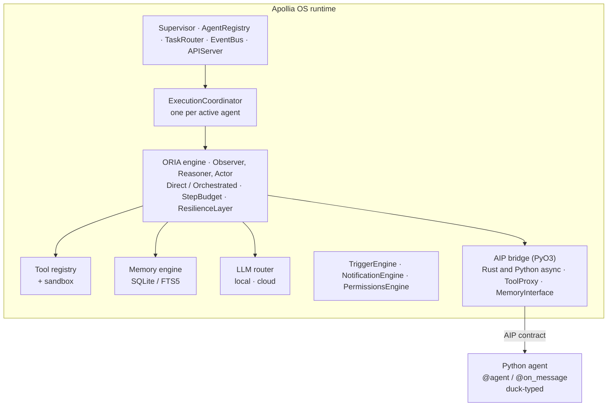

# Apollia OS

> The sovereign runtime for autonomous AI agents.
> They run on your machine, you can prove everything they do,
> and they are as capable as the model you plug in.

Local-first. No cloud dependency. Sovereign by design.

[](https://github.com/Apollia-OS/apollia-os/actions/workflows/ci.yml)
[](#license)

---

## Why Apollia

The best model alone does not make a reliable agent. What decides the result is the system around it: the tools, the guardrails, the memory, the verification. Apollia is that system, and it runs on your machine.

- **Yours** - agents run locally; no data leaves your machine without an explicit action.
- **Auditable** - every action is recorded, so you can prove what an agent did.
- **Cost-bounded** - a step budget enforced by the runtime, never bypassable.
- **As powerful as you want** - a local model by default, any model you choose on demand.


*The audit trail. Every tool an agent invoked, immutable, with the agent that
invoked it and what it cost.*

Learn more at [apollia.fr](https://apollia.fr).

---

## What is Apollia OS?

Apollia OS is a Rust runtime that executes autonomous Python AI agents in an isolated, local environment. Agents run in-process: the PyO3 bridge translates async Rust futures to Python coroutines directly, with no per-agent subprocess.

Sovereign means self-contained, not feature-poor. The runtime is a single binary, the Python SDK has zero third-party dependencies, SQLite is vendored, the API binds to loopback by default, and there is no telemetry and no phone-home. Nothing is required from the cloud to run an agent. Every external host Apollia can reach (Anthropic, OpenAI, Google, Microsoft, and so on) is a backend or connector you configure yourself.

**Key capabilities:**

- **Local-first LLM inference** - run GGUF models locally through the embedded `llama-server` (CPU, Metal, Vulkan, CUDA depending on the platform), or connect to Anthropic / OpenAI-compatible APIs
- **Persistent memory** - three-tier SQLite store (episodic, semantic, procedural) with FTS5 full-text search per agent
- **Native tools** - bash (Linux PID/mount namespaces), path-confined file I/O, Python execution with per-agent venv isolation, HTTP fetch, web search, and more
- **Step budget** - `max_steps` / `max_tool_calls` / wall-clock timeout enforced at the runtime level, not bypassable by agent code
- **Circuit breaker** - per-tool resilience layer with exponential backoff and jitter
- **Triggers** - cron, interval, oneshot, file watch, and authenticated webhooks (HMAC-SHA256)
- **Multi-agent orchestration** - directors coordinate specialized workers over the A2A skill protocol, with human-in-the-loop suspension and resume
- **Human-in-the-Loop (HITL)** - any tool can require human approval before execution; the runtime suspends and resumes transparently
- **Desktop app** - native Tauri v2 + Svelte 5 UI, kept live for every subsystem by the Tauri event bus
- **REST API + CLI** - full management via the `apollia-os` CLI or HTTP on `127.0.0.1:7771`

---

## Install

Three ways in, and most people want the first.

**Install the desktop application.** Installers are attached to each GitHub
release: a `.dmg` for macOS Apple Silicon, an `.msi` or `.exe` for Windows
x86-64, an `.AppImage` or `.deb` for Linux x86-64, plus CUDA-engine variants for
Linux and Windows. No compiler, no checkout, no command line. The step by step,
including the checksum verification and the first-launch warnings, is in
[Install the desktop app](https://docs.apollia.fr/how-to/install-the-desktop-app/).

**Install the command-line runtime.** The same releases attach a self-contained
archive per platform preset (`apollia-os-macos-silicon.tar.gz`,
`apollia-os-linux-x86-cpu.tar.gz`, `apollia-os-windows-x86-cpu.zip`, and their
Vulkan and Linux ARM counterparts). Unpack it, put `apollia-os` on your `PATH`,
and `apollia-os update` handles later versions from the same feed.

Apollia publishes no package on crates.io or PyPI, so the third way in is a
source build, described below.

---

## Quickstart from source

This sequence takes you from a clean clone to a running agent. The demo `echo`
agent needs no model, so it runs on any machine. Run every command from the
repository root.

**Prerequisites:** a Rust toolchain (stable), Python 3.13 available as `python3`
(the checkout pins the exact version in `.python-version`), and `git`.

```bash
# 1. Clone and build the daemon.
#    Build only the CLI crate: the default workspace build excludes the heavy
#    Tauri desktop crate, so `--workspace` is not what you want here.
git clone https://github.com/Apollia-OS/apollia-os.git
cd apollia-os
cargo build -p apollia-cli --release

# 2. Put the binary on your PATH.
#    The crate is `apollia-cli` but the binary it produces is `apollia-os`.
export PATH="$PWD/target/release:$PATH"

# 3. Install the Python SDK for your own shell: editors, tests, and the
#    `apollia` command. From this checkout the runtime does NOT read this venv:
#    it walks up from the binary until it finds `sdk/apollia/__init__.py` and
#    prepends that directory to the agent's `sys.path`.
#    Use a virtual environment. Homebrew, Debian and Fedora ship Python as an
#    externally managed environment (PEP 668), where a bare `pip install` stops
#    with `error: externally-managed-environment`.
python3 -m venv .venv
source .venv/bin/activate          # Windows: .venv\Scripts\activate
pip install -e ./sdk

# 4. Start the runtime. It runs in the FOREGROUND, so leave this terminal
#    running and open a second one for the remaining commands.
apollia-os start --port 7771

# --- in a second terminal, from the same directory ---

# A fresh shell inherits neither the PATH of step 2 nor the venv of step 3.
export PATH="$PWD/target/release:$PATH"
source .venv/bin/activate          # Windows: .venv\Scripts\activate

# 5. Install, enable, and run the no-LLM demo agent.
apollia-os agent install clients/examples/echo_agent.py --skip-tests
apollia-os agent enable echo
apollia-os run echo "hello from Apollia"

# 6. Stop the runtime (graceful drain).
apollia-os stop
```

Expected output for step 5's `run` (the task id is a fresh UUID each time):

```
  -> Task 6f2a1c8e-... submitted to echo
echo: hello from Apollia
  * Completed in 0.2s
```

macOS note: PyO3 must find the right interpreter at build time. If your default
`python3` is not the one you want, export it before building, for example
`export PYO3_PYTHON=$(brew --prefix python@3.13)/bin/python3.13`.

For an agent that generates text, configure a model backend (see [LLM Backends](#llm-backends)).
Full instructions, including local GGUF inference, are in
[the install guide](https://docs.apollia.fr/how-to/install-and-run/).

---

## Architecture

Apollia OS is built around independent Tokio actors communicating over channels. Zero shared mutable state between actors.



Full architecture documentation: [the arc42 architecture section](https://docs.apollia.fr/architecture/)

---

## Platform Support

Apollia runs on three operating systems, over the four platform couples the
release pipeline actually builds (`packaging/artifacts.json` is the contract).
The local inference engine is the upstream `llama-server` binary, pinned and
checksum-verified; the release stages the backend upstream publishes for each
couple, and builds the CUDA engine itself for the two desktop bundles that carry
one.

| Platform | Local inference | Tool sandbox | Notes |
|----------|-----------------|--------------|-------|
| macOS Apple Silicon | Metal | `setrlimit` | Desktop `.dmg` and CLI archive |
| Linux x86_64 | Vulkan, CPU, plus CUDA in a separate desktop bundle | PID + mount namespaces, `setrlimit` | Strongest isolation of the four |
| Windows x86_64 | Vulkan, CPU, plus CUDA in a separate desktop bundle | none | `bash_executor` needs a POSIX shell on `PATH` (Git Bash, WSL or MSYS2) |
| Linux aarch64 | CPU | PID + mount namespaces, `setrlimit` | CLI archive only, no desktop bundle |

Not built for 0.1.0: macOS Intel (`x86_64-apple-darwin`), Windows ARM64, and the
AMD ROCm engine. `apollia-os update` says so for the first: it has no artifact to
offer a macOS x86-64 host.

Two asymmetries are worth stating rather than discovering. Tool subprocesses get
OS-level confinement only where the OS provides it: namespaces and resource
limits on Linux, resource limits on macOS, neither on Windows. And the shell tool
assumes POSIX semantics, because the command validator that guards it was written
for them; on Windows it uses a POSIX shell from `PATH` and refuses clearly if
there is none, instead of silently switching to a shell with different quoting
and a different injection surface. `apollia-os doctor` reports the sandbox
posture it detects and whether per-process rlimits are active; it does not probe
for the POSIX shell, so on Windows the first `bash_executor` call is what tells
you whether one is there.

---

## LLM Backends

Apollia talks to Anthropic, OpenAI, Mistral, Ollama and any OpenAI-compatible
endpoint (LM Studio, vLLM, a self-hosted gateway), and serves local GGUF models
through an embedded `llama-server` that the daemon spawns and supervises. A
local model is the default; a cloud one is a choice you make, per agent or per
conversation.

Declaring a backend:
[configuration reference](https://docs.apollia.fr/reference/configuration/).
Getting the most out of a local model:
[accelerate local inference](https://docs.apollia.fr/how-to/accelerate-local-inference/).

## Writing an Agent

An Apollia agent is an ordinary Python class. The SDK decorators declare the
manifest and the entry points; no base class, no inheritance. Every agent module
ends with `agent = MyClass()`, which is what the runtime loads. Use absolute
imports (`from apollia import ...`), never relative ones.

### Conversational agent

```python
# coach.py
from apollia import agent, on_message
from apollia.types import Ctx, Message


@agent(
    name="coach",
    version="0.1.0",
    description="Friendly product coach.",
)
class Coach:
    @on_message
    async def chat(self, message: str, history: list[Message], ctx: Ctx) -> str:
        response = await ctx.llm.complete(
            messages=[
                {"role": "system", "content": "You are a helpful coach."},
                *history,
                {"role": "user", "content": message},
            ],
        )
        return response.content
```

- **`@agent(...)`** declares the manifest. `name`, `version`, and `description` are required.
- **`@on_message`** marks the single conversational entry point. Its signature is fixed: `(self, message, history, ctx)` returning the reply as a string.

Install, enable, and talk to it:

```bash
apollia-os agent install ./coach.py
apollia-os agent enable coach
apollia-os run coach "How does the Director pattern work?"
```

### Beyond a conversation

A **worker** answers one skill at a time and returns a payload; a **director**
orchestrates workers and holds the plan. Both are the same minimal contract: a
decorated class and an `agent = MyClass()` at module level.

Inside a skill, `ctx` is the whole runtime surface: `ctx.llm` for the model,
`ctx.memory` for what the agent remembers, `ctx.tools` for the native tools
(filesystem, shell, HTTP, search), `ctx.logger` for the trace. Every tool call
goes through the permission engine and lands in the audit journal.

- [Your first agent](https://docs.apollia.fr/tutorials/your-first-agent/)
- [Write a worker](https://docs.apollia.fr/how-to/write-a-worker/)
- [Write a director](https://docs.apollia.fr/how-to/write-a-director/)
- [SDK reference](https://docs.apollia.fr/reference/sdk/), including the full
  `ctx` contract and the native tools


## Configuration

Configuration lives in `~/.config/apollia/apollia.toml`, and every key is also
reachable from `apollia-os config`. Nothing is required to start: the defaults
run a local model against a local workspace.

Every key, its default and its effect:
[configuration reference](https://docs.apollia.fr/reference/configuration/).

## Triggers

An agent can be woken by a schedule, a file that changes, or a webhook, rather
than by you. Triggers are declared in the desktop application or through
`apollia-os trigger`, and each one carries what happens when the agent is
already busy.

The trigger types and their options:
[`apollia-os trigger`](https://docs.apollia.fr/reference/cli/).

## Human-in-the-Loop

An agent that reaches a boundary stops and asks. Filesystem writes outside its
workspace, a tool marked as requiring approval, a question it cannot answer on
its own: each one becomes a request you answer, in the application or from the
CLI, and each answer is recorded in the audit journal.

How approvals are asked, scoped and revoked:
[human in the loop](https://docs.apollia.fr/how-to/human-in-the-loop/).

## Security model

Apollia OS is local-first and defends in layers. Be precise about what is and is
not enforced:

- **Network.** The API binds to `127.0.0.1` by default (loopback only). Binding
  to `0.0.0.0` is opt-in. No telemetry, no phone-home.
- **Bash isolation.** On Linux, `bash_executor` runs each command under PID and
  mount namespaces (`unshare --pid --mount --fork`). On macOS and Windows there
  is no namespace isolation: the executor logs a dev-mode warning on every call,
  and production deployments are expected to run on Linux. There is no seccomp
  syscall filtering and no network namespace, so a shell command can still reach
  the network. Treat bash as an isolated process tree, not an untrusted-code
  container.
- **File tools.** File access is confined to a canonicalized sandbox root; any
  path that resolves outside the root is rejected (path-traversal safe).
- **Step budget.** `max_steps`, `max_tool_calls`, and a wall-clock timeout are
  enforced by the runtime and cannot be bypassed by agent code.
- **Human-in-the-Loop.** Sensitive tools can require explicit human approval
  before execution.
- **Secrets.** Credentials are stored through the OS keychain or an encrypted
  age file, never in plaintext config.

For the threat model, scope, and private reporting, see [SECURITY.md](SECURITY.md).

---

## Desktop App

The Tauri v2 + Svelte 5 desktop application provides a native UI for all runtime subsystems. Build the UI once, then launch it through the repository recipe (requires the `cargo tauri` CLI):

```bash
just desktop-ui-install          # npm ci in crates/apollia-desktop/ui
just desktop-dev                 # links PyO3 against the bundled interpreter, then `cargo tauri dev`
```

Use the recipe rather than `cargo tauri dev` on its own. `just desktop-dev`
first points `PYO3_PYTHON` and `RUSTFLAGS` at the interpreter bundle under
`target/`, which is the one the application sets `PYTHONHOME` to at run time.
Without that step the two interpreters differ, every agent dies at boot on
`ModuleNotFoundError`, and the failure surfaces only as a warning nobody reads.
The recipe needs that bundle to exist: build it once with
`bash packaging/build-python-bundle.sh <target-triple> target/python-bundle/<target-triple>`.

**Main routes:** Dashboard · Agents · Projects · Tasks · Chat · Inbox · Connections · LLM · Automations · Memory · Transcriptions · Notifications · Observability · Settings

Views update in real time over the Tauri event bus, not over SSE; the HTTP API is where SSE lives, on `GET /api/v1/tasks/{id}/stream`. The system tray shows the pending approval count and supports graceful quit.

**Updates.** Releases are published on [GitHub Releases](https://github.com/Apollia-OS/apollia-os/releases). The desktop app checks that feed only when you ask it to, from Settings, and never in the background. Until a release is published the check reports that there is nothing newer, rather than failing.

---

## CLI Reference

`apollia-os` covers the same surface as the desktop application: agents, tasks,
chat, memory, triggers, permissions, models, connectors and the audit journal.
Every command answers `--json` for scripting, and exit codes are part of the
contract (0 success, 1 usage, 2 runtime unavailable).

The full command tree: [CLI reference](https://docs.apollia.fr/reference/cli/).

## Project Structure

A Cargo workspace of Rust crates, a Python SDK under `sdk/`, the desktop
application under `crates/apollia-desktop/`, and the documentation site under
`docs/site/`.

What each crate holds and why it exists:
[repository layout](https://docs.apollia.fr/explanation/repository-layout/).

## Contributing

Apollia OS is a single-maintainer preview. **Issues are
welcome, pull requests are auto-closed by policy.** See
[CONTRIBUTING.md](CONTRIBUTING.md) for the full rationale and the right
channel for each kind of feedback.

- Found a bug? [Open an issue](https://github.com/Apollia-OS/apollia-os/issues/new?template=bug_report.yml).
- Have a feature idea? [Open an issue](https://github.com/Apollia-OS/apollia-os/issues/new?template=feature_request.yml).
- Usage question? [Discussions Q&A](https://github.com/Apollia-OS/apollia-os/discussions/categories/q-a).
- Security vulnerability? [Private advisory](https://github.com/Apollia-OS/apollia-os/security/advisories/new).

---

## Support Apollia OS

Apollia OS is built in the open, under a permissive license. There is no cloud
backend to upsell and no telemetry to monetize. If the project is useful to you,
or you want to see it reach a stable v1.0, recurring support is what keeps the
work going.

- **[Patreon](https://patreon.com/apollia)** - recurring support, with patron-only
  development updates and a vote on what ships next.
- **[Ko-fi](https://ko-fi.com/apollia)** - a one-time tip, no account or
  subscription required.

GitHub Sponsors is not open yet: the organisation has no Sponsors profile, so
the button GitHub renders from `.github/FUNDING.yml` leads nowhere. This list
gains the rail when the profile goes live.

Funding goes straight into the work: cross-platform CI, vision support, and the
foundations for distributing community agents. Supporters are listed in
[SPONSORS.md](SPONSORS.md).

This is separate from the commercial side. If you need a custom agent built for
your own workflow, that is a paid engagement, see [apollia.fr](https://apollia.fr).

---

## License

Apollia OS is dual-licensed under either of:

- [Apache License, Version 2.0](LICENSE-APACHE)
- [MIT License](LICENSE-MIT)

at your option. This aligns with the de facto standard for the Rust ecosystem.

Unless you explicitly state otherwise, any contribution intentionally submitted
for inclusion in this project, as defined in the Apache-2.0 license, shall be
dual licensed as above, without any additional terms or conditions.
