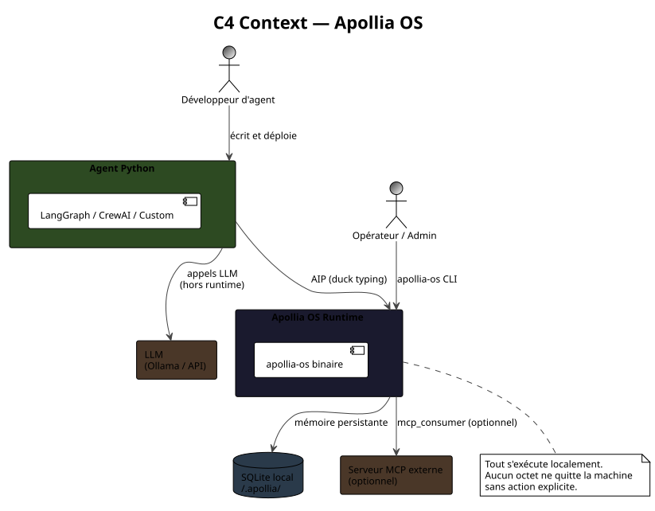
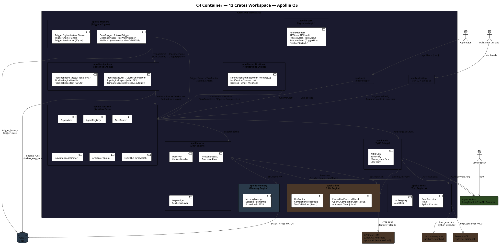
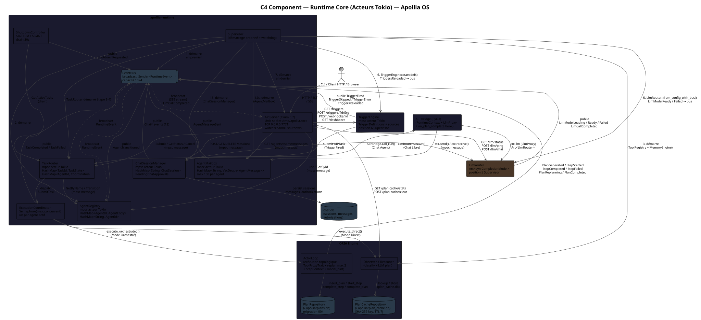
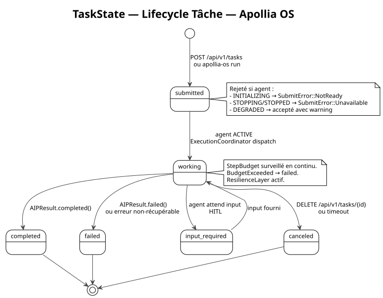
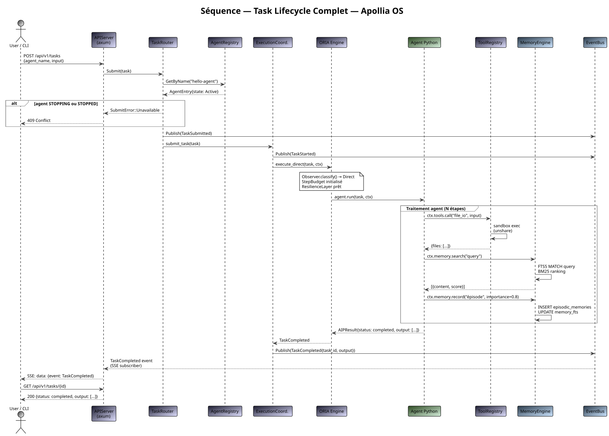
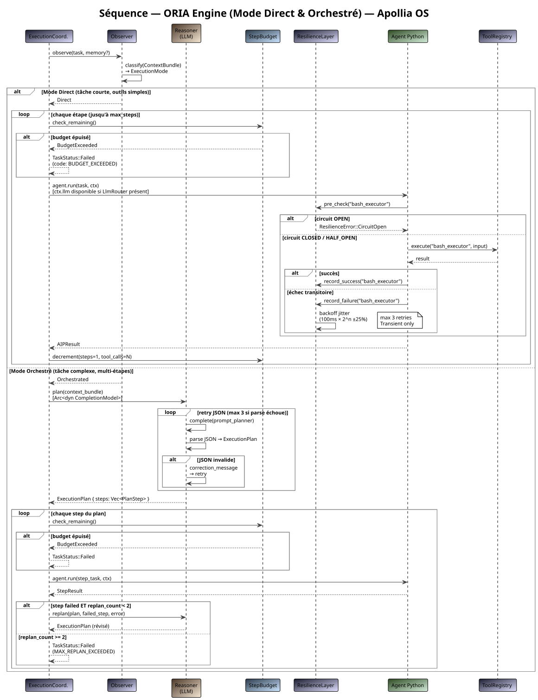
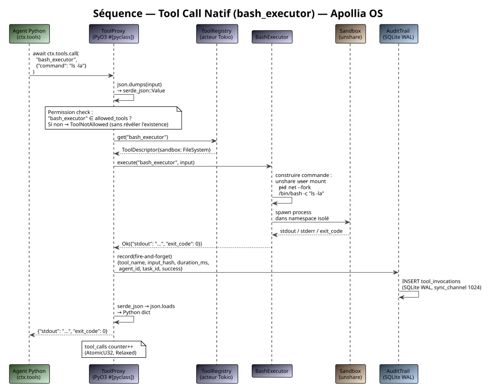

# Diagrammes d'Architecture

> Sources PlantUML : [`docs/diagrams/`](https://github.com/nidal-z/apollia-os/tree/main/docs/diagrams)
> Régénérer : `just diagrams`

## C4 — Vue Contexte

## C4 — Vue Container (7 crates)

## C4 — Composants Runtime Core

## Machine d'état — Agent (ProcessState)

## Machine d'état — Tâche (TaskState)

## Séquence — Cycle de vie d'une tâche

## Séquence — Boucle ORIA

## Séquence — Appel outil natif

## Séquence — Appel outil MCP

## Séquence — Mémoire

