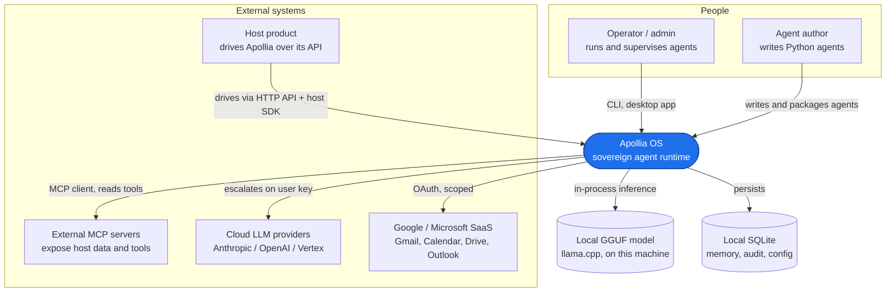

# 3. Context and scope

This is the C4 system context: Apollia OS as one box, and everything outside it
that it talks to. It sets the boundary before the next pages open the box.

## System context

## Actors and neighbours

| Neighbour | Relationship | Direction |
|---|---|---|
| **Operator / admin** | Runs, supervises, and approves. Uses the [CLI](/reference/cli) and the desktop operator app. | Drives Apollia |
| **Agent author** | Writes typed Python agents against the [SDK contract](/reference/sdk), then packages and installs them. | Builds for Apollia |
| **Host product** | Embeds and drives the runtime through the stable [HTTP API](/reference/api/apollia-os-runtime-api) and generated host SDKs. In the federation pattern the host is often Apollia's client and the other way around at once. | Bidirectional |
| **External MCP servers** | Apollia is an MCP client: it discovers and calls their tools over stdio, streamable HTTP, or SSE. It can also expose a limited inbound MCP server. | Apollia calls out (mostly) |
| **Cloud LLM providers** | Optional. A run can escalate to a frontier model on the user's own key, while local stays the default. | Apollia calls out |
| **Google / Microsoft** | Native connectors act on mail, calendar, and files through OAuth, on scoped permissions. | Apollia calls out |
| **Local model and database** | The GGUF model and the SQLite store both live on the same machine. Nothing here is remote. | In-boundary |

## What is inside the boundary

Everything that does the agent work: reasoning and planning, the tool calls,
memory, governance (permissions, audit, budgets), local inference, and the
surfaces (API, CLI, desktop). The next page,
[Solution strategy](/architecture/solution-strategy), states the structural
decisions that shape the inside; [Building block view](/architecture/building-blocks)
opens it into its parts.

## What is deliberately outside

The host's own data store stays on the host side and is read through MCP tools,
never copied wholesale into the runtime. Cloud inference is opt-in, not a
dependency. There is no Apollia-operated cloud service in the loop: the runtime
is the product, running on the adopter's machine.
