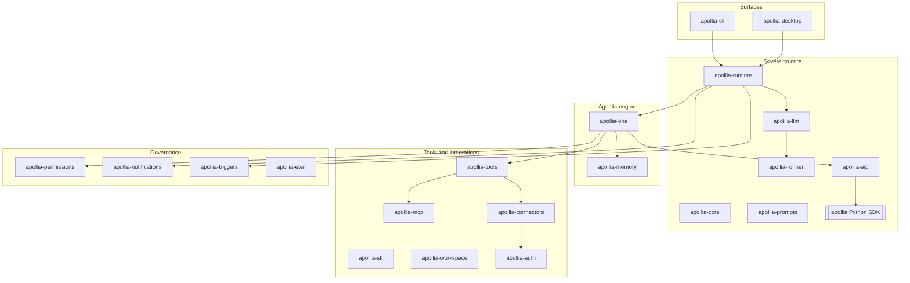

# 5. Building block view

This is the C4 container and component view. Apollia is a Rust workspace of
twenty crates plus a Python SDK, grouped into five domains. Each crate below
carries a one-line role that matches what the code actually does. For the exact
shapes of the API, the CLI, and the SDK, this page links to the generated
reference rather than restating it.

## Containers by domain

The arrows show the main call directions, not every edge. Governance
(`apollia-permissions`) and the audit trail (inside `apollia-runtime`) sit on
the path of every governed tool call, which the [Runtime view](/architecture/runtime-view)
makes concrete.

## Sovereign core

| Crate | Role |
|---|---|
| **apollia-runtime** | The daemon. Hosts the Tokio actor supervisor, the EventBus, the axum HTTP API, chat and plan management, and the signed audit journal with verify and rollback. |
| **apollia-runner** | The speech-to-text sidecar: `whisper` (via `whisper-rs`) out of process, one GPU backend per build. Local LLM inference no longer runs here; it goes through the embedded `llama-server` (upstream llama.cpp) that the daemon supervises, over an OpenAI-compatible HTTP API with `--jinja` native tool calling and continuous batching. |
| **apollia-llm** | The multi-backend LLM router: local plus cloud (Anthropic, OpenAI, Vertex), daily cost tracking, a Hugging Face GGUF registry, and hardware detection. |
| **apollia-core** | Shared types: the unified plan model, configuration, lifecycle hooks, and the hybrid routing configuration that lets a run escalate to a frontier model on a user key. |
| **apollia-aip** | The PyO3 bridge and the A2A path that lets agents call one another by skill. |
| **apollia-prompts** | The English prompt corpus with a language footer, shared across the engine. |
| **apollia (Python SDK)** | AgentKit: the `@agent` and `@skill` decorators, `TypedDict` payloads, the test harness and mocks, datasources, templates, and gated secrets. The runtime context is the fifteen-service `ctx`. |

The `ctx` contract is `sdk/apollia/types.py` and is documented service by
service in the [SDK reference](/reference/sdk). The fifteen services are `llm`,
`memory`, `tools`, `a2a`, `mail`, `datasources`, `templates`, `secrets`,
`events`, `logger`, `profile`, `workspace`, `stt`, `notify`, and `budget`.

## Agentic engine

| Crate | Role |
|---|---|
| **apollia-oria** | The autonomous engine. It runs a ReAct loop in two modes, direct and orchestrated, with an observer that classifies and a reasoner that plans and re-plans. It carries the non-bypassable step budget, tool resilience, the verification and critic pass, three-tier context compaction with disk offload, and read-only tool parallelism over a dependency graph. |
| **apollia-memory** | Three memory layers (episodic, semantic, procedural) over SQLite FTS5 with BM25 ranking, an injection tracker, TTL purge, a plan-choice store, and sovereign export and import. Recall happens at the agent's initiative, never auto-injected. |

## Tools and integrations

| Crate | Role |
|---|---|
| **apollia-tools** | The native tool library (shell, Python, file operations, notebook, HTTP fetch, web search and read, memory search, ask-user), with a path sandbox, SSRF guard, a risk classifier, permission rules, and a SHA-256 audit of each call. |
| **apollia-mcp** | The MCP client (initialize plus tools/list over stdio, streamable HTTP, and SSE, with HITL approvals and optional mDNS discovery). Agents invoke MCP tools through the governed tool path. An inbound MCP server exists but is partial (stdio only). |
| **apollia-connectors** | Native Google and Microsoft connectors acting on mail, calendar, and files. Google is scoped to non-restricted, free-tier scopes; Microsoft is broader. Tokens go to the keyring or an age-encrypted file. |
| **apollia-stt** | Local speech-to-text on `whisper`: batch transcribe and translate plus an audio pipeline. Batch only, no streaming. |
| **apollia-workspace** | Project context (Git, an `APOLLIA.md` rules provider, a file tree, a script provider) and custom slash-commands: the harness layer around an agent. |
| **apollia-auth** | OAuth and PKCE flows backing the connectors, with secrets landing in the keyring or an age file. |

For the full native tool list see the [native tool catalog](/reference/native-tools).

## Governance

| Crate | Role |
|---|---|
| **apollia-permissions** | Permission types and decisions, scoped to install, project, or session, with four autonomy tiers and an approvals register. Every decision is audited. What ships enabled is the prefix-rule engine; the `PermissionEngine` aggregate, its safe-list and its shell-injection detector are present but not wired into the application (see [crosscutting concepts](./07-crosscutting-concepts.md)). |
| **apollia-notifications** | Operator notifications across desktop, terminal, and webhook, with severity, HITL, and an inactivity watcher. |
| **apollia-triggers** | Scheduled and reactive agent starts: cron, interval, one-shot, and file-watch are wired; the webhook source is a stub. |
| **apollia-eval** | Sovereign evaluation: declarative TOML suites, an LLM-as-judge, and success, length, wall-clock, and cost metrics. |

The audit journal, verification, and rollback that back accountability live in
`apollia-runtime`. See [the accountability model](/explanation/accountability-model)
for how they fit together, and [Audit, verify and roll back a run](/how-to/audit-verify-rollback)
for the commands.

## Surfaces

| Crate | Role |
|---|---|
| **apollia-cli** | The AI-native CLI: `do` (natural language to a validated command over the real command tree, dry-run and confirm, re-dispatched through governance), `explain` (read-only), `suggest` (deterministic, no LLM), a fuzzy palette, and a written `guide`. |
| **apollia-desktop** | The Tauri v2 and Svelte 5 operator app. Hundreds of Tauri commands across dozens of modules give an operator view over chat, MCP, connectors, tasks, memory, governance, notifications, and audit, reaching the backend through a direct handle or a local REST bridge. |

The command surface is the [CLI reference](/reference/cli); the HTTP surface the
desktop and hosts drive is the [HTTP API reference](/reference/api/apollia-os-runtime-api).
