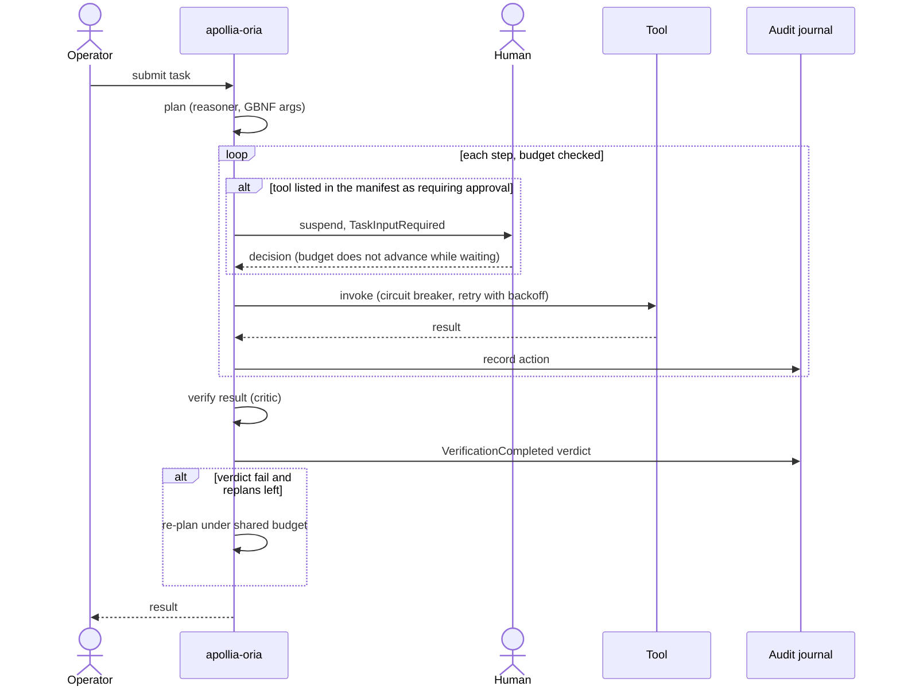
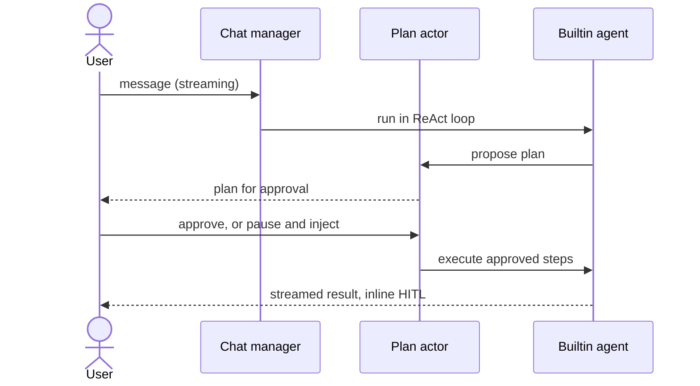
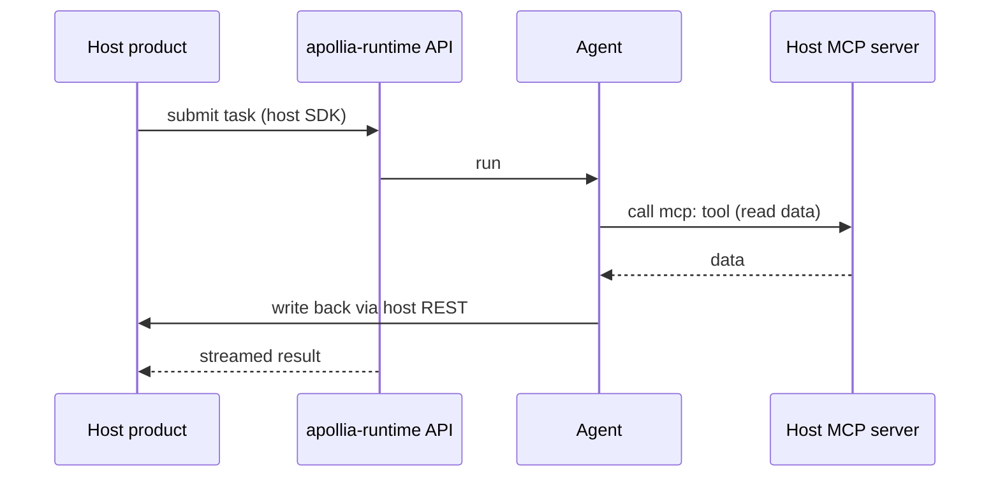
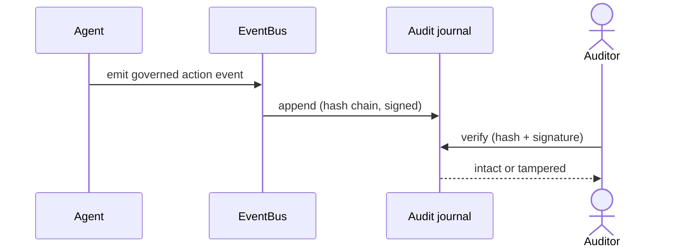
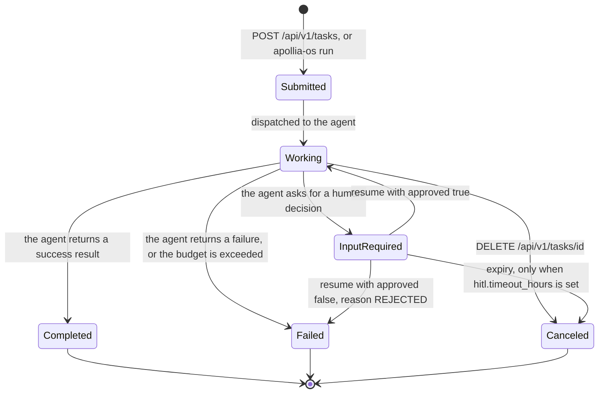
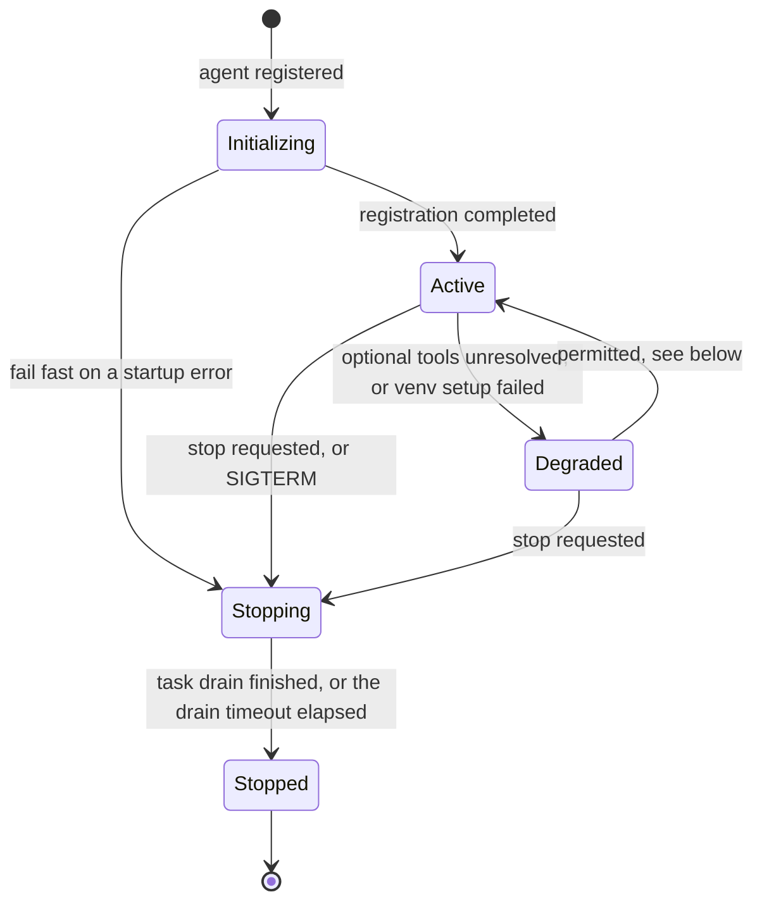
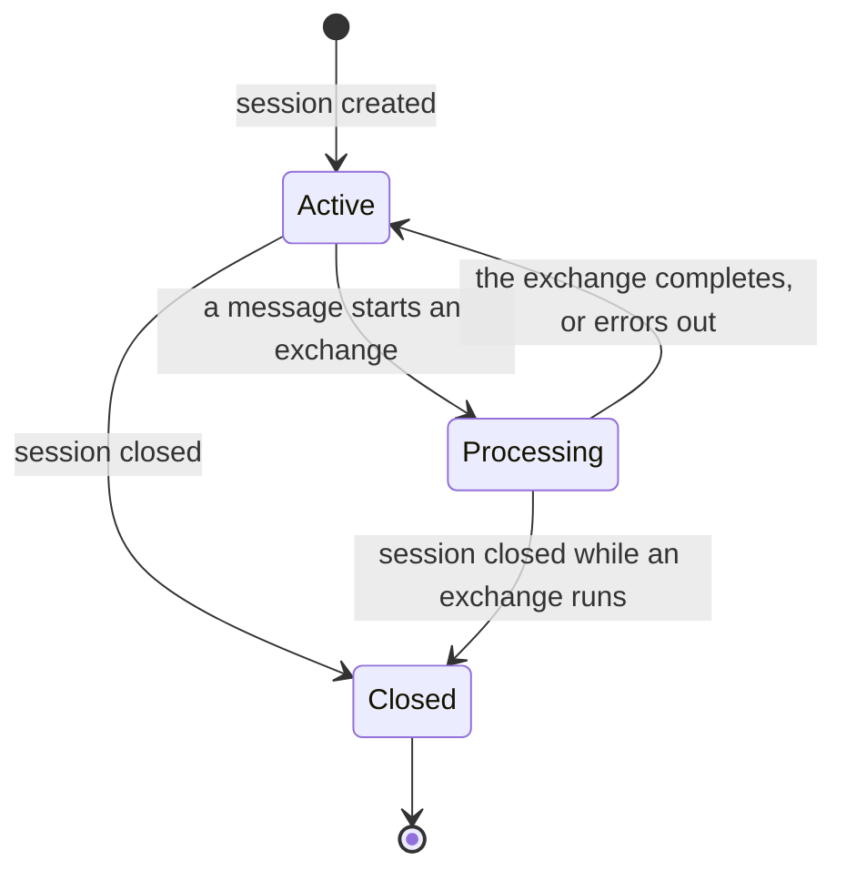
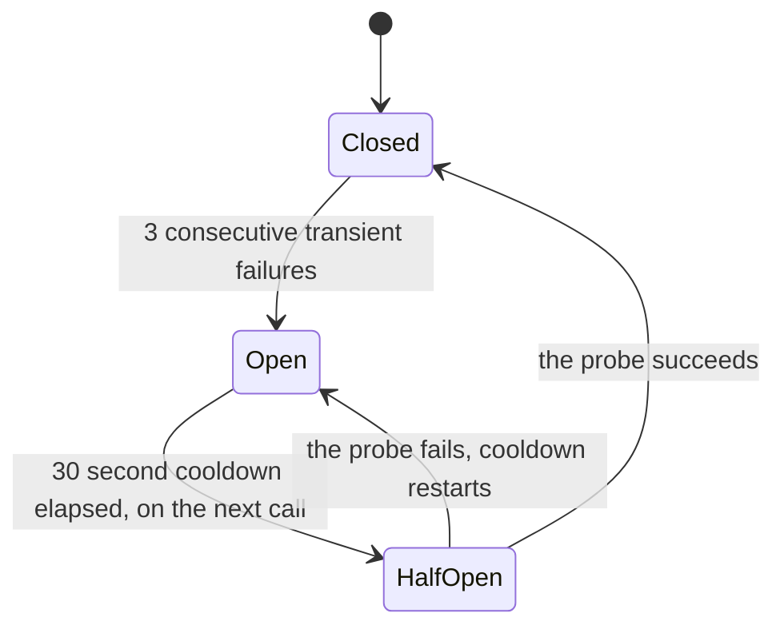

# 6. Runtime view

Four end-to-end scenarios show how the building blocks cooperate at run time.
Each is anchored to a real, wired capability; where a step is only partly wired,
it is called out here and in [Risks and technical debt](/architecture/risks-and-technical-debt).

## Scenario A: an orchestrated task with verification

An operator hands a task to an autonomous agent. The engine plans, executes
governed tool calls under a budget, then a critic verifies the result and can
re-plan on a failing verdict, all within the same ceiling.



The budget increment is wired into the actor loop, so the ceiling actually stops
the agent. The critic runs; running an agent's declared shell checks under
governance is a later step. Decisions ADR-038 (step args) and ADR-039
(verification and critic).

<!-- claim:orchestrated-approval-from-manifest -->

Read the approval branch precisely, because it is narrower than it looks. On
this path the only thing that makes a step stop for a human is the agent's own
manifest listing that tool under `tools_requiring_approval`. There is no policy
evaluation, no operator-side rule, and nothing the runtime decides on its own:
an agent that declares nothing runs every step unattended. The prefix rules and
the approval prompts described in the next scenario belong to the chat path and
are not consulted here.

The suspension is a plain await, so the step budget does not advance while a
human thinks. If the runtime was built without an approvals registry, the step
runs anyway and logs a warning: the gate degrades open, not closed.

## Scenario B: chat with plan-mode

A user talks to the runtime in streaming, and for a consequential request the
agent proposes a plan the user approves before execution, with the option to
pause, inject, and resume.



Chat, plan-mode, HITL, fork and children, and pause-inject-resume are wired. One
nuance: sessions left in a processing state are not reloaded at boot, and resume
moves them back to active. Decisions ADR-031, ADR-032, ADR-022.

## Scenario C: host federation over MCP and REST

A host product drives the runtime through the stable API while exposing its own
data over MCP. Apollia reads through the host's MCP tools and writes back through
the host's REST API, so the host stays the system of record.



The MCP client, the governed `mcp:` tool path, and the OpenAPI-plus-SDK driving
contract are wired and proven. See [Embed via federation](/how-to/embed-via-federation)
and [Integrate via the driving contract](/how-to/integrate-via-driving-contract).

## Scenario D: an audited run

Every governed action lands in a signed, hash-chained journal. After the fact,
the run can be verified for integrity.



The signed journal and verification are wired. Replay (re-execution and
comparison) was abandoned by decision; accountability rests on the journal and
verification. Decision ADR-033; the narrative is
[the accountability model](/explanation/accountability-model).

## Scenario E: how a tool call is governed in chat

<!-- claim:chat-tool-governance-path -->

This is the path that actually decides whether a tool runs when a user is
talking to the runtime. It is worth reading in full, because it is the one most
often described wrongly: there is no central permission engine sitting in front
of tool calls, and no injection classifier in the decision. The gate is a set
membership, and what fills that set is what matters.

```mermaid
sequenceDiagram
    actor User
    participant Chat as Chat manager
    participant Rules as Prefix rules (governance.db)
    participant Loop as ReAct loop
    participant Tool
    Chat->>Rules: allow-rules for this agent, and global ones
    Rules-->>Chat: tool names to pre-authorize
    Note over Chat: code executors are filtered out here
    User->>Loop: message
    Loop->>Loop: model asks for a tool
    alt tool name is in the authorized set
        Loop->>Tool: invoke
    else not authorized
        Loop-->>User: ChatApprovalRequired (5 minute timeout)
        User-->>Loop: allow once, always allow, or refuse
        alt refused, or the timeout expires
            Loop->>Loop: nothing runs, the model is told
        else allowed
            Loop->>Tool: invoke
        end
    end
    Tool-->>Loop: result
    opt always allow
        Loop->>Rules: persist an allow rule at the chosen scope
    end
```

Four properties follow from that shape, and each one is a deliberate choice
rather than an accident.

**The first gate is by tool name, the second by argument.** Authorizing
`file_read` once with "always allow" authorizes it for every path it will ever
be given at that scope: the pre-authorization set is name-only, and
argument-level prefix rules are skipped when seeding it because it cannot
represent them. On a miss of that set, the loop evaluates the stored prefix
rules against the call's argument, per invocation, before raising an approval;
a matching allow runs the call without widening the set, and a matching deny
refuses it without a prompt.

**Code executors are exempt from every blanket authorization.** `bash_executor`
and its siblings are filtered out of the pre-authorized set on all three routes
that fill it: the chat configuration, agent-scoped allow rules, and global allow
rules. "Always allow" on one is refused at persistence time as well. Outside a
targeted prefix rule, which only ever covers a single simple command, every
invocation asks, every time. This is the single invariant that survives all the
paths above, and it exists because a blanket allow on a shell is a blanket allow
on everything.

**No answer is treated as a refusal.** An approval prompt that goes unanswered
for five minutes resolves to a refusal, and no tool runs. The timeout is fixed
in the code and is not configurable.

**"Always allow" means one of five stickinesses.** The operator picks the scope:
this tool for the turn, this session, this agent, this project, or machine-wide.
The default is the session, the least sticky of the five. Anything above the
session is written to `governance.db` and comes back on the next run, which is
what makes the first step of the diagram non-empty.

## State machines

The four scenarios above move things between states. The states themselves are
enumerated in the code and, in two cases, the transitions are enforced there
rather than merely intended.

### Task

A task carries one of six statuses, defined by `TaskStatus` in `apollia-core`.



Two details are easy to get backwards.

A rejected approval does not cancel the task, it fails it. The engine returns a
failure carrying the code `REJECTED` and the operator's reason, without calling
the agent again.

A task waiting on a human waits **indefinitely by default**. `[hitl]
timeout_hours` has no default value, so nothing expires a suspended task unless
an operator sets one; `scan_interval_secs` is ignored while it is unset. See the
[configuration reference](/reference/configuration).

Submission is refused outright when the target agent is not in a state to take
work: initializing, stopping and stopped are rejected. A degraded agent still
accepts tasks, and the submission emits a warning.

### Agent process

<!-- claim:process-state-transitions-enforced -->

The agent registry rejects an invalid transition instead of recording it. This is
a real gate, not a convention: `ProcessState::can_transition_to` is consulted on
every state change, and a disallowed one returns an error to the caller.



There is no transition from `Initializing` straight to `Stopped`: a startup
failure goes through `Stopping` like any other stop.

`Degraded` means the agent runs but something optional did not come up. Two
paths reach it, both at registration: optional tools declared and not resolved,
and a Python environment whose package installation failed. `Degraded` to
`Active` is permitted by the transition table, and the runtime never performs it
on its own, so an agent that starts degraded stays degraded until it is
restarted.

The drain timeout defaults to 30 seconds.

### Chat session



`Processing` is what makes a second message on the same session refuse rather
than interleave. Closing a session cancels the exchange in flight. `Closed` is
terminal: the history stays readable, nothing new is accepted.

### Tool circuit breaker

<!-- claim:tool-circuit-breaker-wired -->

Each tool carries its own circuit breaker, keyed by tool name. Repeated
transient failures on one tool stop the calls to that tool and leave the others
alone.



Only failures classified transient count. A permanent error, a bad argument or a
refused permission, leaves the counter untouched: the breaker exists to ride out
a flapping dependency, not to punish a caller. A single success resets the
counter to zero.

The cooldown is not a timer that fires. The breaker moves to `HalfOpen` when the
next call arrives after the cooldown has elapsed, so a tool nobody calls stays
`Open` indefinitely. `HalfOpen` does not restrict concurrency: calls that arrive
together are all admitted, and the first result decides the transition.

Threshold and cooldown are fixed at 3 and 30 seconds. They are not configurable.
