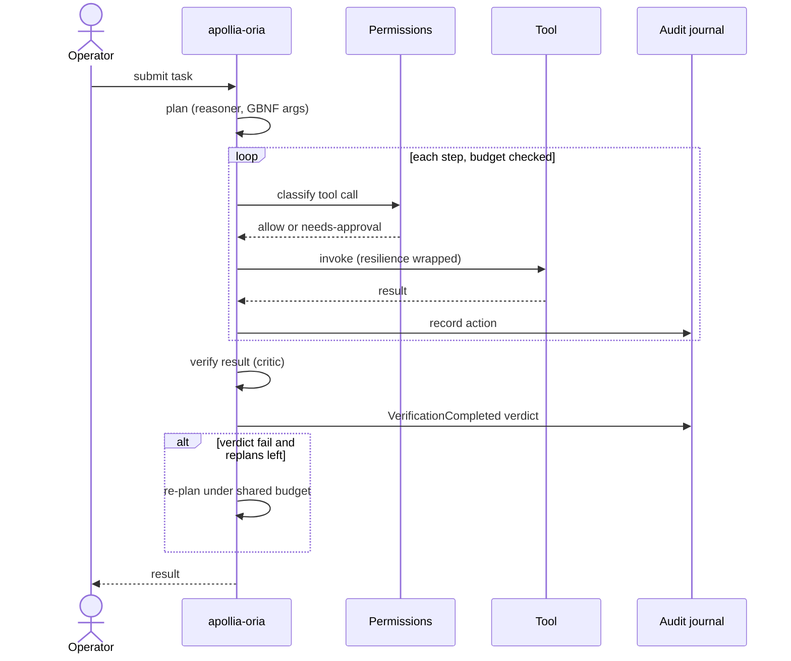
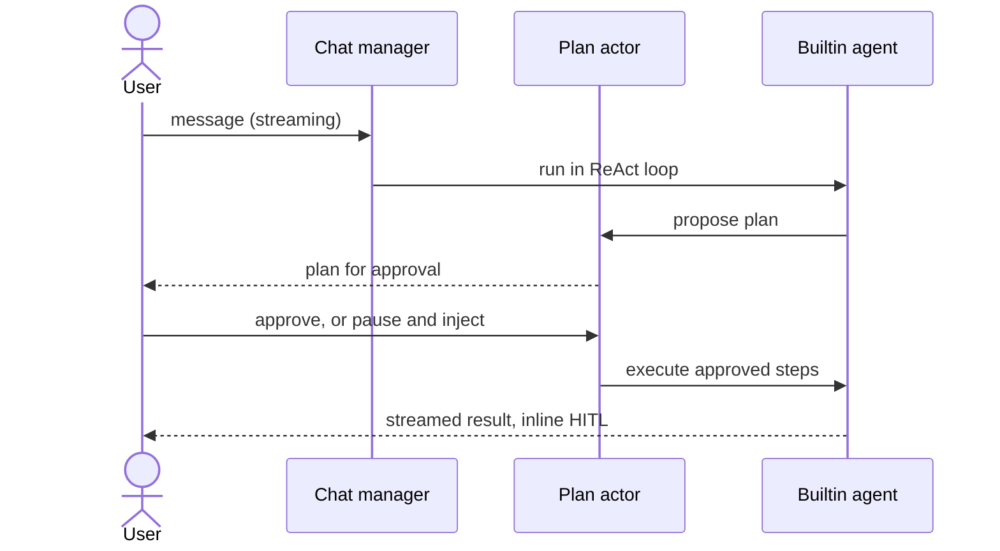
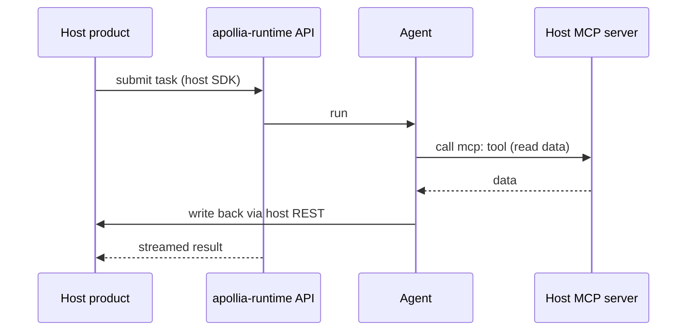
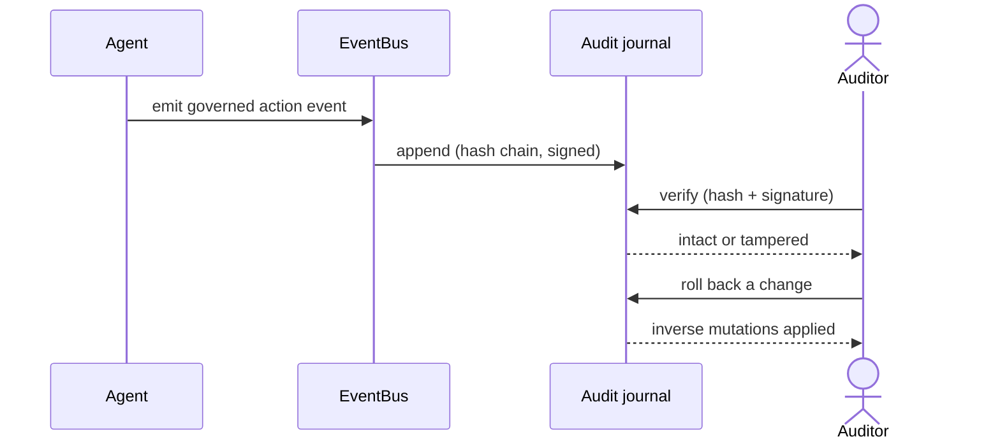

# 6. Runtime view

Four end-to-end scenarios show how the building blocks cooperate at run time.
Each is anchored to a real, wired capability; where a step is only partly wired,
it is called out here and in [Risks and technical debt](/architecture/risks-and-technical-debt).

## Scenario A: an orchestrated task with verification

An operator hands a task to an autonomous agent. The engine plans, executes
governed tool calls under a budget, then a critic verifies the result and can
re-plan on a failing verdict, all within the same ceiling.

The budget increment is wired into the actor loop, so the ceiling actually stops
the agent. The critic runs; running an agent's declared shell checks under
governance is a later step. Decisions ADR-038 (step args) and ADR-039
(verification and critic).

## Scenario B: chat with plan-mode

A user talks to the runtime in streaming, and for a consequential request the
agent proposes a plan the user approves before execution, with the option to
pause, inject, and resume.

Chat, plan-mode, HITL, fork and children, and pause-inject-resume are wired. One
nuance: sessions left in a processing state are not reloaded at boot, and resume
moves them back to active. Decisions ADR-031, ADR-032, ADR-022.

## Scenario C: host federation over MCP and REST

A host product drives the runtime through the stable API while exposing its own
data over MCP. Apollia reads through the host's MCP tools and writes back through
the host's REST API, so the host stays the system of record.

The MCP client, the governed `mcp:` tool path, and the OpenAPI-plus-SDK driving
contract are wired and proven. See [Embed via federation](/how-to/embed-via-federation)
and [Integrate via the driving contract](/how-to/integrate-via-driving-contract).

## Scenario D: an audited run

Every governed action lands in a signed, hash-chained journal. After the fact,
the run can be verified for integrity and, for filesystem changes made in a chat
session, rolled back.

The signed journal, verification, and reversible rollback are wired. Replay
(re-execution and comparison) was abandoned by decision; accountability rests on
journal, verify, and rollback. Decision ADR-033; the narrative is
[the accountability model](/explanation/accountability-model).
