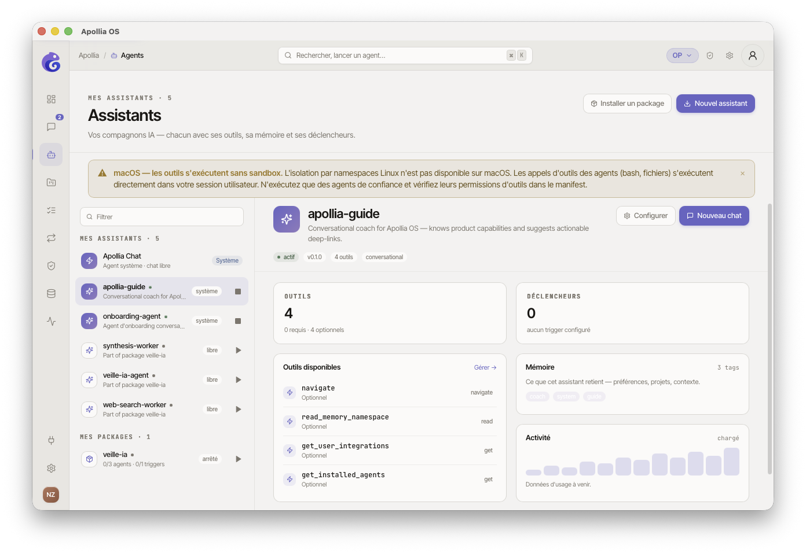
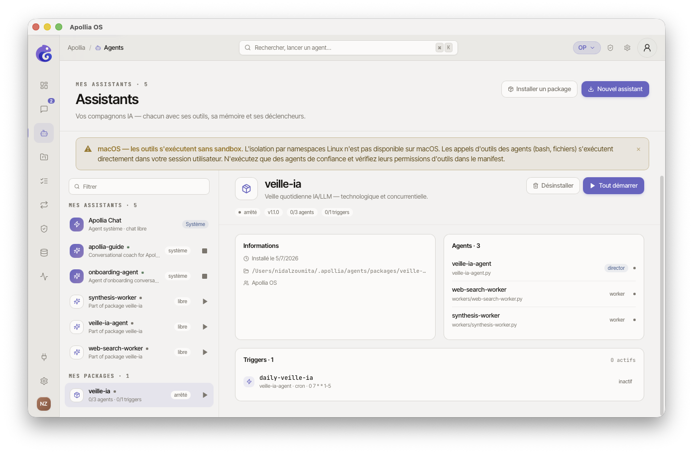
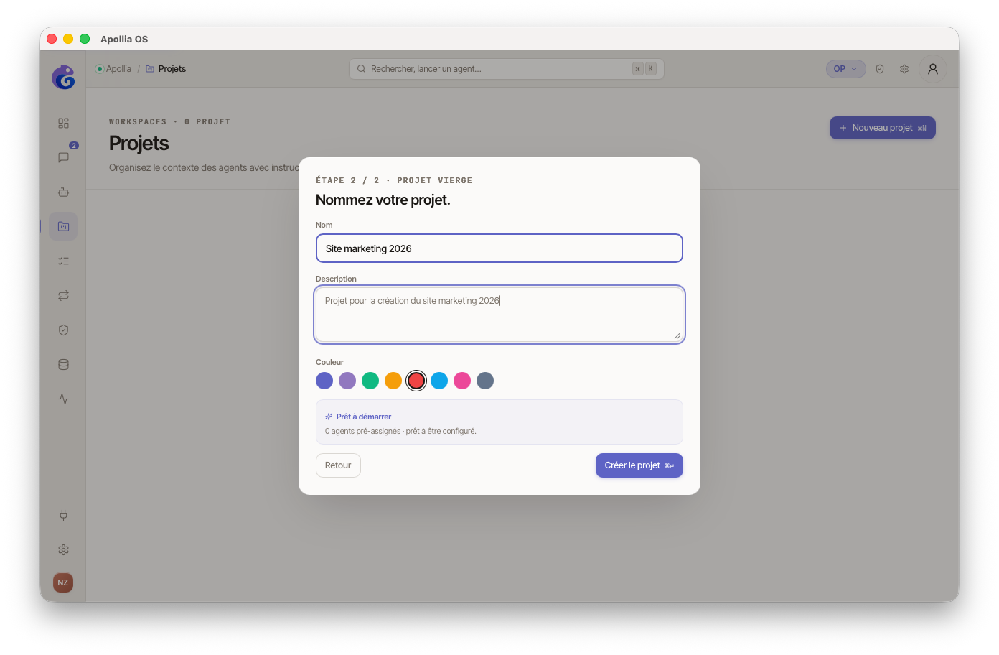

# Démarrer un agent ou un package

> Pour tout operator qui a installé un agent (ou un package d'agents) : le mettre en marche pour pouvoir lui parler ou laisser ses déclencheurs s'activer.

## Prérequis

- L'agent ou le package est installé et visible dans la colonne de gauche de **Mes assistants**.
- Un fournisseur d'IA est connecté (pastille verte dans le bandeau supérieur).

## Agent ou package : quelle différence côté usage ?

Dans la page **Mes assistants**, la colonne de gauche affiche deux sections distinctes :

- **Mes assistants** - un agent unique, identifié par une icône d'étoile. On le démarre seul. C'est le format livré pour un agent simple (un fichier `.py`).
- **Mes packages** - un ensemble cohérent d'agents qui travaillent souvent ensemble, identifié par une icône de boîte. Démarrer un package, c'est démarrer **tous ses agents et activer ses déclencheurs** d'un coup.

Vous y trouverez aussi un agent système épinglé en haut, **Apollia Chat** : il est toujours disponible et ne nécessite ni installation ni démarrage.

## Étapes - Démarrer un assistant seul

1. Dans la sidebar, ouvrez **Mes assistants**. La colonne de gauche liste vos assistants sous **Mes assistants · N**.
   

2. Repérez votre agent dans la liste. La pastille à droite de son nom indique son état : **grise** (arrêté), **verte** (actif), **orange** (dégradé).

3. Cliquez sur le **bouton lecture** (▶) à droite de la ligne. La pastille passe au vert et le bouton se transforme en bouton stop (■).

4. Cliquez sur la ligne (n'importe où sauf le bouton lecture) pour ouvrir le panneau de détail à droite. Vous y voyez son statut, ses outils, sa version et son activité.

5. Pour discuter avec lui, cliquez sur **Nouveau chat** en haut à droite du panneau de détail. Une conversation dédiée s'ouvre.

6. Pour libérer les ressources quand vous n'en avez plus besoin, recliquez sur le bouton stop de la ligne. La pastille redevient grise.

> Les agents marqués comme **workers** (uniquement appelés en interne par d'autres agents) n'apparaissent pas dans la section **Mes assistants** - vous les retrouverez dans le détail d'un package.

## Étapes - Démarrer un package entier

1. Dans la sidebar, ouvrez **Mes assistants**. Faites défiler la colonne de gauche jusqu'à la section **Mes packages · N**.

2. La ligne du package indique combien d'agents et de déclencheurs il contient au total et combien sont actifs (par exemple `0/2 agents · 0/1 triggers` quand tout est arrêté).

3. Cliquez sur le **bouton lecture** (▶) à droite de la ligne. Apollia démarre tous les agents du package et active leurs déclencheurs en une seule opération. La pastille passe au vert ; le compteur affiche `2/2 agents · 1/1 triggers`.

4. Cliquez sur la ligne pour ouvrir le détail du package : vous y voyez la liste des agents qu'il contient, leurs rôles (*director* ou *worker*), et la liste des déclencheurs configurés (cron, webhook…).
   



5. Si certains agents seulement ont démarré, la pastille du package devient **orange** (statut **partiel**). Cliquez sur la ligne d'un agent dans le panneau pour identifier celui qui pose problème, puis ouvrez ses logs.

6. Pour tout arrêter d'un coup : recliquez sur le bouton stop de la ligne du package, ou utilisez **Tout arrêter** en haut à droite du panneau de détail.

## Cas particulier - Apollia Chat

L'agent système **Apollia Chat**, épinglé en haut de la liste, est **toujours actif** : pas de bouton démarrer/arrêter. Cliquez dessus pour ouvrir son panneau de configuration (personnalité, outils, modèle).

## Choisir le palier d'autonomie avant de lancer

Par défaut, un agent démarre en palier `assisted` : il demande votre approbation à chaque action sensible. Vous pouvez choisir un palier différent pour une exécution précise avec le flag `--autonomy` :

```
apollia-os run --autonomy <palier>
```

Les quatre paliers disponibles :

| Palier | Comportement |
|---|---|
| `assisted` | Défaut. Approbation humaine à chaque action sensible. |
| `supervised` | Boucle de vérification automatique après chaque étape. Les anomalies détectées sont corrigées sans vous solliciter ; seules les situations résistantes remontent. |
| `bounded_autonomous` | Autonomie étendue dans un périmètre défini. Moins d'interruptions, StepBudget plus large. |
| `long_autonomous` | Exécution longue durée. Vérification finale en sortie. Réservé aux tâches qui tolèrent un cycle sans approbation intermédiaire. |

Si vous omettez le flag, le palier configuré dans vos préférences s'applique (par défaut `assisted`).

> Pour le détail des paliers et leurs garanties, voir [Paliers d'autonomie](choisir-un-palier-d-autonomie.md).

## Vérification

- **Assistant seul** - pastille verte sur la ligne et dans le panneau de détail. L'envoi d'un message dans **Nouveau chat** déclenche une réponse en streaming.
- **Package** - pastille verte et compteur du type `N/N agents · M/M triggers`. Les déclencheurs (cron, webhook…) sont actifs.

## Si ça ne marche pas

- **La pastille reste orange ou rouge :** ouvrez les logs de l'agent depuis son panneau de détail (lien **Logs** en bas) pour lire l'erreur précise.
- **Erreur « fournisseur d'IA indisponible » :** vérifiez la pastille du bandeau supérieur et reconnectez le fournisseur si besoin.
- **Bouton lecture grisé sur un agent :** son chemin d'installation est introuvable (fichier déplacé ou supprimé). Réinstallez-le.
- **Bouton lecture grisé sur un package :** le dossier source du package a disparu (icône d'avertissement à côté du nom). Réinstallez le package depuis sa source.
- **Package en statut « partiel » :** un ou plusieurs agents n'ont pas démarré. Le détail du package liste l'état de chaque agent - ouvrez les logs de celui qui est en échec.
- **L'agent s'arrête trop vite :** le StepBudget du palier actuel est atteint. Montez le palier avec `--autonomy supervised` ou `--autonomy bounded_autonomous` selon votre niveau de confiance. Voir [Paliers d'autonomie](choisir-un-palier-d-autonomie.md).
- **L'agent démarre mais ne répond pas :** consultez [Un agent est bloqué](../troubleshooting/un-agent-est-bloque.md).

> **Concept :** [Explication Apollia](../../explanation/index.md) - comprendre la différence director/worker dans un package et leur cycle de vie.
