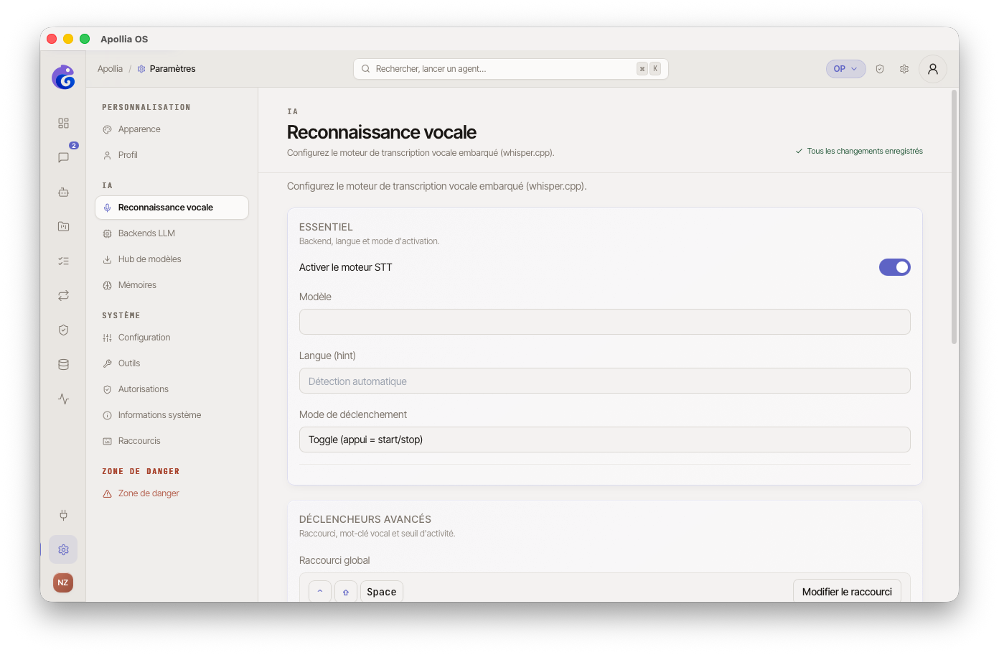
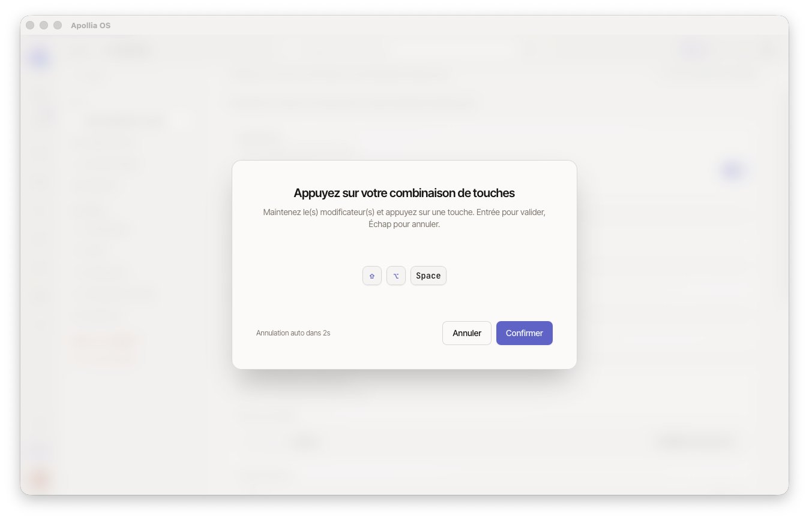

# Activer la dictée vocale

> Pour tout operator qui veut parler à son IA au lieu de taper : configurer un raccourci clavier qui transcrit votre voix directement dans le champ de chat, en local.

## Prérequis

- Un modèle Whisper est téléchargé via [Télécharger des modèles locaux](../installation/telecharger-des-modeles-locaux.md).
- Le microphone de votre machine fonctionne et Apollia a l'autorisation d'y accéder.
- Un raccourci clavier libre, qui n'entre pas en conflit avec l'OS ou une autre application.

## Étapes

1. Dans la sidebar, cliquez sur **Paramètres**, puis sur la section **Reconnaissance vocale**.
   

2. Vérifiez que le modèle Whisper apparaît avec une pastille verte **Chargé**. Sinon, retournez au Hub de modèles pour le télécharger.

3. Sélectionnez la **langue** de dictée (français, anglais, espagnol, etc.) dans le sélecteur. Choisir la bonne langue améliore nettement la précision.

4. Cliquez sur le champ **Raccourci global**. Une fenêtre invite à appuyer sur la combinaison de touches souhaitée (par exemple **Cmd + Shift + Espace**).
   

5. Activez l'interrupteur **Mode push-to-talk**. Avec ce mode, vous maintenez le raccourci pendant que vous parlez, et la transcription se déclenche au relâchement.

6. Ouvrez un chat depuis la sidebar.

7. Maintenez votre raccourci enfoncé. Un **overlay sombre plein écran** s'affiche avec un visualiseur audio à barres. Parlez naturellement.
   `[SCREENSHOT: overlay d'enregistrement avec visualiseur audio et texte "{hotkey} pour arrêter · Esc pour annuler"]`

8. Relâchez le raccourci. La transcription est injectée dans le champ de saisie via le presse-papiers.

   > **Note :** la transcription est insérée par simulation de collage (`Ctrl+V` / `Cmd+V`). Le champ de saisie doit être actif pour recevoir le texte.

9. Relisez, corrigez si besoin, puis appuyez sur **Entrée** pour envoyer.

## Vérification

Une phrase parlée de quelques secondes apparaît transcrite dans le champ de saisie, sans qu'aucune donnée n'ait quitté votre machine.

## Si ça ne marche pas

- **Aucune transcription :** vérifiez que le microphone est bien sélectionné dans les préférences système, puis consultez [La dictée vocale ne transcrit rien](../troubleshooting/la-dictee-vocale-ne-transcrit-rien.md).
- **Raccourci ignoré :** une autre application capte peut-être la même combinaison ; choisissez-en une moins courante.
- **Transcription approximative :** vérifiez que la langue sélectionnée correspond bien à celle parlée, et envisagez un modèle Whisper plus gros.
- **Le texte n'apparaît pas dans le champ :** assurez-vous que le champ de saisie du chat est actif (cliquez dessus) avant d'utiliser le raccourci.

> **Référence technique :** [Référence Apollia](../../reference/index.md) - moteurs supportés, tailles de modèles Whisper, formats audio, optimisations de latence.
