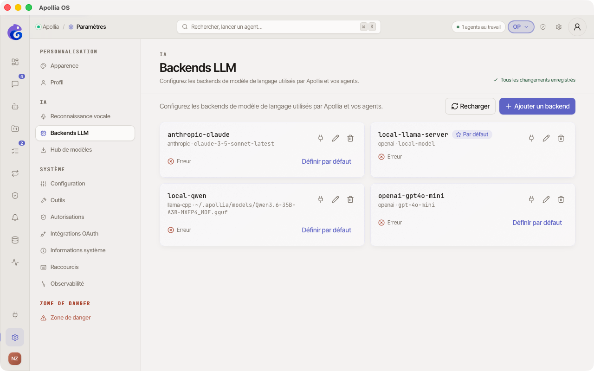

# Connecter un fournisseur d'IA

> Pour tout operator qui vient d'installer Apollia et veut brancher un premier fournisseur d'IA afin que le chat et les agents puissent répondre.

## Prérequis

- Apollia lancé et le bandeau supérieur affiche le statut connexion.
- Vous savez si vous voulez un fournisseur **cloud distant** (Anthropic, OpenAI, Mistral, Ollama distant) ou un **modèle local** chargé directement par Apollia.

## Quel parcours suivre

Apollia distingue trois cas d'usage. Choisissez selon ce que vous voulez :

- **Brancher un fournisseur cloud (Anthropic, OpenAI, Mistral) ou un serveur Ollama** : voir [Connecter un modèle distant](connecter-un-modele-distant.md). La clé API ou l'URL suffit, aucun téléchargement local.
- **Télécharger un modèle local au format GGUF** et le faire tourner directement dans Apollia via llama.cpp : voir [Télécharger des modèles locaux](telecharger-des-modeles-locaux.md). Idéal pour rester local-first.
- **Voir et gérer tous les backends déjà configurés** : ouvrez **Paramètres** puis **Backends LLM**.

## Étapes générales

1. Dans la sidebar, cliquez sur **Paramètres**, puis sur la section **Backends LLM**.

   

2. Cliquez sur **+ Ajouter un backend LLM** en haut à droite. Une fenêtre s'ouvre.

3. Selon votre choix, suivez la page dédiée :
   - Cloud ou Ollama distant : [Connecter un modèle distant](connecter-un-modele-distant.md).
   - Modèle GGUF local : [Télécharger des modèles locaux](telecharger-des-modeles-locaux.md) (le téléchargement vous amène ensuite à la même fenêtre d'ajout backend).

## Vérification

- Au moins un backend apparaît dans la liste avec une pastille verte.
- Le bandeau supérieur affiche le nom du backend par défaut.
- Ouvrez un chat et envoyez un message court, la réponse arrive en streaming.

## Si ça ne marche pas

- **Voyant rouge au test du backend** : la clé API est mauvaise ou le modèle n'existe pas. Voir les pages dédiées par type de fournisseur.
- **Pas de réponse dans le chat malgré pastille verte** : voir [Le fournisseur d'IA ne répond pas](../troubleshooting/le-fournisseur-d-ia-ne-repond-pas.md).
- **Vous voulez basculer sur un autre backend par défaut** : cliquez sur **Définir par défaut** dans la carte du backend voulu.

> **Référence technique :** [Référence Apollia](../../reference/index.md) , table complète des fournisseurs supportés, paramètres avancés, routing, fallback.
