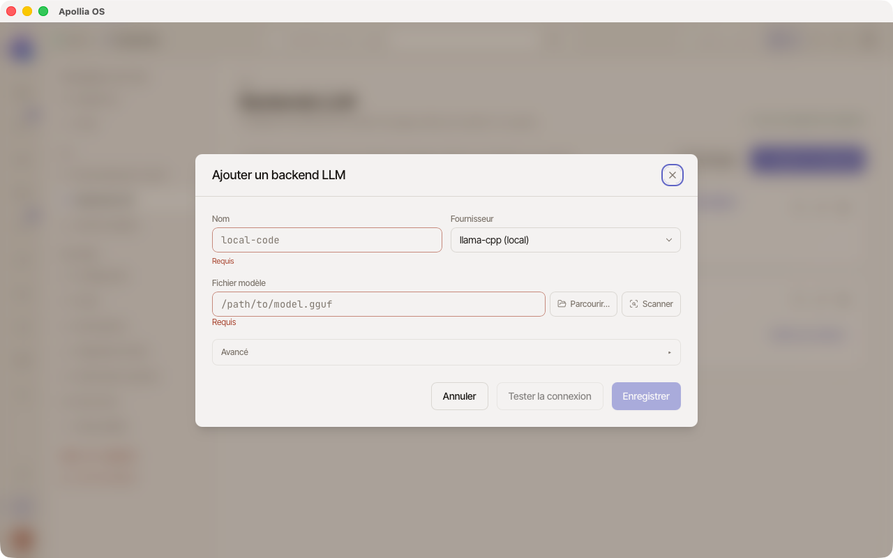

# Connecter un modèle distant

> Pour tout operator qui veut brancher Anthropic, OpenAI (ou compatible LM Studio, vLLM), Mistral, ou un serveur Ollama distant à Apollia.

## Prérequis

- Apollia lancé.
- Pour un modèle cloud, une clé API valide chez le fournisseur (lien vers la console plus bas par provider).
- Pour Ollama distant, l'URL d'une instance accessible depuis votre machine (et `ollama serve` qui tourne côté serveur).
- Connexion internet active, sauf si Ollama est sur votre réseau local.

## Ce que ce choix implique

Deux points à connaître avant de brancher un backend distant. Apollia les
rappelle aussi dans le formulaire, mais ils méritent d'être posés ici.

**Vos prompts quittent la machine.** Un backend distant reçoit ce qu'Apollia lui
envoie, ce qui peut inclure du contenu de fichiers, des souvenirs mémoire et des
données de workspace. C'est le comportement attendu d'un modèle distant, et c'est
précisément ce qu'un modèle local évite : avec le moteur `llama-server` embarqué,
rien ne sort. Le choix vous appartient, il doit juste être conscient.

**En `http://`, la clé d'API circule en clair.** Si l'endpoint n'est pas en
`https://` et pointe vers une autre machine, la clé transite sans chiffrement sur
le réseau. Sur un réseau local de confiance ou dans un tunnel, c'est acceptable.
Sinon, préférez `https://`. Ollama distant n'utilisant pas de clé, seul le premier
point s'applique à lui.

## Pour quel cas d'usage

- **Modèle distant** = cloud (Anthropic, OpenAI, Mistral) ou serveur Ollama joignable par HTTP.
- **Modèle local** = fichier `.gguf` servi par le moteur `llama-server` embarqué, géré automatiquement par Apollia. Voir [Télécharger des modèles locaux](telecharger-des-modeles-locaux.md).
- **Vue d'ensemble des backends** : voir [Connecter un fournisseur d'IA](connecter-un-fournisseur-d-ia.md).

## Étapes communes

1. Dans la sidebar, ouvrez **Paramètres**, puis la section **Backends LLM**.
2. Cliquez sur **+ Ajouter un backend LLM** en haut. Une fenêtre de configuration s'ouvre.

   

3. Donnez un **nom** unique (lettres minuscules, chiffres et tirets, par exemple `claude-anthropic`).
4. Choisissez le **fournisseur** dans la liste déroulante.
5. Renseignez les champs spécifiques au fournisseur (voir sections ci-dessous).
6. Cliquez sur **Tester** pour valider la connexion. Un badge vert *"OK · XXX ms"* confirme que le fournisseur répond.

   *Capture : le dialogue de configuration avec le fournisseur sélectionné, les champs Endpoint et API Key remplis, et un badge vert « OK · 312 ms » affiché sous le bouton Tester.*

7. Si le test passe, cliquez sur **Enregistrer**. Le backend apparaît dans la liste.
8. (Optionnel) Cochez **Backend par défaut** pour qu'il soit sélectionné automatiquement à l'ouverture d'un nouveau chat.

## Anthropic

- **Endpoint par défaut** : `https://api.anthropic.com` (laissez tel quel sauf gateway custom).
- **Où obtenir la clé** : https://console.anthropic.com, section **API Keys**.
- **Modèles recommandés v0.1.0** (identifiants datés, format exact attendu par l'API) :
  - `claude-opus-4-20250514` pour la qualité maximale.
  - `claude-sonnet-4-20250514` pour un bon rapport qualité/vitesse.
  - `claude-3-5-haiku-20241022` pour la rapidité et un coût bas.

  Les identifiants de modèles évoluent : reprenez toujours l'identifiant exact du modèle courant depuis la [liste des modèles Anthropic](https://docs.anthropic.com/en/docs/about-claude/models).

Apollia applique automatiquement le prompt caching côté Anthropic.

## OpenAI (ou compatible)

- **Endpoint par défaut** : `https://api.openai.com/v1`.
- **Endpoint custom** : utilisez l'URL `/v1` correspondante pour LM Studio, vLLM, OpenRouter, Azure OpenAI ou tout autre service compatible.
- **Où obtenir la clé** : https://platform.openai.com, section **API keys**.
- **Modèles recommandés** : `gpt-4o-mini`, `gpt-4o`, `o1-mini`.

## Mistral

- **Endpoint par défaut** : `https://api.mistral.ai/v1`.
- **Où obtenir la clé** : https://console.mistral.ai, section **API keys**.
- **Modèles recommandés** : `mistral-large-2`, `mistral-small`.

## Ollama distant

- **Endpoint** : `http://<host>:11434/v1` pour un serveur distant, ou `http://localhost:11434/v1` si Ollama tourne sur votre machine.
- **API Key** : optionnelle (utile si vous avez un reverse-proxy avec authentification).
- **Prérequis service** : `ollama serve` doit tourner sur l'hôte cible.
- **Modèles** : voir `ollama list` sur l'hôte. Exemples : `llama3.1:8b`, `qwen2.5:14b`.

Pour un modèle GGUF géré directement par Apollia via son moteur embarqué (sans daemon Ollama), voir [Télécharger des modèles locaux](telecharger-des-modeles-locaux.md).

## Routage hybride : escalader vers un modèle frontier

Le routage hybride permet à Apollia d'utiliser un modèle local par défaut et de basculer automatiquement vers un modèle frontier (cloud) pour les étapes qui dépassent les capacités locales, dans la limite d'un plafond de coût.

Configurez-le dans votre fichier de configuration Apollia :

```toml
[llm.routing.hybrid]
frontier = "claude-anthropic"   # nom du backend distant à utiliser en escalade
cost_ceiling_usd = 0.50         # plafond en dollars par exécution
```

Avec ce réglage, le runtime évalue chaque étape : si elle nécessite le modèle frontier et que le plafond n'est pas encore atteint, l'escalade se fait automatiquement. Au-delà du plafond, le runtime repasse en local.

Le backend désigné dans `frontier` doit être configuré et actif dans **Paramètres - Backends LLM**.

## Vérification

- Le backend apparaît dans la liste avec une pastille verte.
- Ouvrez un chat, sélectionnez ce backend dans le sélecteur en haut, envoyez un message court. La réponse arrive en streaming.
- Le bandeau supérieur d'Apollia affiche le nom du backend actif.

## Si ça ne marche pas

- **Erreur 401 ou 403 au test** : votre clé API est invalide, expirée ou révoquée. Recopiez la clé depuis la console du fournisseur sans espaces parasites.
- **Erreur "Modèle non trouvé"** : vérifiez l'orthographe exacte du nom (case-sensitive, par exemple `claude-3-5-sonnet-20241022` et pas `Claude-3.5-Sonnet`).
- **Timeout sur cloud** : vérifiez votre connexion internet ou le statut du fournisseur.
- **Ollama injoignable** : vérifiez que `ollama serve` tourne sur l'hôte cible et que le port 11434 est ouvert. Pour Ollama distant, testez avec `curl http://<host>:11434/api/tags` depuis votre machine.
- **Pas de réponse dans le chat malgré pastille verte** : voir [Le fournisseur d'IA ne répond pas](../troubleshooting/le-fournisseur-d-ia-ne-repond-pas.md).
- **Plafond atteint et l'agent ne termine pas** : quand `cost_ceiling_usd` est atteint, le runtime dégrade automatiquement en local pour la suite de l'exécution. Si la tâche nécessite absolument le modèle frontier jusqu'au bout, augmentez le plafond ou désactivez le routage hybride en retirant la section `[llm.routing.hybrid]`.

> **Référence technique :** [Référence Apollia](../../reference/index.md) , tous les fournisseurs supportés, paramètres avancés (temperature, top_k, context_size, fallback policy), routing multi-backend.
