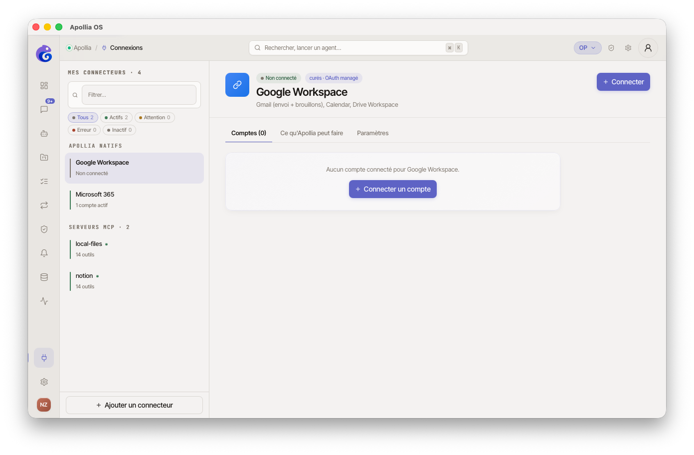
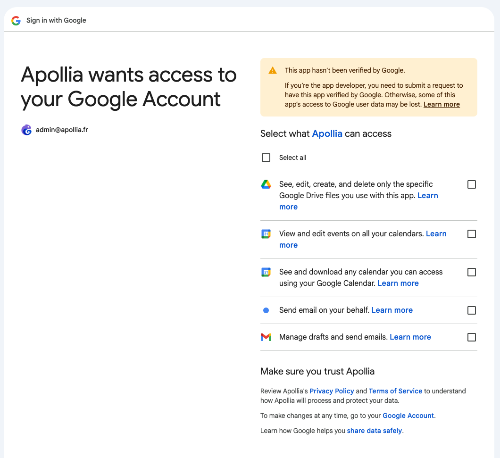
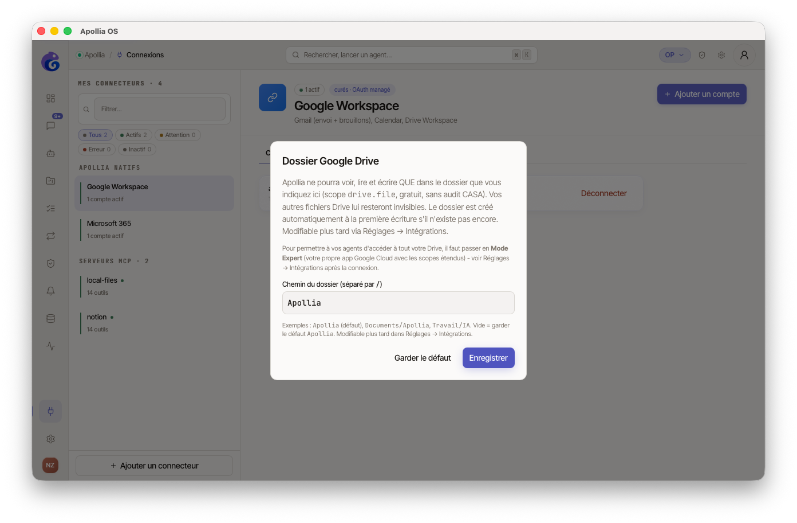

# Connecter Google Workspace

> Pour tout operator qui veut brancher Gmail, Calendar, Drive, Sheets, Docs, Slides, Forms, Tasks ou YouTube à Apollia, en quelques clics.

## Prérequis

- Apollia lancé.
- Un compte Google personnel ou Workspace.
- Votre profil de souveraineté n'est pas réglé sur `local_only` (sinon les boutons cloud sont grisés).
- Connexion internet active.

## Étapes

1. Dans la sidebar, ouvrez **Connexions**, puis sélectionnez la carte **Google Workspace** dans la liste des connecteurs natifs.

   

2. Cliquez sur **Connecter un compte**. Une fenêtre s'ouvre dans Apollia et votre navigateur ouvre automatiquement la page de consentement Google.

3. Choisissez le compte Google à utiliser, puis acceptez les autorisations proposées (Mail, Calendar, Drive Workspace, etc.).

   

4. De retour dans Apollia, la fenêtre détecte automatiquement le retour. Une seconde étape vous propose le dossier racine Drive de l'agent (défaut **Apollia**). Validez en cliquant **Enregistrer** (ou **Défaut** pour garder la valeur proposée).

   

5. La fenêtre se ferme, votre compte apparaît dans la sidebar avec une pastille verte.

   *Figure : la sidebar Connexions, avec la carte Google Workspace dépliée affichant le compte connecté, sa pastille verte et le bouton Déconnecter.*

## Ce que vous pouvez faire

**Lectures (sans approbation)** : lister vos brouillons Gmail, lister vos événements Calendar, parcourir le dossier `Apollia/` sur Drive, lire des cellules Sheets, lire du texte Docs, lister vos tâches, chercher des vidéos YouTube.

**Écritures (avec approbation HITL)** : envoyer un mail, créer un brouillon, créer ou modifier un événement Calendar, écrire un fichier Drive Workspace, ajouter ou modifier des valeurs dans Sheets, ajouter du texte à un Doc, créer un Slide, créer un formulaire, créer ou compléter une tâche.

**Suppressions (avec phrase de confirmation)** : supprimer un événement Calendar, supprimer une tâche.

## Pattern Workspace Drive

Avec le scope `drive.file`, l'application ne voit que les fichiers qu'elle a créés ou ceux que vous lui ouvrez explicitement. Apollia s'appuie sur ce comportement :

- À la première connexion, un dossier racine `Apollia` est créé à la racine de votre Drive.
- À chaque création de fichier par un agent, un sous-dossier `Apollia/<nom-agent>/` est créé à la demande.
- Les opérations Drive sont scopées à ce dossier. L'agent ne voit pas le reste de votre Drive.

L'agent peut donc sauvegarder une note `meeting-notes.md` dans son workspace, la relire plus tard, et la supprimer, sans jamais voir le reste de votre Drive.

## Multi-comptes

Vous pouvez connecter plusieurs comptes Google. Chaque compte apparaît dans la sidebar avec son adresse email. Au moment où un agent appelle un outil Google, il peut choisir le compte cible via un paramètre `account` si plusieurs comptes sont connectés.

## Vérification

- La pastille à côté du compte est verte.
- Dans le chat libre, demandez par exemple *"Liste mes 3 derniers événements Calendar"*. La réponse arrive sans demande d'approbation.
- Tentez ensuite *"Envoie un mail à <votre adresse> avec le sujet test"*. Une popup d'approbation s'affiche avant l'envoi.
- Le trousseau de votre système (Keychain sur macOS) contient une entrée `apollia-connector-google` associée à votre adresse email.

## Si ça ne marche pas

- **L'écran de consentement Google affiche "Cette app n'est pas vérifiée"** : c'est normal en mode expert avec votre propre app OAuth. Cliquez sur **Avancé** puis **Accéder à Apollia** pour continuer.
- **Le bouton Connecter est grisé** : votre profil de souveraineté est `local_only`. Les connecteurs cloud sont désactivés dans ce mode.
- **Vous voulez la lecture complète Gmail ou Drive** : ces scopes sont restricted (audit Google CASA) et hors v0.1.0. Aucun outil Apollia ne les exploite encore, voir « Mode expert » ci-dessus.
- **L'agent ne voit pas un fichier précis sur Drive** : il n'a accès qu'au dossier `Apollia/<agent>/`. Déposez le fichier dans ce dossier ou passez-lui l'identifiant explicite dans votre prompt.
- **Un agent demande un outil Gmail de lecture complète** : il n'en existe pas. Le catalogue d'opérations Google ne contient que les scopes non restricted, et un test le verrouille. L'agent recevra une erreur d'outil inconnu, pas une erreur de scope.

## Mode expert : votre propre app OAuth

Cette section s'adresse aux power users familiers de Google Cloud Console. Si vous ne l'êtes pas, le périmètre par défaut couvre déjà l'envoi, la composition, le calendrier complet et le Drive scopé, et vous pouvez la sauter.

**Pourquoi ce mode existe.** Les scopes Google classés *restricted* (`gmail.readonly`, `gmail.modify`, `drive.readonly`, `drive`) exigent un audit CASA Tier 2 par un tiers agréé Google, facturé 5 000 à 15 000 dollars par an. Pour rester gratuite, l'app Apollia par défaut ne les demande pas. Vous pouvez créer votre propre app OAuth, la garder en statut **Testing** (jusqu'à 100 test users), et la brancher à Apollia. Aucun coût.

**Ce que ce mode fait aujourd'hui, et ce qu'il ne fait pas.** Il branche votre client OAuth à la place de l'app partagée, et l'écran de consentement peut alors proposer les scopes restricted. En revanche **aucun outil Apollia n'exploite encore ces scopes** : le catalogue d'opérations Google n'en contient aucun, et un test le verrouille. Obtenir le scope ne débloque donc pas de nouvelle capacité pour l'instant. Utilisez ce mode si vous voulez maîtriser votre propre app OAuth, pas pour gagner des fonctions.

**Procédure.**

1. **Google Cloud Console** : créez un projet, activez les APIs Gmail, Calendar et Drive, configurez l'écran de consentement OAuth en mode External + Testing, ajoutez votre email comme test user, ajoutez les scopes restricted souhaités, créez un OAuth client de type Desktop, notez le **Client ID**.
2. **Apollia** : exportez la variable d'environnement avant de lancer Apollia :

   ```bash
   export APOLLIA_GOOGLE_CLIENT_ID="123456789-abcdef.apps.googleusercontent.com"
   ```

3. **Reconnectez Google** dans Apollia. L'écran de consentement affichera votre app.

**Vérification.** L'écran de consentement Google affiche le nom de votre app et non "Apollia OS", et les `granted_scopes` listés sous le compte connecté incluent le scope accordé.

**Si ça ne marche pas.**

- **L'écran affiche encore "Apollia OS"** : le processus qui a lancé Apollia n'a pas la variable. Relancez Apollia depuis le shell où vous avez fait `export`, ou ajoutez la variable à votre `~/.zshrc` ou `~/.bashrc`.
- **Google refuse les scopes** : restez en mode **Testing** et ajoutez-vous comme test user.

**Responsabilité.** En mode expert, l'app OAuth est la vôtre et Apollia n'audite pas cette configuration. Si vous distribuez Apollia avec votre Client ID embarqué au-delà de 100 utilisateurs, Google exigera l'audit CASA Tier 2.

**Alternative.** Si Google Cloud Console vous semble lourd, un serveur MCP Gmail communautaire (cherchez `mcp-server-gmail`) tourne localement avec vos credentials et expose les outils Gmail via MCP. Voir [Câbler son propre serveur MCP](cabler-son-propre-serveur-mcp.md).

## Déconnecter un compte

Sur la carte Google Workspace, cliquez sur **Déconnecter** à côté du compte concerné. Le token est immédiatement supprimé du trousseau local. Pour révoquer également côté Google, allez sur https://myaccount.google.com/permissions et retirez l'application Apollia.

> **Référence technique :** [Référence Apollia](../../reference/index.md) , scopes complets, refresh proactif, multi-comptes, stockage trousseau.
