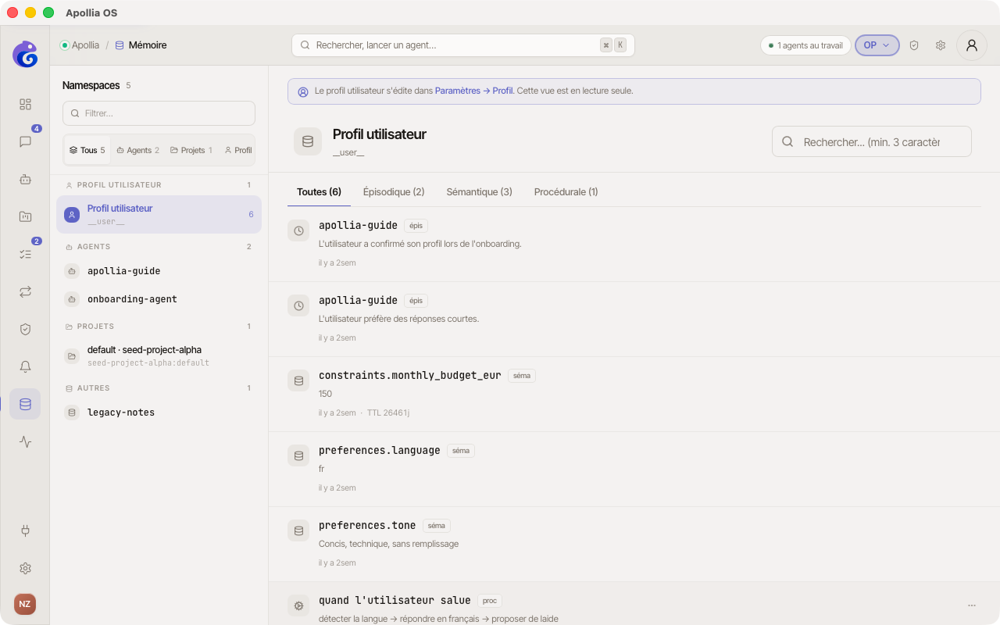
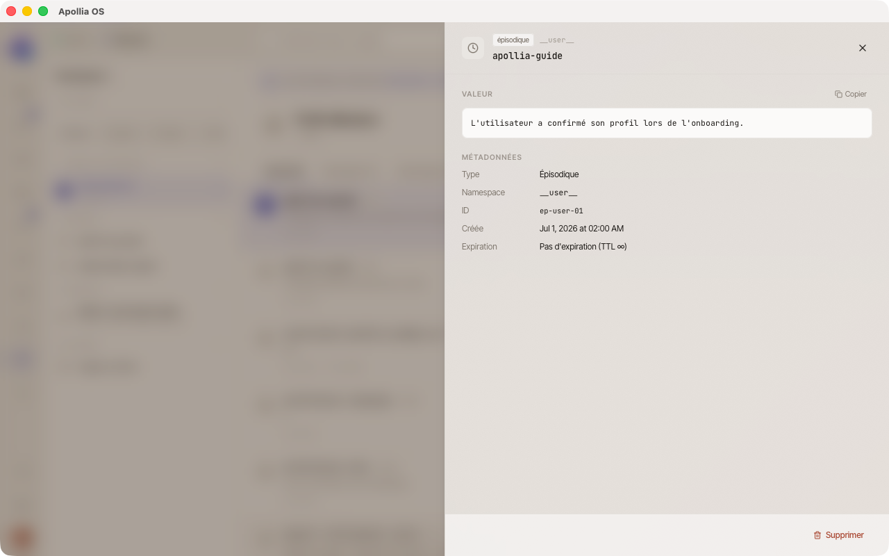

# Consulter et nettoyer la mémoire

> Pour les operators qui veulent voir ce que leurs IA ont retenu, et supprimer ce qui ne devrait plus être là.

## Prérequis

- Au moins un agent qui a déjà conversé ou exécuté une tâche.

## Où trouver quoi

Deux endroits distincts, deux usages distincts :

- **Paramètres → Profil** - votre profil utilisateur (prénom, rôle, secteur, supervision des agents, souveraineté…). C'est ce que tous vos agents savent de vous. Voir [Mon profil](gerer-mon-profil.md).
- **Mémoire** (depuis la sidebar) - l'explorateur des **namespaces mémoire** par agent et par projet. C'est ce que chaque agent retient pour lui-même (épisodes de conversation, faits sémantiques, procédures apprises).

Cette page couvre la deuxième : naviguer dans les namespaces mémoire et y supprimer des entrées.

## Étapes

1. Dans la sidebar, cliquez sur **Mémoire**. La page affiche un layout deux colonnes : sidebar des namespaces à gauche, panneau central avec la liste des entrées du namespace sélectionné.

   

2. **Sidebar gauche** - la liste des **namespaces** (un namespace = un espace mémoire isolé). Chaque namespace est classifié automatiquement :
   - **Profil** : votre profil utilisateur partagé (`__user__`). En lecture seule depuis cette page - l'édition se fait dans **Paramètres → Profil**. Une bannière le rappelle quand vous sélectionnez `__user__`.
   - **Agents** : namespaces d'agents installés (un par agent - ex: `veille-ia`, `email-triage`).
   - **Projets** : namespaces scopés à un projet (format `{project_id}:{ns}`).
   - **Autres** : namespaces legacy ou d'agents désinstallés.

   Un **segmented control** en haut permet de filtrer la liste par catégorie. Un champ **Filtrer…** permet de retrouver un namespace par nom.

3. **Panneau central** - la liste des entrées du namespace sélectionné, avec :
   - Un **segmented control** par type d'entrée : **Toutes / Épisodique / Sémantique / Procédurale**.
   - Une **barre de recherche** plein texte (FTS5) qui interroge le contenu.
   - Un **breadcrumb** sous le filtre qui rappelle le namespace courant.
   - Chaque ligne montre l'icône du type, la clé, un aperçu de la valeur, et la date relative.

4. **Cliquez sur une entrée** pour ouvrir le **panneau de détail** à droite. Il affiche la valeur complète (avec pretty-print JSON automatique si applicable), toutes les métadonnées (type, namespace, ID, dates, score BM25 en mode recherche), et expose deux actions : **Copier** la valeur et **Supprimer** l'entrée.

   

5. Pour **rechercher**, tapez quelques mots-clés dans la **barre de recherche** en haut du panneau central. Les entrées correspondantes s'affichent triées par pertinence (score BM25), et le breadcrumb indique « *N résultats* ».

6. Pour **supprimer une entrée** précise, deux options équivalentes :
   - Survolez la ligne, cliquez sur le menu **⋯** en bout de ligne, choisissez **Supprimer**, puis confirmez sur le bouton **Confirmer** qui apparaît.
   - Ou ouvrez le panneau de détail (click sur la ligne) et utilisez le bouton **Supprimer** en bas.

   L'entrée disparaît immédiatement et ne reviendra pas.

## Vérification

L'entrée supprimée n'apparaît plus dans la liste, même après recharge de la page. Une recherche par mot-clé sur cette entrée ne retourne plus de résultat. Le compteur du namespace dans la sidebar et le compteur du type dans le segmented control sont décrémentés.

## Si ça ne marche pas

- **La page est vide** : aucun agent n'a encore généré de mémoire. Lancez une conversation et revenez.
- **La suppression échoue** : l'agent est en train d'écrire dans la mémoire, attendez quelques secondes et réessayez.
- **Le namespace attendu n'apparaît pas** : vérifiez que l'agent est bien installé (l'agent doit être listé dans **Agents** pour apparaître sous la catégorie *Agents*, sinon le namespace bascule en *Autres*).
- **Vous voulez vider tout un namespace ou tout effacer d'un coup** : la suppression en masse depuis l'UI n'est pas encore disponible ; voir [Réinitialiser Apollia (factory reset)](../troubleshooting/reinitialiser-apollia-factory-reset.md) pour la procédure de réinitialisation complète, ou utilisez la CLI : `apollia-os memory clear --agent <NAME> --confirm`.

> **Note** : Pour gérer les **outils** disponibles à vos agents (recherche web, lecture de fichiers, etc.), ouvrez **Paramètres → Outils**. La page propose le détail de chaque outil, son activation/désactivation, et sa configuration éventuelle.

> **Référence technique :** [Référence Apollia](../../reference/index.md) - types de mémoire, durées de rétention par défaut, limites.
