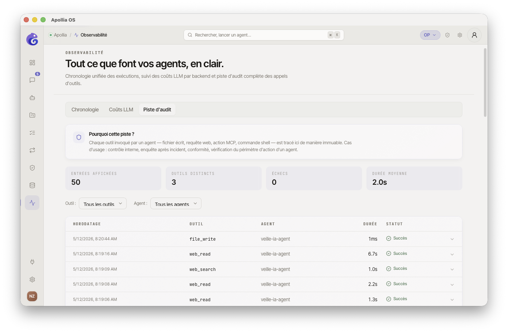
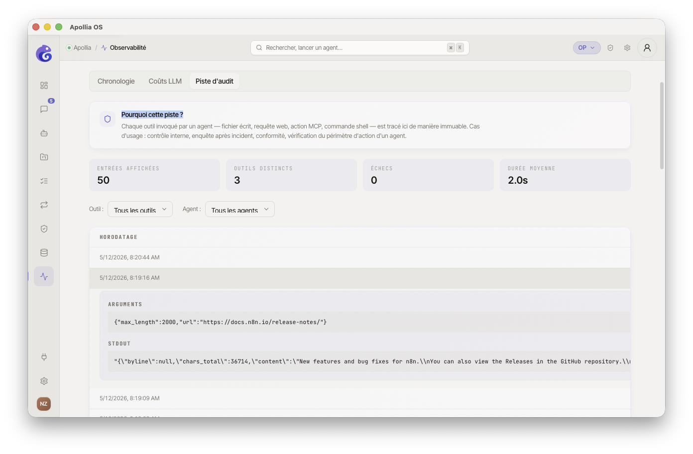

# Consulter l'audit trail

> Pour les operators qui veulent retrouver précisément qui a fait quoi, quand - typiquement pour un contrôle interne ou une enquête après incident.

## Prérequis

- Au moins une action sensible (écriture de fichier, commande, appel d'outil) a été exécutée.
- Vous savez approximativement la période ou l'agent à investiguer.

## Étapes

1. Dans la sidebar, cliquez sur **Observabilité**, puis sur l'onglet **Piste d'audit**.

2. En haut de l'onglet, un **encart violet** rappelle l'utilité de la piste d'audit : contrôle interne, enquête après incident, conformité, vérification du périmètre d'action d'un agent. C'est la trace immuable de chaque outil invoqué par un agent.

3. Juste en dessous, **quatre indicateurs clés** (KPI) se mettent à jour selon les filtres : **Entrées affichées**, **Outils distincts**, **Échecs** (en rouge si > 0), **Durée moyenne**.
   

4. Le tableau présente toutes les invocations d'outils tracées, du plus récent au plus ancien. **Cinq colonnes** :
   - **Horodatage** (date + heure locale)
   - **Outil** (nom technique en monospace : `bash`, `file_write`, `mcp:notion.search`, etc.)
   - **Agent** (nom lisible ; à défaut l'identifiant brut si l'agent n'est plus enregistré)
   - **Durée** (`850ms` ou `2.1s`, ou `-` si non mesuré)
   - **Statut** - badge **Succès** (vert, ✓) ou **Échec** (rouge, ✕). Le statut est déduit du code de sortie *et* de la présence de stderr ; un outil MCP sans code de sortie est considéré OK s'il s'est terminé sans erreur.

5. Affinez la recherche avec les deux sélecteurs au-dessus du tableau :
   - **Outil** - isole les invocations d'un outil précis (la liste se construit à partir des entrées chargées).
   - **Agent** - isole le travail d'un seul agent.

6. Cliquez sur une ligne pour déplier son détail. Selon ce qui a été capturé, trois sections peuvent apparaître :
   - **Arguments** - JSON envoyé à l'outil, formaté.
   - **stdout** - sortie standard.
   - **stderr** - sortie d'erreur, affichée en rouge.

   Si l'invocation n'a rien produit de capturable (outils MCP en lecture seule, outils sans I/O standard…), un message *« Aucun détail disponible »* s'affiche.
   

7. En bas du tableau, le bouton **Charger plus** étend la liste de 50 entrées supplémentaires.

   > **⚠️ Non disponible dans cette version :** l'export de l'audit trail depuis l'interface. Côté CLI, les commandes disponibles sont :
   > - `apollia-os audit list [--limit N]`
   > - `apollia-os audit stats`

## Vérification

Vous retrouvez dans le tableau les actions que vous savez avoir validées récemment, avec leur statut correct (Succès en vert, Échec en rouge). Les KPI en haut reflètent la sélection courante : si vous filtrez par agent, le compteur d'**Entrées affichées** baisse en conséquence.

## Si ça ne marche pas

- **Une action attendue ne figure pas** : vérifiez les filtres **Outil** et **Agent** - un filtre actif peut masquer la ligne. Cliquez sur **Charger plus** si la fenêtre par défaut (50 entrées) ne remonte pas assez loin.
- **Le détail d'une ligne ne montre rien** : l'invocation provient probablement d'un outil sans capture stdout/stderr (outil MCP, appel API interne). La ligne reste tracée mais ses entrées-sorties ne le sont pas.
- **Le tableau est vide** : aucune action outillée n'a encore été exécutée. Lancez un agent sur une tâche utilisant des outils (bash, file_write, etc.).

> **Référence technique :** [Référence Apollia](../../reference/index.md)
