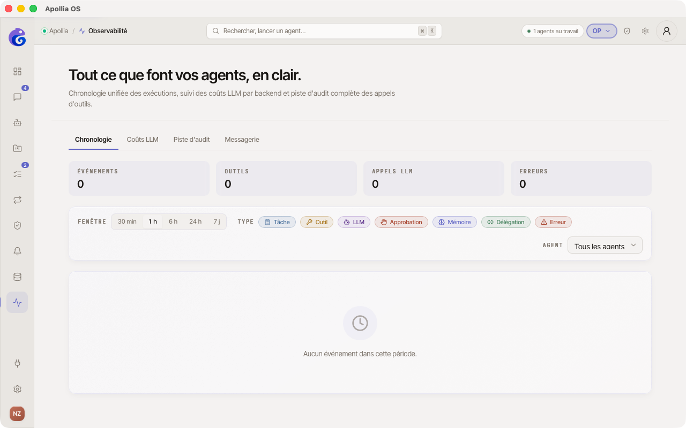

# Consulter la chronologie d'activité

> Pour les operators qui veulent voir ce qui s'est passé dans l'application sur une fenêtre temporelle donnée : tâches lancées, outils appelés, approbations, appels LLM, mémoire, délégations entre agents, erreurs.

## Prérequis

- Au moins une tâche ou un agent s'est exécuté récemment.

## Où regarder selon le besoin

| Vous cherchez… | Allez plutôt sur… |
|---|---|
| L'historique d'**un agent précis** (statuts, durées, input/output des tâches) | **Mes assistants → Logs** - voir [Consulter les logs d'un agent](../agents/consulter-les-logs-d-un-agent.md). |
| Un **événement précis** (un appel LLM, un outil exécuté, une approbation) sur une fenêtre temporelle | **Observabilité → Chronologie** (cette page). |
| Une **invocation d'outil** avec ses entrées-sorties | **Observabilité → Piste d'audit** - voir [Consulter l'audit trail](consulter-l-audit-trail.md). |

## Étapes

1. Dans la sidebar, cliquez sur **Observabilité**, puis sur l'onglet **Chronologie**.

2. En haut, **quatre KPIs** résument la fenêtre courante : Événements · Outils · Appels LLM · Erreurs (compteur en rouge si > 0). Les KPIs réagissent aux filtres : si vous masquez les outils, leur compteur reste mais le total **Événements** descend.

3. Choisissez la **fenêtre temporelle** : **30 min / 1 h / 6 h / 24 h / 7 j**. Par défaut : 1 h. Les événements se rechargent automatiquement environ toutes les 15 secondes.
   

4. **Filtrez les événements** :
   - **Type** - 7 chips arrondies (Tâche / Outil / LLM / Approbation / Mémoire / Délégation / Erreur). Chaque chip active/désactive sa catégorie ; les chips grisés sont désactivés.
   - **Agent** - sélecteur déroulant pour ne voir que les événements d'un assistant précis. *Tous les agents* par défaut.

5. Les événements sont **groupés par jour** avec un en-tête (« Aujourd'hui », « Hier » ou date complète) et un compteur à droite. Chaque ligne affiche :
   - Une **pastille colorée** + **icône lucide** correspondant au type (ClipboardList pour Tâche, Wrench pour Outil, Bot pour LLM, Hand pour Approbation, Brain pour Mémoire, Link2 pour Délégation, AlertTriangle pour Erreur).
   - Le **titre lisible** *« Tâche → completed »*, *« Tool: bash (2.1 s) »*, *« LLM: claude-sonnet-4 · $0.42 »*…
   - Un **badge** de type, l'**agent**, l'**horodatage** précis (HH:MM:SS) **et** l'âge relatif (*« il y a 3 min »*).

6. Cliquez sur une ligne pour **déplier le payload brut** de l'événement (JSON formaté en monospace, incluant le champ `source` qui indique de quelle base SQLite provient l'événement). Re-cliquez pour replier.

## Vérification

Vous retrouvez vos exécutions récentes dans la fenêtre choisie. Élargir la fenêtre depuis `1h` à `24h` fait apparaître plus d'événements anciens sans rafraîchissement manuel.

## Si ça ne marche pas

- **La chronologie est vide** : la fenêtre par défaut (1 h) ne contient peut-être pas d'activité. Élargissez à `24 h` ou `7 j`. La chronologie scanne désormais directement chaque source SQLite par horodatage : tâches, outils (audit), appels LLM, HITL, déclenchements de triggers, ouvertures de sessions chat, raisonnements et erreurs runtime. Si elle reste vide sur `7 j`, aucune activité n'a été enregistrée dans cette fenêtre.
- **Mes appels LLM faits depuis Chat n'apparaissent pas** : seul l'**ouverture/fermeture de la session chat** et ses **approbations d'outils** apparaissent. Les appels LLM internes au chat ne sont pas (encore) persistés dans `llm_calls.db` - limitation connue (issue tracker). Les sessions chat avec un agent qui déclenche une tâche font, eux, remonter tous les événements normalement.
- **Un événement attendu n'apparaît pas** : vérifiez les chips de type et le sélecteur d'agent - un filtre actif peut masquer la ligne. Les chips de type fonctionnent en logique additive : si tous sont grisés, rien ne s'affiche.
- **Je veux le détail d'une tâche complète, pas un événement granulaire** : passez par **Mes assistants → Logs** sur l'agent concerné. La chronologie est volontairement granulaire et factuelle.

> **Concept :** [Explication Apollia](../../explanation/index.md)
