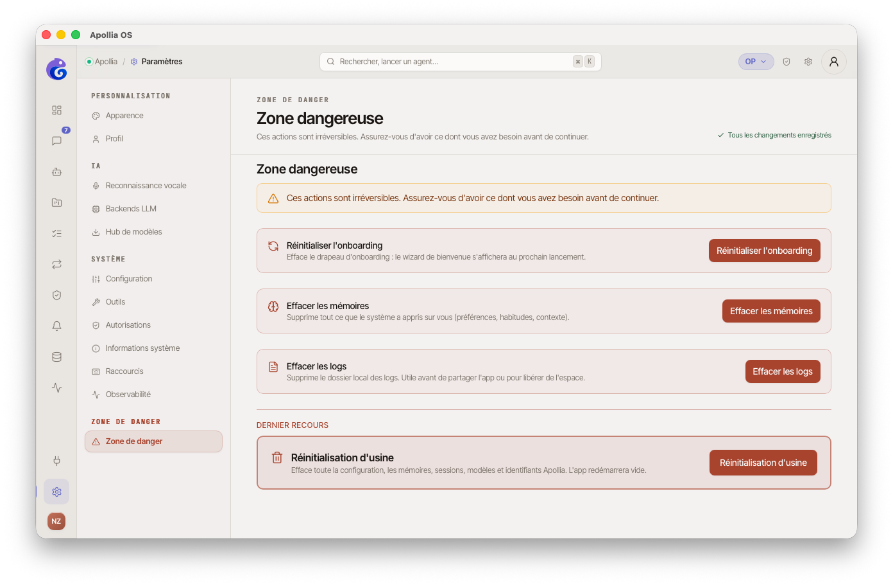

# Réinitialiser Apollia (factory reset)

> Pour tout operator qui souhaite remettre Apollia dans son état d'usine : effacer agents, mémoire, projets, intégrations et préférences. Cette action est irréversible - lisez chaque étape avant d'agir.

## Avant de commencer - à lire impérativement

Une réinitialisation supprime **toutes** vos données locales : agents installés, mémoire des conversations, projets, intégrations MCP, transcriptions, historique de chat, règles de permissions, clés API enregistrées et préférences.

**Aucune de ces données n'est récupérable après confirmation.** Les fichiers stockés ailleurs sur votre disque (vos documents, vos rapports) ne sont pas touchés.

Avant de continuer, demandez-vous :

- Souhaitez-vous vraiment tout perdre, ou voulez-vous simplement résoudre un problème précis ? Consultez d'abord [Un agent est bloqué](un-agent-est-bloque.md) ou [Le fournisseur d'IA ne répond pas](le-fournisseur-d-ia-ne-repond-pas.md).
- Avez-vous fait une **sauvegarde** de ce qui compte ? Voir l'étape 1 ci-dessous.

## Étape 1 - Sauvegarder ce qui compte (recommandé)

1. **Mémoire :** utilisez la CLI `apollia-os memory export --namespace <namespace> --output <fichier>` pour exporter la mémoire de chaque agent. Réimport ensuite avec `apollia-os memory import --input <fichier>`.
2. **Transcriptions :** ouvrez **Transcriptions** *(mode Builder)* et notez les transcriptions importantes.
3. **Liste de vos agents et connexions :** prenez une capture d'écran ou notez les noms : vous devrez les réinstaller manuellement après le reset.

## Étape 2 - Lancer la réinitialisation

1. Dans la sidebar, cliquez sur **Paramètres**, puis sur la section **Zone de danger**.
   
2. Repérez le bloc **Réinitialisation d'usine**. Lisez attentivement la liste des données qui vont être supprimées.
3. Cliquez sur le bouton rouge **Réinitialisation d'usine**.

## Étape 3 - Confirmer explicitement

Une fenêtre de confirmation s'ouvre avec une **pause de sécurité de 3 secondes** pendant lesquelles le bouton de confirmation reste désactivé.

1. Lisez à nouveau la liste des données concernées.
2. Dans le champ de confirmation, **tapez exactement** `FACTORY RESET` (en majuscules, espace inclus). Le coller au presse-papiers est **bloqué** : vous devez taper la phrase au clavier.
3. Le bouton **Confirmer la réinitialisation** devient actif uniquement quand le mot est correct **et** la pause de 3 secondes écoulée.
4. Cliquez sur **Confirmer la réinitialisation**.

## Étape 4 - Après la réinitialisation

1. Apollia redémarre automatiquement. Si le redémarrage automatique échoue (environnement de développement sans bundle packagé), un bandeau orange vous invite à relancer l'application manuellement.
2. Au redémarrage, le **parcours de configuration en quatre étapes** s'ouvre automatiquement : **Accueil → Profil → Modèles → Calibrage**. C'est le même parcours qu'au tout premier lancement.
3. À l'étape **Modèles**, vous devez reconfigurer le LLM (téléchargement d'un modèle local ou ajout d'un backend cloud) - la réinitialisation a effacé l'ensemble de vos backends LLM. Voir aussi [Connecter un modele distant](../installation/connecter-un-modele-distant.md) si vous préférez ne pas passer par le parcours intégré.
4. Une fois le parcours terminé, réinstallez vos agents, vos intégrations MCP et vos projets selon votre besoin.
5. Si vous avez exporté votre mémoire via la CLI à l'étape 1, réimportez-la avec `apollia-os memory import --input <fichier>`.

## Si quelque chose se passe mal

- **Apollia ne redémarre pas après la réinitialisation :** lancez l'application manuellement depuis votre menu d'applications.
- **Le parcours de configuration ne s'affiche pas :** la réinitialisation a peut-être échoué partiellement. Vérifiez que `~/.apollia/` est absent ou vide - sinon, supprimez-le manuellement et relancez. Si le problème persiste, contactez le support en précisant l'instant exact du reset.
- **Le bouton Continuer reste grisé à l'étape Modèles :** c'est normal tant qu'aucun LLM n'est configuré. Téléchargez un modèle GGUF depuis la liste curée, ou cliquez sur **Utiliser un fournisseur cloud** pour ajouter un backend Anthropic, OpenAI ou Ollama. Le parcours reprend automatiquement après l'ajout du backend.
- **Vous regrettez la suppression :** restaurez vos sauvegardes de l'étape 1. Sans sauvegarde, les données sont définitivement perdues.

> **Concept :** [Référence Apollia](../../reference/index.md) - comprendre où Apollia stocke vos données et ce qui est effacé exactement lors d'une réinitialisation.
