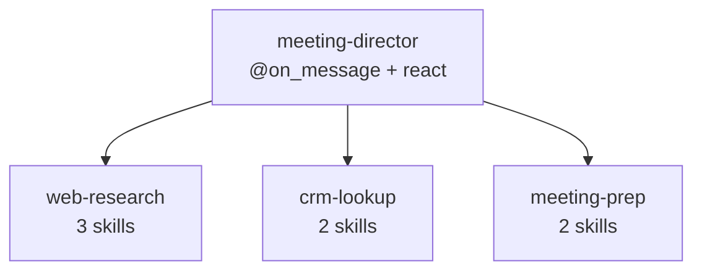
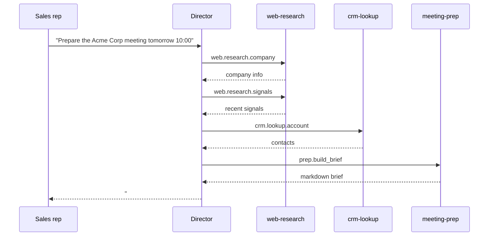

# Build a multi-agent assistant

This advanced tutorial walks through a complete multi-agent system: a sales
meeting-prep assistant. A sales rep types a request in Apollia and, a few seconds
later, gets a structured markdown briefing about the prospect. Behind that single
message sit four agents: one director orchestrating three workers over A2A.

You should already have written [your first agent](/tutorials/your-first-agent),
a [worker](/how-to/write-a-worker), and a
[director](/how-to/write-a-director). Plan for around an hour.

## What you will build

The rep asks, in the Apollia chat:

> Prepare the meeting with Acme Corp tomorrow at 10:00.

The assistant returns something like:

```markdown
# Meeting with Acme Corp, tomorrow 10:00

## The company
Acme Corp is an industrial SMB (around 80 employees, 12M euro revenue).
It manufactures precision metal parts. Headquartered in Lyon, with two
production sites.

## Recent signals
- 2026-05-10: 4M euro Series A raise from a regional fund.
- 2026-04-22: announced hire of a Head of IT (LinkedIn).
- 2026-04-15: obtained the ISO 9001:2026 certification.

## CRM history
- 3 prior contacts with Pierre Martin (Head of IT).
- Last exchange: 2026-03-08, quote request for an infrastructure audit.
- Notes: main concern is production traceability.

## Points to raise
1. Follow up on the March 8 quote.
2. Traceability use case for the new workshops.
3. Possible link with their recent fundraise.

## Questions to ask
- What are the objectives after the fundraise?
- Has the newly hired Head of IT set a roadmap?
- What are the friction points in the current system?
```

## Architecture

Four agents, one responsibility each. The director is the chat entry point and
holds no domain skill of its own; each worker owns one domain.



| Agent | Role | Type | Skills |
|---|---|---|---|
| `meeting-director` | Orchestrator, chat entry point | conversational + react | none exposed |
| `web-research` | Public company research | worker | `web.research.company`, `web.research.signals`, `web.research.linkedin` |
| `crm-lookup` | CRM lookup | worker | `crm.lookup.account`, `crm.lookup.history` |
| `meeting-prep` | Render the final brief | worker | `prep.build_brief`, `prep.format_questions` |

The director drives the workers through A2A, one call at a time, reacting to each
result:



Each agent lives in its own `.py` file. Install copies only the file you pass, so
every TypedDict and helper an agent needs must live in that one file. Do not add
`from __future__ import annotations` to a file that defines a `TypedDict`: it
turns annotations into strings and breaks the schema the runtime reads at
registration.

<!-- claim:skill-schema-built-from-typeddict-required-keys -->

That schema is derived from the `TypedDict` at registration time, which is why a
stringified annotation silently produces a malformed skill rather than an error.

## Worker 1: web-research

Three read-only skills over Apollia's native `web_search` and `web_read` tools.
Create `web_research.py`:

```python
"""Public web research about a company."""

from typing import Annotated, TypedDict

from apollia import DomainError, agent, skill
from apollia.types import Ctx


# No `from __future__ import annotations` here: it would break
# TypedDict.__required_keys__, which the runtime reads to build schemas.

class CompanyInfo(TypedDict):
    name: str
    industry: str
    size_estimate: str
    headquarters: str
    description: str


class SignalEntry(TypedDict):
    date: str
    title: str
    source: str
    url: str
    summary: str


TRUSTED_NEWS_DOMAINS = (
    "lesechos.fr",
    "latribune.fr",
    "usine-nouvelle.com",
    "linkedin.com",
    "bfmtv.com",
)


@agent(
    name="web-research",
    version="0.1.0",
    description="Public web research about a company.",
    agent_type="worker",
    tools_required=("web_search", "web_read"),
)
class WebResearch:
    @skill(
        "web.research.company",
        description="Find general public info about a company (industry, size, HQ).",
        examples=[{"company_name": "Acme Corp"}],
    )
    async def research_company(
        self,
        company_name: Annotated[str, "Legal or commercial name of the company."],
        ctx: Ctx,
    ) -> CompanyInfo:
        results = await ctx.tools.call(
            "web_search",
            input={"query": f'"{company_name}" company headquarters employees'},
        )
        if not results.get("results"):
            raise DomainError("COMPANY_NOT_FOUND", f"No public info on {company_name}")

        top = results["results"][0]
        page = await ctx.tools.call("web_read", input={"url": top["url"]})

        # A production worker would summarize with ctx.llm here.
        return {
            "name": company_name,
            "industry": "Unknown (summarization step)",
            "size_estimate": "Unknown",
            "headquarters": "Unknown",
            "description": page.get("content", "")[:500],
        }

    @skill(
        "web.research.signals",
        description="Find recent news signals about a company (last 90 days).",
        examples=[{"company_name": "Acme Corp", "max_signals": 5}],
    )
    async def research_signals(
        self,
        company_name: Annotated[str, "Legal or commercial name of the company."],
        ctx: Ctx,
        max_signals: Annotated[int, "Maximum number of signals to return."] = 5,
    ) -> dict:
        signals: list[SignalEntry] = []
        results = await ctx.tools.call(
            "web_search",
            input={"query": f'"{company_name}" news 2026', "max_results": max_signals * 2},
        )

        for hit in results.get("results", [])[:max_signals]:
            if not any(src in hit["url"] for src in TRUSTED_NEWS_DOMAINS):
                continue
            page = await ctx.tools.call("web_read", input={"url": hit["url"]})
            signals.append({
                "date": hit.get("age", "Unknown"),
                "title": hit["title"],
                "source": hit["url"],
                "url": hit["url"],
                "summary": page.get("content", "")[:280],
            })

        return {"company_name": company_name, "signals": signals}

    @skill(
        "web.research.linkedin",
        description="Find a company's LinkedIn page.",
        examples=[{"company_name": "Acme Corp"}],
    )
    async def research_linkedin(
        self,
        company_name: Annotated[str, "Company name."],
        ctx: Ctx,
    ) -> dict:
        results = await ctx.tools.call(
            "web_search",
            input={"query": f'site:linkedin.com/company "{company_name}"'},
        )
        if not results.get("results"):
            return {"company_name": company_name, "linkedin_url": None, "key_people": []}
        return {
            "company_name": company_name,
            "linkedin_url": results["results"][0]["url"],
            "key_people": [],
        }
```

Each skill returns a plain `dict` (or a `TypedDict`, which is a `dict` at
runtime), and raises `DomainError` for expected failures. The tool calls use
[`ctx.tools`](/reference/sdk/tools); see the
[native tool reference](/reference/native-tools) for `web_search` and `web_read`
input shapes.

## Worker 2: crm-lookup

<!-- claim:secrets-gated-by-manifest-declaration -->

This worker reads a credential with [`ctx.secrets`](/reference/sdk/secrets). The
secret is declared in `@agent(secrets=(...))` and read, never written, at run
time. Create `crm_lookup.py`:

```python
"""Read-only CRM lookup (HubSpot)."""

from typing import Annotated, TypedDict

from apollia import DomainError, agent, skill
from apollia.types import Ctx


class ContactRecord(TypedDict):
    full_name: str
    job_title: str
    email: str
    last_contact_date: str


class HistoryEntry(TypedDict):
    date: str
    type: str
    summary: str


HUBSPOT_API = "https://api.hubapi.com/crm/v3/objects"


@agent(
    name="crm-lookup",
    version="0.1.0",
    description="Read-only CRM lookup (HubSpot).",
    agent_type="worker",
    secrets=("hubspot_api_token",),
    tools_required=("web_read",),
)
class CrmLookup:
    @skill(
        "crm.lookup.account",
        description="Look up contacts for a company in HubSpot CRM.",
        examples=[{"company_name": "Acme Corp"}],
    )
    async def lookup_account(
        self,
        company_name: Annotated[str, "Company name as known in the CRM."],
        ctx: Ctx,
    ) -> dict:
        token = ctx.secrets.get("hubspot_api_token")
        if not token:
            raise DomainError("CONFIG", "hubspot_api_token is not configured")

        url = f"{HUBSPOT_API}/companies/search?q={company_name}"
        response = await ctx.tools.call(
            "web_read",
            input={"url": url, "headers": {"Authorization": f"Bearer {token}"}},
        )
        if response.get("status_code", 0) >= 400:
            raise DomainError("CRM_ERROR", f"HubSpot lookup failed: {response.get('status_code')}")

        contacts: list[ContactRecord] = []
        return {"company_name": company_name, "contacts": contacts}

    @skill(
        "crm.lookup.history",
        description="Fetch interaction history with a company contact.",
        examples=[{"contact_email": "pierre.martin@acmecorp.fr", "since_days": 365}],
    )
    async def lookup_history(
        self,
        contact_email: Annotated[str, "Email of the contact in the CRM."],
        ctx: Ctx,
        since_days: Annotated[int, "Look-back window in days."] = 365,
    ) -> dict:
        token = ctx.secrets.get("hubspot_api_token")
        if not token:
            raise DomainError("CONFIG", "hubspot_api_token is not configured")

        history: list[HistoryEntry] = []
        return {"contact_email": contact_email, "history": history}
```

## Worker 3: meeting-prep

A pure formatting worker: it takes the aggregated data and renders markdown. No
`ctx` service needed. Create `meeting_prep.py`:

```python
"""Format the final meeting briefing."""

from typing import Annotated, TypedDict

from apollia import DomainError, agent, skill
from apollia.types import Ctx


class BriefPayload(TypedDict):
    company_name: str
    meeting_when: str
    company_info: dict
    signals: list
    crm_contacts: list
    crm_history: list


def _render_brief(payload: BriefPayload) -> str:
    lines = [f"# Meeting with {payload['company_name']}, {payload['meeting_when']}", ""]
    lines.append("## The company")
    lines.append(payload["company_info"].get("description", "(no info)"))
    lines.append("")
    lines.append("## Recent signals")
    if payload["signals"]:
        for signal in payload["signals"]:
            lines.append(f"- {signal['date']}: {signal['title']} ({signal['source']}).")
    else:
        lines.append("- No recent signal.")
    lines.append("")
    lines.append("## CRM contacts")
    for contact in payload["crm_contacts"]:
        lines.append(f"- {contact['full_name']} ({contact['job_title']}, {contact['email']}).")
    lines.append("")
    lines.append("## Recent history")
    for entry in payload["crm_history"]:
        lines.append(f"- {entry['date']}: {entry['type']}, {entry['summary']}.")
    return "\n".join(lines)


@agent(
    name="meeting-prep",
    version="0.1.0",
    description="Format the final meeting briefing.",
    agent_type="worker",
)
class MeetingPrep:
    @skill(
        "prep.build_brief",
        description="Render the full meeting briefing as Markdown.",
        examples=[{
            "company_name": "Acme Corp",
            "meeting_when": "tomorrow 10:00",
            "company_info": {"name": "Acme Corp", "description": "Industrial SMB"},
            "signals": [],
            "crm_contacts": [],
            "crm_history": [],
        }],
    )
    async def build_brief(self, payload: BriefPayload, ctx: Ctx) -> dict:
        if not payload.get("company_name"):
            raise DomainError("EMPTY_COMPANY", "company_name must not be empty")
        return {"markdown": _render_brief(payload), "company_name": payload["company_name"]}

    @skill(
        "prep.format_questions",
        description="Format a list of open questions to ask at the meeting.",
        examples=[{"company_name": "Acme Corp", "themes": ["funding", "hiring"]}],
    )
    async def format_questions(
        self,
        company_name: Annotated[str, "Company name."],
        themes: Annotated[list[str], "Topics to probe. Each topic yields one or two questions."],
        ctx: Ctx,
    ) -> dict:
        lines = [f"## Questions to ask {company_name}", ""]
        for theme in themes:
            lines.append(f"- About **{theme}**: ?")
        return {"markdown": "\n".join(lines)}
```

## Install and enable the workers

Installing records the agent; enabling loads it into the running registry. A
director that calls a skill of an installed-but-not-enabled worker gets
`unknown A2A skill` on its first message, so do both.

```bash
apollia-os agent install ./web_research.py
apollia-os agent install ./crm_lookup.py
apollia-os agent install ./meeting_prep.py

apollia-os agent enable web-research
apollia-os agent enable crm-lookup
apollia-os agent enable meeting-prep
```

Provide the CRM credential the `crm-lookup` worker declared. Agent-declared
secrets live in the operator-managed credential store under the fixed `agent`
namespace; `ctx.secrets` reads them, never writes them. The operator provisions
the value once, it is stored encrypted, and the worker only reads it at run time.

The `apollia-os tools credentials set <target> <key>` command provisions the
value. The `<target>` is either a native tool name (such as `web_search`) or the
literal `agent` namespace for a secret an agent declared in its manifest:

```bash
apollia-os tools credentials set agent hubspot_api_token
# prompts once for the value, input masked, stored encrypted
```

The same value is also settable from the desktop credential manager. See
[`ctx.secrets`](/reference/sdk/secrets) for how the worker reads it back.

Confirm the three workers are active and their skills are exposed:

```bash
apollia-os agent list
apollia-os a2a skills | grep -E "(web|crm|prep)\."
```

If a worker fails to load, run `apollia-os inspect <file>.py` to see why.

## The director

The director is a conversational agent that exposes every worker skill as a tool
and lets `apollia.react` decide the order of calls. Create `director.py`:

```python
"""Meeting-prep director: orchestrates the three workers through apollia.react."""

from apollia import agent, on_message, react
from apollia.types import Ctx, Message


SYSTEM_PROMPT = """\
You are a meeting preparation assistant. The user is a sales rep about to meet a
prospect. Your job: build a structured briefing in markdown.

Workflow:

1. Parse the request: company name and meeting time (for example "tomorrow 10:00").
2. Use `a2a__web__research__company` to gather general info.
3. Use `a2a__web__research__signals` to fetch three to five recent news signals.
4. Use `a2a__crm__lookup__account` to fetch contacts. If it fails, continue without.
5. For the most relevant contact, call `a2a__crm__lookup__history` for their history.
6. Call `a2a__prep__build_brief` with the aggregated payload to render the markdown.
7. Optionally call `a2a__prep__format_questions` for three to five open questions.

Aim for six to eight tool calls in total. If a worker fails, note it with
emit_thought and continue. The brief must always be produced.
"""


@agent(
    name="meeting-director",
    version="0.1.0",
    description="Prepare a commercial meeting briefing.",
)
class MeetingDirector:
    @on_message
    async def chat(
        self,
        message: str,
        history: list[Message],
        ctx: Ctx,
    ) -> str:
        ctx.events.emit_thought("Director starting", step=0)

        return await react(
            ctx,
            system=SYSTEM_PROMPT,
            user=message,
            tools=[
                await ctx.a2a.skill_as_tool("web.research.company"),
                await ctx.a2a.skill_as_tool("web.research.signals"),
                await ctx.a2a.skill_as_tool("web.research.linkedin"),
                await ctx.a2a.skill_as_tool("crm.lookup.account"),
                await ctx.a2a.skill_as_tool("crm.lookup.history"),
                await ctx.a2a.skill_as_tool("prep.build_brief"),
                await ctx.a2a.skill_as_tool("prep.format_questions"),
            ],
            max_steps=12,
        )
```

`emit_thought` streams a reasoning step to any observer through
[`ctx.events`](/reference/sdk/events). The seven `skill_as_tool` calls turn each
worker skill into a tool the model can pick; [`ctx.a2a`](/reference/sdk/a2a)
resolves each schema at call time.

<!-- claim:a2a-tool-name-is-prefixed-and-encoded -->
The prompt spells the tool names the way the model receives them, not the way you
write them in `skill_as_tool`. That call prefixes `a2a__` and replaces each dot
with a double underscore, so `web.research.company` is offered as
`a2a__web__research__company`; the bridge decodes the name back to the `skill_id`
before dispatch.

## Run it

```bash
apollia-os agent install ./director.py
apollia-os agent enable meeting-director
apollia-os run meeting-director "Prepare the meeting with Acme Corp tomorrow at 10:00"
```

## Observe what happened

Every run leaves a trace. List recent tasks and inspect one step by step:

```bash
apollia-os task list
apollia-os task inspect <task_id>
```

`task inspect` shows the director's thoughts and each A2A call with its input.
For the flat record of tool calls and their results, read the tool-invocation
trail:

```bash
apollia-os audit list --limit 50
```

That trail is not the tamper-evident one. Tamper-evidence lives in the
hash-chained journal, which `audit show` reads and `audit verify` checks; see
[Audit and verify a run](/how-to/audit-and-verify) for which command reads which
register.

See the [CLI reference](/reference/cli) for every `task` and `audit` subcommand.

## Test your agents

Apollia ships an isomorphic testing harness, `apollia.testing.mock`, that runs a
skill or a message in-process with a mocked `ctx`, no daemon required. It lets
you assert on results and on the calls a director made.
[Test your agents](/how-to/test-your-agents) covers it; this tutorial stops at
build and run.

## Going further

- Trigger the assistant from a calendar event instead of a typed message.
- Personalize the brief per rep with [`ctx.profile`](/reference/sdk/profile).
- Let the director learn from past meetings with
  [`ctx.memory`](/reference/sdk/memory).
- Add a worker for a new data source, and expose its skills to the director the
  same way.
