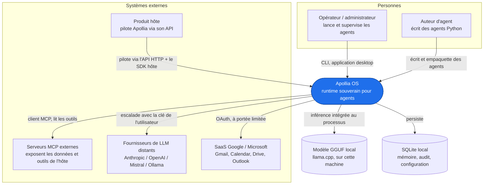

# 3. Contexte et périmètre

Ceci est le contexte système C4 : Apollia OS comme une seule boîte, et tout ce
qui se trouve à l'extérieur avec quoi elle communique. Il pose la frontière
avant que les pages suivantes n'ouvrent la boîte.

## Contexte système

## Acteurs et voisins

| Voisin | Relation | Direction |
|---|---|---|
| **Opérateur / administrateur** | Exécute, supervise et approuve. Utilise la [CLI](/reference/cli) et l'application desktop opérateur. | Pilote Apollia |
| **Auteur d'agent** | Écrit des agents Python typés conformes au [contrat du SDK](/reference/sdk), puis les empaquette et les installe. | Développe pour Apollia |
| **Produit hôte** | Embarque et pilote le runtime via l'[API HTTP](/reference/api/apollia-os-runtime-api) stable et les SDK hôtes générés. Dans le modèle de fédération, l'hôte est souvent à la fois client d'Apollia et l'inverse. | Bidirectionnel |
| **Serveurs MCP externes** | Apollia est un client MCP : elle découvre et appelle leurs outils via stdio, Streamable HTTP, ou SSE. Elle peut aussi exposer un serveur MCP entrant limité. | Apollia appelle vers l'extérieur (majoritairement) |
| **Fournisseurs de LLM distants** | Optionnel. Une exécution peut escalader vers un modèle de pointe avec la clé propre de l'utilisateur, le local restant la valeur par défaut. | Apollia appelle vers l'extérieur |
| **Google / Microsoft** | Les connecteurs natifs agissent sur le courrier, le calendrier et les fichiers via OAuth, avec des permissions à portée limitée. | Apollia appelle vers l'extérieur |
| **Modèle et base de données locaux** | Le modèle GGUF et le magasin SQLite vivent tous deux sur la même machine. Rien ici n'est distant. | À l'intérieur du périmètre |

## Ce qui est à l'intérieur du périmètre

Tout ce qui accomplit le travail de l'agent : le raisonnement et la
planification, les appels d'outils, la mémoire, la gouvernance (permissions,
audit, budgets), l'inférence locale, et les surfaces (API, CLI, desktop). La
page suivante, [Stratégie de solution](/architecture/solution-strategy),
énonce les décisions structurantes qui façonnent l'intérieur ; la
[vue de construction](/architecture/building-blocks) l'ouvre en ses parties.

## Ce qui est délibérément à l'extérieur

Le magasin de données propre à l'hôte reste du côté de l'hôte et se lit via
des outils MCP, jamais copié en bloc dans le runtime. L'inférence cloud est
optionnelle, pas une dépendance. Aucun service cloud exploité par Apollia
n'intervient dans la boucle : le runtime est le produit, qui s'exécute sur la
machine de l'adoptant.
