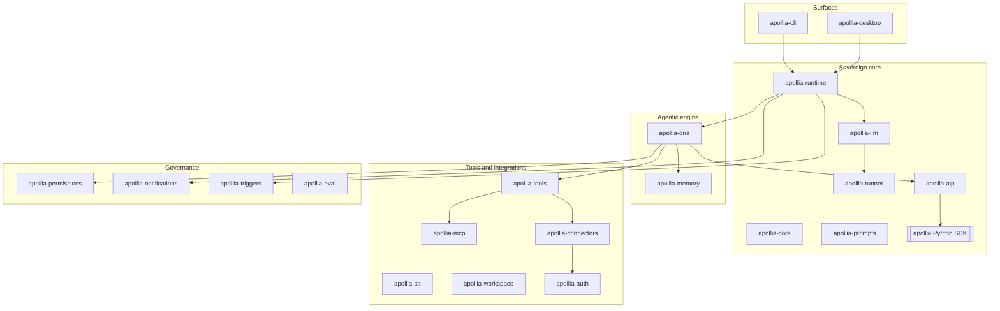

# 5. Vue de construction

Il s'agit de la vue C4 conteneurs et composants. Apollia est un workspace Rust
de vingt crates plus un SDK Python, regroupés en cinq domaines. Chaque crate
ci-dessous porte un rôle en une ligne qui correspond à ce que le code fait
réellement. Pour les formes exactes de l'API, de la CLI et du SDK, cette page
renvoie vers la référence générée plutôt que de la reformuler.

## Conteneurs par domaine

Les flèches indiquent les principales directions d'appel, pas la totalité des
liens. La gouvernance (`apollia-permissions`) et le journal d'audit (à
l'intérieur d'`apollia-runtime`) se trouvent sur le chemin de chaque appel
d'outil gouverné, ce que la [vue d'exécution](/architecture/runtime-view)
rend concret.

## Socle souverain

| Crate | Rôle |
|---|---|
| **apollia-runtime** | Le démon. Héberge le superviseur d'acteurs Tokio, l'EventBus, l'API HTTP axum, la gestion du chat et des plans, ainsi que le journal d'audit signé avec vérification. |
| **apollia-runner** | Le sidecar de reconnaissance vocale : `whisper` (via `whisper-rs`) hors processus, un backend GPU par build. L'inférence LLM locale ne s'exécute plus ici : elle passe par le `llama-server` embarqué (upstream llama.cpp) que le démon supervise, via une API HTTP compatible OpenAI avec appel d'outils natif `--jinja` et traitement par lots en continu. |
| **apollia-llm** | Le routeur LLM multi-backend : local et distant (Anthropic, OpenAI, Mistral, et tout point d'entrée compatible OpenAI, Ollama compris), suivi quotidien des coûts, un registre GGUF Hugging Face, et la détection matérielle. |
| **apollia-core** | Types partagés : le modèle de plan unifié, la configuration, les hooks de cycle de vie, et la configuration de routage hybride qui permet à une exécution d'escalader vers un modèle de pointe sur une clé utilisateur. |
| **apollia-aip** | Le pont PyO3 et le chemin A2A qui permet aux agents de s'appeler mutuellement par skill. |
| **apollia-prompts** | Le corpus de prompts anglais avec un pied de page de langue, partagé dans tout le moteur. |
| **apollia (SDK Python)** | AgentKit : les décorateurs `@agent` et `@skill`, les payloads `TypedDict`, le harnais de test et les mocks, les datasources, les templates, et les secrets à accès contrôlé. Le contexte d'exécution est le `ctx` à quinze services. |

Le contrat `ctx` est `sdk/apollia/types.py` et est documenté service par
service dans la [référence SDK](/reference/sdk). Les quinze services sont
`llm`, `memory`, `tools`, `a2a`, `mail`, `datasources`, `templates`,
`secrets`, `events`, `logger`, `profile`, `workspace`, `stt`, `notify`, et
`budget`.

## Moteur agentique

| Crate | Rôle |
|---|---|
| **apollia-oria** | Le moteur autonome. Il exécute une boucle ReAct selon deux modes, direct et orchestré, avec un observateur qui classifie et un raisonneur qui planifie et re-planifie. Il porte le budget d'étapes non contournable, la résilience des outils, la passe de vérification et de critique, la compaction de contexte à trois niveaux, et la parallélisation des outils en lecture seule sur un graphe de dépendances. Le déversement sur disque des résultats volumineux d'outils est implémenté mais n'est installé sur aucun chemin d'exécution : la compaction reste donc uniquement en mémoire. |
| **apollia-memory** | Trois couches de mémoire (épisodique, sémantique, procédurale) au-dessus de SQLite FTS5 avec classement BM25, un traqueur d'injection, une purge TTL, un magasin des choix de plan, et un export/import souverain. Le rappel se produit à l'initiative de l'agent, jamais injecté automatiquement. |

## Outils et intégrations

| Crate | Rôle |
|---|---|
| **apollia-tools** | La bibliothèque d'outils natifs (shell, Python, opérations sur fichiers, notebook, récupération HTTP, recherche et lecture web, recherche mémoire, demande à l'utilisateur), avec un bac à sable de chemins, une garde SSRF, des règles de permission, un audit SHA-256 de chaque appel, et un filtre de commandes shell dont les listes de motifs sont livrées vides et qu'aucun code de production ne remplit, si bien qu'il ne bloque aucune commande. |
| **apollia-mcp** | Le client MCP (initialize plus tools/list via stdio, Streamable HTTP, et SSE, avec des approbations HITL et une découverte mDNS optionnelle). Les agents invoquent les outils MCP via le chemin d'outil gouverné. Un serveur MCP entrant existe mais reste partiel (stdio uniquement). |
| **apollia-connectors** | Des connecteurs natifs Google et Microsoft agissant sur le mail, le calendrier et les fichiers. Google est limité aux scopes non restreints du niveau gratuit ; Microsoft est plus large. Les jetons vont dans le trousseau ou dans un fichier chiffré age. |
| **apollia-stt** | Reconnaissance vocale locale sur `whisper` : transcription et traduction par lots, plus une chaîne de traitement audio. Uniquement par lots, sans diffusion en continu. |
| **apollia-workspace** | Le contexte projet (Git, un fournisseur de règles `APOLLIA.md`, une arborescence de fichiers, un fournisseur de scripts) et des commandes slash personnalisées : la couche harnais autour d'un agent. |
| **apollia-auth** | Les flux OAuth et PKCE qui alimentent les connecteurs, avec les secrets qui atterrissent dans le trousseau ou dans un fichier age. |

Pour la liste complète des outils natifs, voir le [catalogue des outils
natifs](/reference/native-tools).

## Gouvernance

| Crate | Rôle |
|---|---|
| **apollia-permissions** | Types et décisions de permission, à l'échelle installation, projet ou session, avec quatre paliers d'autonomie et un registre des approbations. Ce qui est activé par défaut est le moteur de règles par préfixe, consulté à chaque invocation sur le chemin du chat, et le garde-fou qui tient un exécuteur de code hors de toute autorisation globale (voir [concepts transversaux](./07-crosscutting-concepts.md)). |
| **apollia-notifications** | Notifications opérateur sur desktop, terminal et webhook, avec niveaux de gravité, HITL, et un observateur d'inactivité. |
| **apollia-triggers** | Démarrages d'agent planifiés et réactifs : cron, intervalle, ponctuel, et surveillance de fichiers sont câblés ; la source webhook est une ébauche. |
| **apollia-eval** | Évaluation souveraine : suites TOML déclaratives et métriques de succès, de longueur, de durée réelle, et de coût. Une assertion `llm_judge` existe dans le schéma de suite, mais aucun juge n'est installé par la CLI, si bien qu'une telle assertion échoue au lieu d'être notée. |

Le journal d'audit et la vérification qui soutiennent la redevabilité
résident dans `apollia-runtime`. Voir [le modèle de
redevabilité](/explanation/accountability-model) pour comprendre comment ils
s'articulent, et [Auditer et vérifier une exécution](/how-to/audit-and-verify)
pour les commandes.

## Surfaces

| Crate | Rôle |
|---|---|
| **apollia-cli** | La CLI native IA : `do` (langage naturel vers une commande validée sur l'arbre de commandes réel, dry-run et confirmation, redispatché à travers la gouvernance), `explain` (lecture seule), `suggest` (déterministe, sans LLM), une palette floue, et un `guide` écrit. |
| **apollia-desktop** | L'application opérateur en Tauri v2 et Svelte 5. Des centaines de commandes Tauri réparties sur des dizaines de modules donnent une vue opérateur sur le chat, MCP, les connecteurs, les tâches, la mémoire, la gouvernance, les notifications, et l'audit, en atteignant le backend via une référence directe ou un pont REST local. |

La surface de commandes est la [référence CLI](/reference/cli) ; la surface
HTTP que pilotent le desktop et les hôtes est la [référence de l'API
HTTP](/reference/api/apollia-os-runtime-api).
