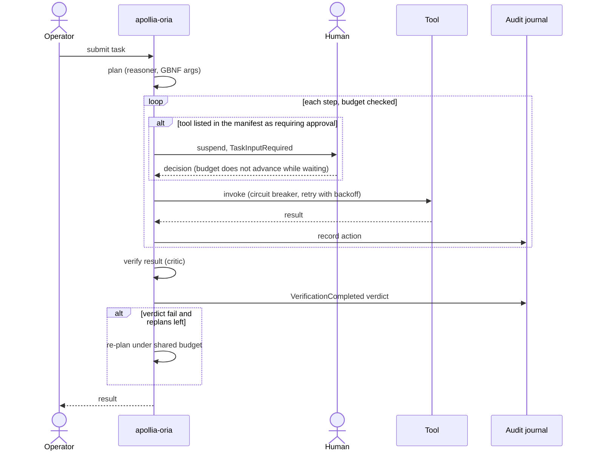
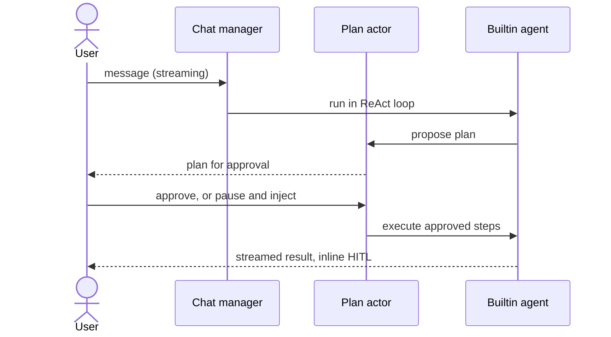
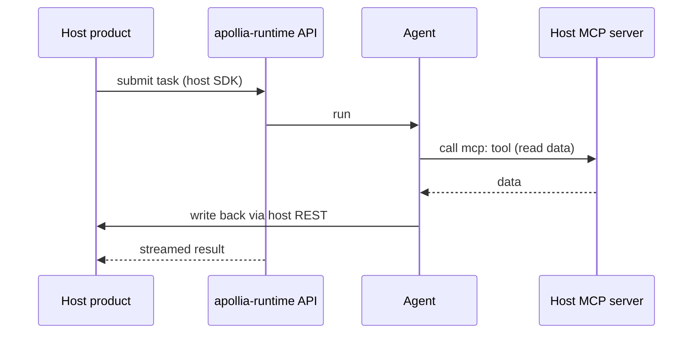
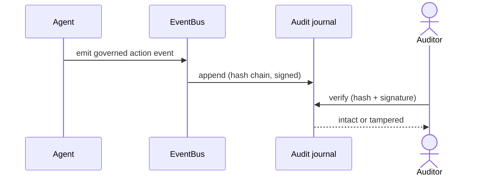
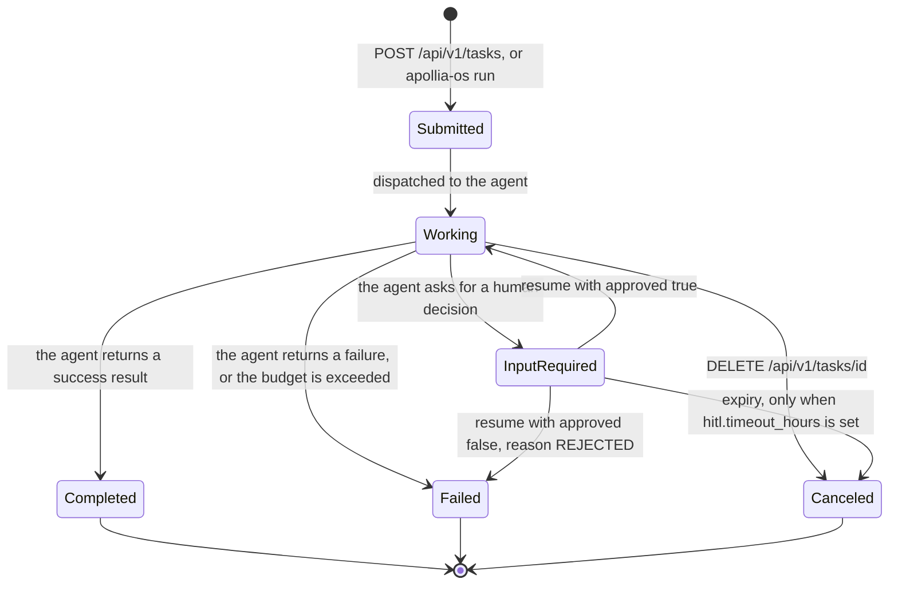
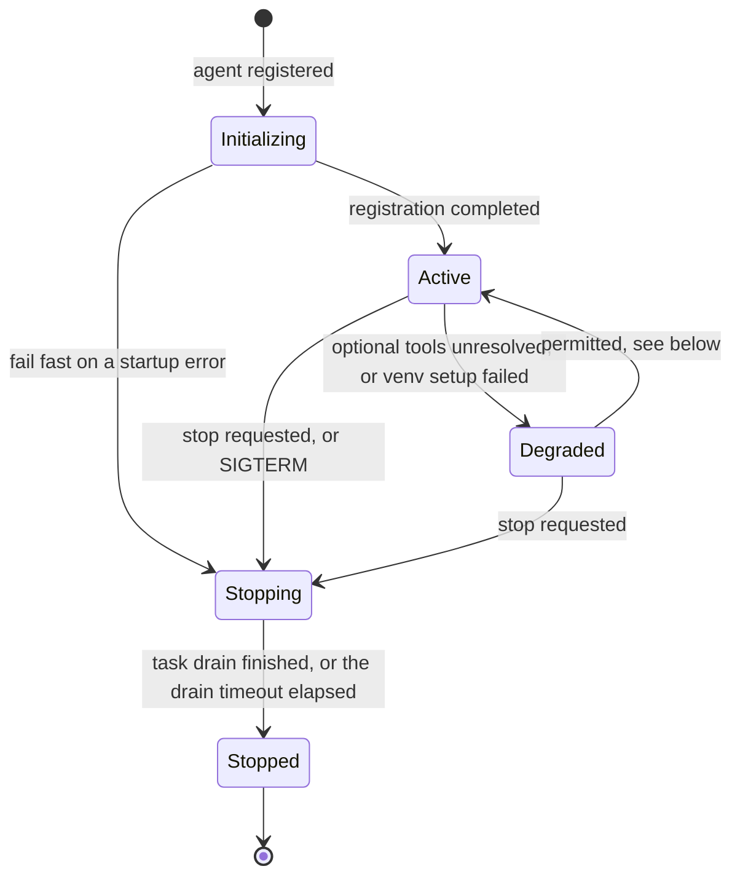
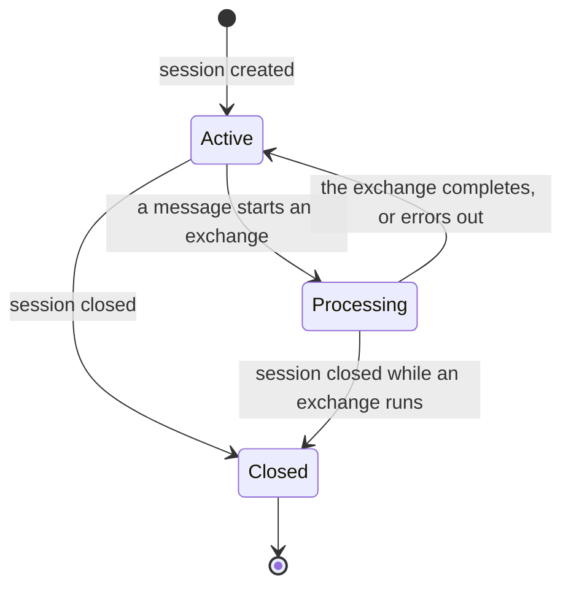
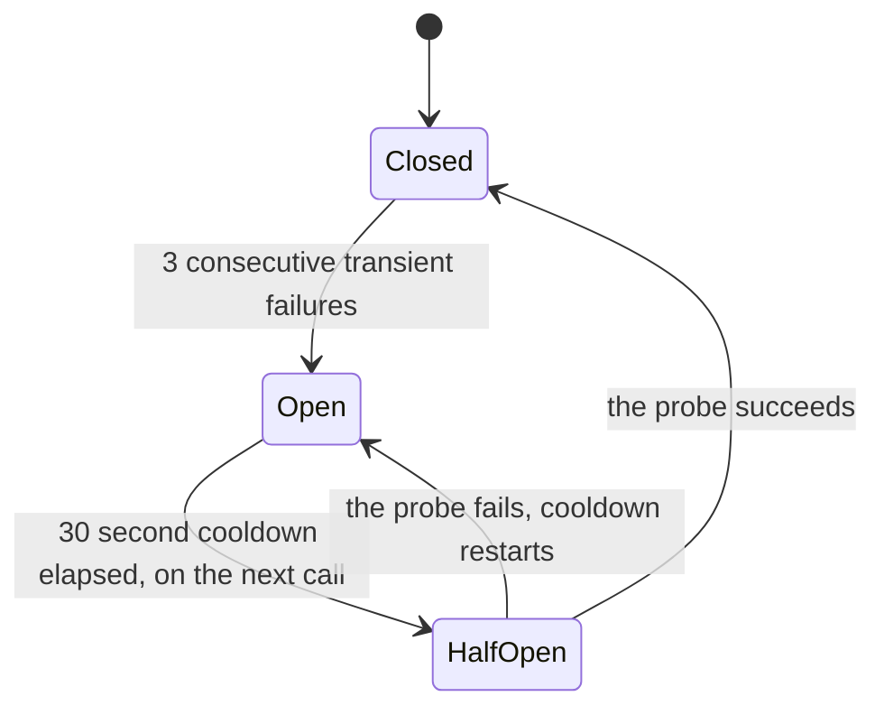

# 6. Vue d'exécution

Quatre scénarios de bout en bout montrent comment les blocs de construction
coopèrent à l'exécution. Chacun s'appuie sur une capacité réelle et effectivement
câblée ; lorsqu'une étape n'est que partiellement câblée, cela est signalé ici et
dans [Risques et dette technique](/architecture/risks-and-technical-debt).

## Scénario A : une tâche orchestrée avec vérification

Un opérateur confie une tâche à un agent autonome. Le moteur planifie, exécute
des appels d'outils gouvernés sous un budget, puis un critique vérifie le
résultat et peut replanifier en cas de verdict d'échec, le tout sous le même
plafond.



L'incrément de budget est câblé dans la boucle de l'acteur, si bien que le
plafond arrête réellement l'agent. Le critique s'exécute ; l'exécution des
vérifications shell déclarées par l'agent sous gouvernance est une étape
ultérieure. Voir [le modèle d'exécution](/architecture/decisions#execution-model) (vérification et
critique).

<!-- claim:orchestrated-approval-from-manifest -->

Lisez la branche d'approbation avec précision, car elle est plus étroite qu'il
n'y paraît. Sur ce chemin, la seule chose qui fait qu'une étape s'arrête pour un
humain est que le manifeste de l'agent lui-même liste cet outil sous
`tools_requiring_approval`. Il n'y a ni évaluation de politique, ni règle côté
opérateur, ni quoi que ce soit que le runtime décide de lui-même : un agent qui
ne déclare rien exécute chaque étape sans surveillance. Les règles de préfixe et
les invites d'approbation décrites dans le scénario suivant appartiennent au
chemin du chat et ne sont pas consultées ici.

La suspension est un simple await, si bien que le budget d'étape n'avance pas
pendant qu'un humain réfléchit. Si le runtime a été compilé sans registre
d'approbations, l'étape s'exécute quand même et journalise un avertissement :
la barrière se dégrade en position ouverte, et non fermée.

## Scénario B : chat avec plan-mode

Un utilisateur parle au runtime en streaming, et pour une requête à conséquence
l'agent propose un plan que l'utilisateur approuve avant l'exécution, avec la
possibilité de mettre en pause, d'injecter, et de reprendre.



Le chat, le plan-mode, le HITL, le fork et les enfants, et le
pause-inject-resume sont câblés. Une nuance : les sessions laissées dans un
état de traitement ne sont pas rechargées au démarrage, et la reprise les
ramène à l'état actif. Voir [le modèle de plan](/explanation/the-plan-model).

## Scénario C : fédération d'hôte via MCP et REST

Un produit hôte pilote le runtime via l'API stable tout en exposant ses propres
données sur MCP. Apollia lit à travers les outils MCP de l'hôte et écrit en
retour via l'API REST de l'hôte, de sorte que l'hôte reste le système de
référence.



Le client MCP, le chemin d'outil `mcp:` gouverné, et le contrat pilote
OpenAPI-plus-SDK sont câblés et éprouvés. Voir
[Intégrer par fédération](/how-to/embed-via-federation) et
[Intégrer via le contrat pilote](/how-to/integrate-via-driving-contract).

## Scénario D : une exécution auditée

Chaque action gouvernée atterrit dans un journal signé et chaîné par hachage.
Après coup, l'exécution peut être vérifiée pour son intégrité.



Le journal signé et la vérification sont câblés. Le rejeu (ré-exécution et
comparaison) a été abandonné par décision ; la redevabilité repose sur le
journal et la vérification. Le récit correspondant est
[le modèle de responsabilité](/explanation/accountability-model).

## Scénario E : comment un appel d'outil est gouverné dans le chat

<!-- claim:chat-tool-governance-path -->

C'est le chemin qui décide réellement si un outil s'exécute lorsqu'un
utilisateur parle au runtime. Il mérite d'être lu en entier, car c'est celui le
plus souvent décrit à tort : il n'y a pas de moteur de permission central placé
devant les appels d'outils, ni de classificateur d'injection dans la décision.
La barrière est une appartenance à un ensemble, et ce qui remplit cet ensemble
est ce qui compte.

```mermaid
sequenceDiagram
    actor User
    participant Chat as Chat manager
    participant Rules as Prefix rules (governance.db)
    participant Loop as ReAct loop
    participant Tool
    Chat->>Rules: allow-rules for this agent, and global ones
    Rules-->>Chat: tool names to pre-authorize
    Note over Chat: code executors are filtered out here
    User->>Loop: message
    Loop->>Loop: model asks for a tool
    alt tool name is in the authorized set
        Loop->>Tool: invoke
    else not authorized
        Loop-->>User: ChatApprovalRequired (5 minute timeout)
        User-->>Loop: allow once, always allow, or refuse
        alt refused, or the timeout expires
            Loop->>Loop: nothing runs, the model is told
        else allowed
            Loop->>Tool: invoke
        end
    end
    Tool-->>Loop: result
    opt always allow
        Loop->>Rules: persist an allow rule at the chosen scope
    end
```

Quatre propriétés découlent de cette forme, et chacune est un choix délibéré
plutôt qu'un accident.

**Les règles sont évaluées par argument, l'ensemble de noms par nom, et le
refus l'emporte.** Les règles de préfixe stockées sont évaluées en premier, par
rapport à l'argument de l'appel, à chaque invocation : un refus correspondant
refuse l'appel sans invite, même quand l'outil se trouve dans l'ensemble de
pré-autorisation par nom seul, si bien qu'un refus permanent ne peut pas être
contourné par un « toujours autoriser » plus large. Une autorisation
correspondante exécute l'appel sans élargir l'ensemble. Autrement, autoriser
`file_read` une fois avec « toujours autoriser » l'autorise quand même pour
chaque chemin qui lui sera jamais donné à cette portée : l'ensemble de
pré-autorisation ne porte que sur le nom, et les règles de préfixe au niveau
des arguments en sont tenues à l'écart (elles ne peuvent pas y être
représentées) précisément parce qu'elles sont évaluées à chaque invocation.
Tout ce qui reste déclenche l'invite d'approbation.

**Les exécuteurs de code sont exemptés de toute autorisation globale.**
`bash_executor` et ses semblables sont filtrés hors de l'ensemble
pré-autorisé sur les trois chemins qui l'alimentent : la configuration du
chat, les règles d'autorisation à l'échelle de l'agent, et les règles
d'autorisation globales. « Toujours autoriser » sur l'un d'eux est également
refusé au moment de la persistance. En dehors d'une règle de préfixe ciblée,
qui ne couvre jamais qu'une seule commande simple, chaque invocation demande,
à chaque fois. C'est le seul invariant qui survit à tous les chemins
ci-dessus, et il existe parce qu'une autorisation globale sur un shell est une
autorisation globale sur tout.

**L'absence de réponse est traitée comme un refus.** Une invite d'approbation
restée sans réponse pendant cinq minutes se résout en refus, et aucun outil ne
s'exécute. Le délai est fixé dans le code et n'est pas configurable.

**« Toujours autoriser » signifie l'un de cinq niveaux de persistance.**
L'opérateur choisit la portée : cet outil pour ce tour, cette session, cet
agent, ce projet, ou toute la machine. Par défaut, la portée est la session,
la moins persistante des cinq. Tout ce qui dépasse la session est écrit dans
`governance.db` et revient lors de l'exécution suivante, ce qui explique que
la première étape du diagramme ne soit pas vide.

## Machines à états

Les quatre scénarios ci-dessus font transiter des éléments entre des états.
Les états eux-mêmes sont énumérés dans le code et, dans deux cas, les
transitions y sont imposées plutôt que simplement voulues.

### Tâche

Une tâche porte l'un de six statuts, définis par `TaskStatus` dans
`apollia-core`.



Deux détails sont faciles à inverser.

Une approbation refusée n'annule pas la tâche, elle la fait échouer. Le
moteur renvoie un échec portant le code `REJECTED` et le motif de
l'opérateur, sans rappeler l'agent.

Une tâche qui attend un humain attend **indéfiniment par défaut**.
`[hitl] timeout_hours` n'a pas de valeur par défaut, si bien que rien ne fait
expirer une tâche suspendue à moins qu'un opérateur n'en fixe une ;
`scan_interval_secs` est ignoré tant qu'il n'est pas défini. Voir la
[référence de configuration](/reference/configuration).

La soumission est refusée d'emblée lorsque l'agent cible n'est pas dans un
état à même de prendre du travail : initializing, stopping et stopped sont
rejetés. Un agent degraded accepte quand même des tâches, et la soumission
émet un avertissement.

### Processus d'agent

<!-- claim:process-state-transitions-enforced -->

Le registre d'agents rejette une transition invalide au lieu de
l'enregistrer. C'est une véritable barrière, pas une convention :
`ProcessState::can_transition_to` est consulté à chaque changement d'état, et
une transition non autorisée renvoie une erreur à l'appelant.



Il n'existe pas de transition directe de `Initializing` à `Stopped` : un
échec au démarrage passe par `Stopping` comme tout autre arrêt.

`Degraded` signifie que l'agent tourne mais qu'un élément optionnel n'a pas
démarré. Deux chemins y mènent, tous deux à l'enregistrement : des outils
optionnels déclarés et non résolus, et un environnement Python dont
l'installation des paquets a échoué. La transition de `Degraded` vers
`Active` est autorisée par la table de transitions, mais le runtime ne
l'effectue jamais de lui-même, si bien qu'un agent qui démarre en `Degraded`
y reste jusqu'à son redémarrage.

Le délai de vidage est de 30 secondes par défaut.

### Session de chat



`Processing` est ce qui fait qu'un second message sur la même session est
refusé plutôt qu'entrelacé. Fermer une session annule l'échange en cours.
`Closed` est terminal : l'historique reste lisible, rien de nouveau n'est
accepté.

### Circuit breaker d'outil

<!-- claim:tool-circuit-breaker-wired -->

Chaque outil porte son propre circuit breaker, indexé par nom d'outil. Des
échecs transitoires répétés sur un outil arrêtent les appels à cet outil sans
toucher aux autres.



Seuls les échecs classés transitoires comptent. Une erreur permanente, un
argument invalide ou une permission refusée, laisse le compteur intact : le
breaker existe pour encaisser une dépendance instable, pas pour punir un
appelant. Un seul succès remet le compteur à zéro.

Le cooldown n'est pas une minuterie qui se déclenche. Le breaker passe à
`HalfOpen` quand le prochain appel arrive après l'écoulement du cooldown, si
bien qu'un outil que personne n'appelle reste `Open` indéfiniment. `HalfOpen`
ne restreint pas la concurrence : les appels qui arrivent ensemble sont tous
admis, et le premier résultat décide de la transition.

Le seuil et le cooldown sont fixés à 3 et 30 secondes. Ils ne sont pas
configurables.
