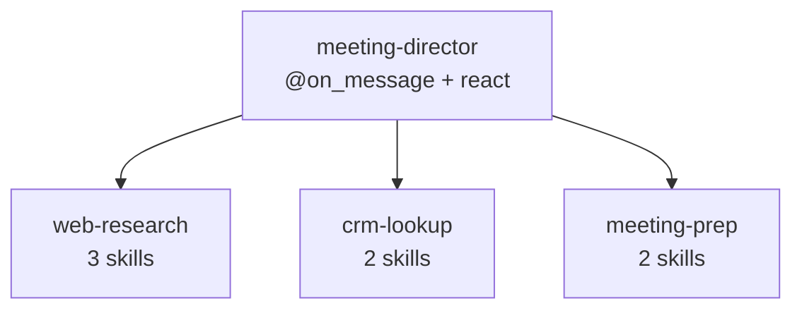
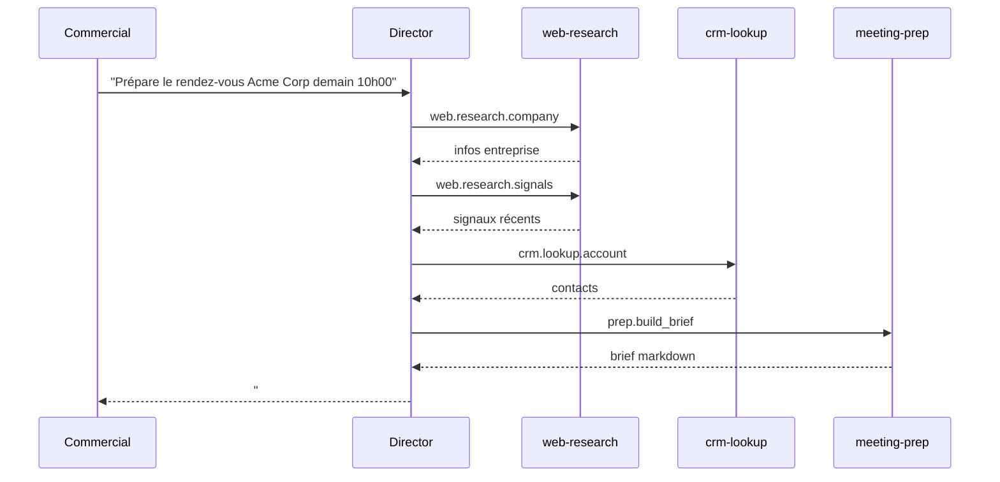

# Construire un assistant multi-agents

Ce tutoriel avancé présente un système multi-agents complet : un assistant de
préparation de rendez-vous commerciaux. Un commercial saisit une demande dans
Apollia et, quelques secondes plus tard, reçoit un briefing structuré en
markdown sur le prospect. Derrière ce message unique se cachent quatre
agents : un director qui orchestre trois workers via A2A.

Vous devriez déjà avoir écrit [votre premier agent](/tutorials/your-first-agent),
un [worker](/how-to/write-a-worker) et un
[director](/how-to/write-a-director). Comptez environ une heure.

## Ce que vous allez construire

Le commercial demande, dans le chat Apollia :

> Prépare le rendez-vous avec Acme Corp demain à 10h00.

L'assistant renvoie quelque chose comme :

```markdown
# Rendez-vous avec Acme Corp, demain 10h00

## L'entreprise
Acme Corp est une PME industrielle (environ 80 salariés, 12 M€ de chiffre
d'affaires). Elle fabrique des pièces métalliques de précision. Son siège
est à Lyon, avec deux sites de production.

## Signaux récents
- 2026-05-10 : levée de fonds de série A de 4 M€ auprès d'un fonds régional.
- 2026-04-22 : annonce du recrutement d'un responsable informatique (LinkedIn).
- 2026-04-15 : obtention de la certification ISO 9001:2026.

## Historique CRM
- 3 contacts précédents avec Pierre Martin (responsable informatique).
- Dernier échange : 2026-03-08, demande de devis pour un audit
  d'infrastructure.
- Notes : la préoccupation principale est la traçabilité de production.

## Points à aborder
1. Relancer sur le devis du 8 mars.
2. Cas d'usage de traçabilité pour les nouveaux ateliers.
3. Lien possible avec leur levée de fonds récente.

## Questions à poser
- Quels sont les objectifs après la levée de fonds ?
- Le responsable informatique récemment recruté a-t-il fixé une feuille de
  route ?
- Quels sont les points de friction du système actuel ?
```

## Architecture

Quatre agents, une responsabilité chacun. Le director est le point d'entrée
du chat et ne détient aucun skill métier propre ; chaque worker possède un
domaine.



| Agent | Rôle | Type | Skills |
|---|---|---|---|
| `meeting-director` | Orchestrateur, point d'entrée du chat | conversational + react | aucun exposé |
| `web-research` | Recherche publique sur une entreprise | worker | `web.research.company`, `web.research.signals`, `web.research.linkedin` |
| `crm-lookup` | Consultation du CRM | worker | `crm.lookup.account`, `crm.lookup.history` |
| `meeting-prep` | Rendu du brief final | worker | `prep.build_brief`, `prep.format_questions` |

Le director pilote les workers via A2A, un appel à la fois, en réagissant à
chaque résultat :



Chaque agent vit dans son propre fichier `.py`. L'installation ne copie que
le fichier passé, donc chaque `TypedDict` et chaque fonction utilitaire dont
un agent a besoin doit vivre dans ce même fichier. N'ajoutez jamais
`from __future__ import annotations` à un fichier qui définit un
`TypedDict` : cela transforme les annotations en chaînes de caractères et
casse le schéma que le runtime lit à l'enregistrement.

<!-- claim:skill-schema-built-from-typeddict-required-keys -->

Ce schéma est dérivé du `TypedDict` au moment de l'enregistrement, ce qui
explique pourquoi une annotation transformée en chaîne produit silencieusement
un skill malformé plutôt qu'une erreur.

## Worker 1 : web-research

Trois skills en lecture seule au-dessus des outils natifs `web_search` et
`web_read` d'Apollia. Créez `web_research.py` :

```python
"""Public web research about a company."""

from typing import Annotated, TypedDict

from apollia import DomainError, agent, skill
from apollia.types import Ctx


# Pas de `from __future__ import annotations` ici : cela casserait
# TypedDict.__required_keys__, que le runtime lit pour construire les schémas.

class CompanyInfo(TypedDict):
    name: str
    industry: str
    size_estimate: str
    headquarters: str
    description: str


class SignalEntry(TypedDict):
    date: str
    title: str
    source: str
    url: str
    summary: str


TRUSTED_NEWS_DOMAINS = (
    "lesechos.fr",
    "latribune.fr",
    "usine-nouvelle.com",
    "linkedin.com",
    "bfmtv.com",
)


@agent(
    name="web-research",
    version="0.1.0",
    description="Public web research about a company.",
    agent_type="worker",
    tools_required=("web_search", "web_read"),
)
class WebResearch:
    @skill(
        "web.research.company",
        description="Find general public info about a company (industry, size, HQ).",
        examples=[{"company_name": "Acme Corp"}],
    )
    async def research_company(
        self,
        company_name: Annotated[str, "Legal or commercial name of the company."],
        ctx: Ctx,
    ) -> CompanyInfo:
        results = await ctx.tools.call(
            "web_search",
            input={"query": f'"{company_name}" company headquarters employees'},
        )
        if not results.get("results"):
            raise DomainError("COMPANY_NOT_FOUND", f"No public info on {company_name}")

        top = results["results"][0]
        page = await ctx.tools.call("web_read", input={"url": top["url"]})

        # Un worker en production résumerait ici avec ctx.llm.
        return {
            "name": company_name,
            "industry": "Unknown (summarization step)",
            "size_estimate": "Unknown",
            "headquarters": "Unknown",
            "description": page.get("content", "")[:500],
        }

    @skill(
        "web.research.signals",
        description="Find recent news signals about a company (last 90 days).",
        examples=[{"company_name": "Acme Corp", "max_signals": 5}],
    )
    async def research_signals(
        self,
        company_name: Annotated[str, "Legal or commercial name of the company."],
        ctx: Ctx,
        max_signals: Annotated[int, "Maximum number of signals to return."] = 5,
    ) -> dict:
        signals: list[SignalEntry] = []
        results = await ctx.tools.call(
            "web_search",
            input={"query": f'"{company_name}" news 2026', "max_results": max_signals * 2},
        )

        for hit in results.get("results", [])[:max_signals]:
            if not any(src in hit["url"] for src in TRUSTED_NEWS_DOMAINS):
                continue
            page = await ctx.tools.call("web_read", input={"url": hit["url"]})
            signals.append({
                "date": hit.get("age", "Unknown"),
                "title": hit["title"],
                "source": hit["url"],
                "url": hit["url"],
                "summary": page.get("content", "")[:280],
            })

        return {"company_name": company_name, "signals": signals}

    @skill(
        "web.research.linkedin",
        description="Find a company's LinkedIn page.",
        examples=[{"company_name": "Acme Corp"}],
    )
    async def research_linkedin(
        self,
        company_name: Annotated[str, "Company name."],
        ctx: Ctx,
    ) -> dict:
        results = await ctx.tools.call(
            "web_search",
            input={"query": f'site:linkedin.com/company "{company_name}"'},
        )
        if not results.get("results"):
            return {"company_name": company_name, "linkedin_url": None, "key_people": []}
        return {
            "company_name": company_name,
            "linkedin_url": results["results"][0]["url"],
            "key_people": [],
        }
```

Chaque skill renvoie un simple `dict` (ou un `TypedDict`, qui est un `dict` à
l'exécution), et lève `DomainError` pour les échecs attendus. Les appels
d'outils utilisent [`ctx.tools`](/reference/sdk/tools) ; consultez la
[référence des outils natifs](/reference/native-tools) pour connaître le
format d'entrée de `web_search` et `web_read`.

## Worker 2 : crm-lookup

<!-- claim:secrets-gated-by-manifest-declaration -->

Ce worker lit un identifiant avec [`ctx.secrets`](/reference/sdk/secrets). Le
secret est déclaré dans `@agent(secrets=(...))` et lu, jamais écrit, à
l'exécution. Créez `crm_lookup.py` :

```python
"""Read-only CRM lookup (HubSpot)."""

from typing import Annotated, TypedDict

from apollia import DomainError, agent, skill
from apollia.types import Ctx


class ContactRecord(TypedDict):
    full_name: str
    job_title: str
    email: str
    last_contact_date: str


class HistoryEntry(TypedDict):
    date: str
    type: str
    summary: str


HUBSPOT_API = "https://api.hubapi.com/crm/v3/objects"


@agent(
    name="crm-lookup",
    version="0.1.0",
    description="Read-only CRM lookup (HubSpot).",
    agent_type="worker",
    secrets=("hubspot_api_token",),
    tools_required=("web_read",),
)
class CrmLookup:
    @skill(
        "crm.lookup.account",
        description="Look up contacts for a company in HubSpot CRM.",
        examples=[{"company_name": "Acme Corp"}],
    )
    async def lookup_account(
        self,
        company_name: Annotated[str, "Company name as known in the CRM."],
        ctx: Ctx,
    ) -> dict:
        token = ctx.secrets.get("hubspot_api_token")
        if not token:
            raise DomainError("CONFIG", "hubspot_api_token is not configured")

        url = f"{HUBSPOT_API}/companies/search?q={company_name}"
        response = await ctx.tools.call(
            "web_read",
            input={"url": url, "headers": {"Authorization": f"Bearer {token}"}},
        )
        if response.get("status_code", 0) >= 400:
            raise DomainError("CRM_ERROR", f"HubSpot lookup failed: {response.get('status_code')}")

        contacts: list[ContactRecord] = []
        return {"company_name": company_name, "contacts": contacts}

    @skill(
        "crm.lookup.history",
        description="Fetch interaction history with a company contact.",
        examples=[{"contact_email": "pierre.martin@acmecorp.fr", "since_days": 365}],
    )
    async def lookup_history(
        self,
        contact_email: Annotated[str, "Email of the contact in the CRM."],
        ctx: Ctx,
        since_days: Annotated[int, "Look-back window in days."] = 365,
    ) -> dict:
        token = ctx.secrets.get("hubspot_api_token")
        if not token:
            raise DomainError("CONFIG", "hubspot_api_token is not configured")

        history: list[HistoryEntry] = []
        return {"contact_email": contact_email, "history": history}
```

## Worker 3 : meeting-prep

Un worker de pur formatage : il prend les données agrégées et les restitue en
markdown. Aucun service `ctx` n'est nécessaire. Créez `meeting_prep.py` :

```python
"""Format the final meeting briefing."""

from typing import Annotated, TypedDict

from apollia import DomainError, agent, skill
from apollia.types import Ctx


class BriefPayload(TypedDict):
    company_name: str
    meeting_when: str
    company_info: dict
    signals: list
    crm_contacts: list
    crm_history: list


def _render_brief(payload: BriefPayload) -> str:
    lines = [f"# Meeting with {payload['company_name']}, {payload['meeting_when']}", ""]
    lines.append("## The company")
    lines.append(payload["company_info"].get("description", "(no info)"))
    lines.append("")
    lines.append("## Recent signals")
    if payload["signals"]:
        for signal in payload["signals"]:
            lines.append(f"- {signal['date']}: {signal['title']} ({signal['source']}).")
    else:
        lines.append("- No recent signal.")
    lines.append("")
    lines.append("## CRM contacts")
    for contact in payload["crm_contacts"]:
        lines.append(f"- {contact['full_name']} ({contact['job_title']}, {contact['email']}).")
    lines.append("")
    lines.append("## Recent history")
    for entry in payload["crm_history"]:
        lines.append(f"- {entry['date']}: {entry['type']}, {entry['summary']}.")
    return "\n".join(lines)


@agent(
    name="meeting-prep",
    version="0.1.0",
    description="Format the final meeting briefing.",
    agent_type="worker",
)
class MeetingPrep:
    @skill(
        "prep.build_brief",
        description="Render the full meeting briefing as Markdown.",
        examples=[{
            "company_name": "Acme Corp",
            "meeting_when": "tomorrow 10:00",
            "company_info": {"name": "Acme Corp", "description": "Industrial SMB"},
            "signals": [],
            "crm_contacts": [],
            "crm_history": [],
        }],
    )
    async def build_brief(self, payload: BriefPayload, ctx: Ctx) -> dict:
        if not payload.get("company_name"):
            raise DomainError("EMPTY_COMPANY", "company_name must not be empty")
        return {"markdown": _render_brief(payload), "company_name": payload["company_name"]}

    @skill(
        "prep.format_questions",
        description="Format a list of open questions to ask at the meeting.",
        examples=[{"company_name": "Acme Corp", "themes": ["funding", "hiring"]}],
    )
    async def format_questions(
        self,
        company_name: Annotated[str, "Company name."],
        themes: Annotated[list[str], "Topics to probe. Each topic yields one or two questions."],
        ctx: Ctx,
    ) -> dict:
        lines = [f"## Questions to ask {company_name}", ""]
        for theme in themes:
            lines.append(f"- About **{theme}**: ?")
        return {"markdown": "\n".join(lines)}
```

## Installer et activer les workers

L'installation enregistre l'agent ; l'activation le charge dans le registre en
cours d'exécution. Un director qui appelle un skill d'un worker installé mais
non activé reçoit `unknown A2A skill` dès son premier message, donc faites les
deux.

```bash
apollia-os agent install ./web_research.py
apollia-os agent install ./crm_lookup.py
apollia-os agent install ./meeting_prep.py

apollia-os agent enable web-research
apollia-os agent enable crm-lookup
apollia-os agent enable meeting-prep
```

Fournissez l'identifiant CRM déclaré par le worker `crm-lookup`. Les secrets
déclarés par un agent vivent dans le magasin d'identifiants géré par
l'opérateur, sous l'espace de noms fixe `agent` ; `ctx.secrets` les lit, ne
les écrit jamais. L'opérateur provisionne la valeur une fois, elle est
stockée chiffrée, et le worker ne fait que la lire à l'exécution.

La commande `apollia-os tools credentials set <target> <key>` provisionne la
valeur. `<target>` est soit le nom d'un outil natif (comme `web_search`),
soit l'espace de noms littéral `agent` pour un secret qu'un agent a déclaré
dans son manifest :

```bash
apollia-os tools credentials set agent hubspot_api_token
# demande la valeur une fois, saisie masquée, stockage chiffré
```

La même valeur peut aussi être définie depuis le gestionnaire d'identifiants
de l'application desktop. Voir [`ctx.secrets`](/reference/sdk/secrets) pour
la façon dont le worker la relit.

Confirmez que les trois workers sont actifs et que leurs skills sont
exposés :

```bash
apollia-os agent list
apollia-os a2a skills | grep -E "(web|crm|prep)\."
```

Si un worker échoue au chargement, exécutez `apollia-os inspect <file>.py`
pour comprendre pourquoi.

## Le director

Le director est un agent conversationnel qui expose chaque skill des workers
comme un outil, et laisse `apollia.react` décider de l'ordre des appels.
Créez `director.py` :

```python
"""Meeting-prep director: orchestrates the three workers through apollia.react."""

from apollia import agent, on_message, react
from apollia.types import Ctx, Message


SYSTEM_PROMPT = """\
You are a meeting preparation assistant. The user is a sales rep about to meet a
prospect. Your job: build a structured briefing in markdown.

Workflow:

1. Parse the request: company name and meeting time (for example "tomorrow 10:00").
2. Use `web.research.company` to gather general info.
3. Use `web.research.signals` to fetch three to five recent news signals.
4. Use `crm.lookup.account` to fetch contacts. If it fails, continue without.
5. For the most relevant contact, call `crm.lookup.history` for their history.
6. Call `prep.build_brief` with the aggregated payload to render the markdown.
7. Optionally call `prep.format_questions` for three to five open questions.

Aim for six to eight tool calls in total. If a worker fails, note it with
emit_thought and continue. The brief must always be produced.
"""


@agent(
    name="meeting-director",
    version="0.1.0",
    description="Prepare a commercial meeting briefing.",
)
class MeetingDirector:
    @on_message
    async def chat(
        self,
        message: str,
        history: list[Message],
        ctx: Ctx,
    ) -> str:
        ctx.events.emit_thought("Director starting", step=0)

        return await react(
            ctx,
            system=SYSTEM_PROMPT,
            user=message,
            tools=[
                await ctx.a2a.skill_as_tool("web.research.company"),
                await ctx.a2a.skill_as_tool("web.research.signals"),
                await ctx.a2a.skill_as_tool("web.research.linkedin"),
                await ctx.a2a.skill_as_tool("crm.lookup.account"),
                await ctx.a2a.skill_as_tool("crm.lookup.history"),
                await ctx.a2a.skill_as_tool("prep.build_brief"),
                await ctx.a2a.skill_as_tool("prep.format_questions"),
            ],
            max_steps=12,
        )
```

`emit_thought` diffuse une étape de raisonnement à tout observateur via
[`ctx.events`](/reference/sdk/events). Les sept appels à `skill_as_tool`
transforment chaque skill de worker en un outil que le modèle peut choisir ;
[`ctx.a2a`](/reference/sdk/a2a) résout chaque schéma au moment de l'appel.

## Exécutez-le

```bash
apollia-os agent install ./director.py
apollia-os agent enable meeting-director
apollia-os run meeting-director "Prepare the meeting with Acme Corp tomorrow at 10:00"
```

## Observer ce qui s'est passé

Chaque exécution laisse une trace. Listez les tâches récentes et inspectez-en
une étape par étape :

```bash
apollia-os task list
apollia-os task inspect <task_id>
```

`task inspect` affiche les pensées du director et chaque appel A2A avec son
entrée. Pour le registre inviolable des appels d'outils et de leurs
résultats, utilisez le journal d'audit :

```bash
apollia-os audit list --limit 50
```

Consultez la [référence CLI](/reference/cli) pour chaque sous-commande
`task` et `audit`.

## Testez vos agents

Apollia embarque un harnais de test isomorphe, `apollia.testing.mock`, qui
exécute un skill ou un message en process avec un `ctx` simulé, sans
nécessiter de daemon. Il permet de faire des assertions sur les résultats et
sur les appels effectués par un director.
[Testez vos agents](/how-to/test-your-agents) couvre ce sujet ; ce tutoriel
s'arrête à la construction et à l'exécution.

## Pour aller plus loin

- Déclenchez l'assistant depuis un événement de calendrier plutôt que par un
  message saisi.
- Personnalisez le brief par commercial avec
  [`ctx.profile`](/reference/sdk/profile).
- Laissez le director apprendre des rendez-vous passés avec
  [`ctx.memory`](/reference/sdk/memory).
- Ajoutez un worker pour une nouvelle source de données, et exposez ses
  skills au director de la même façon.
