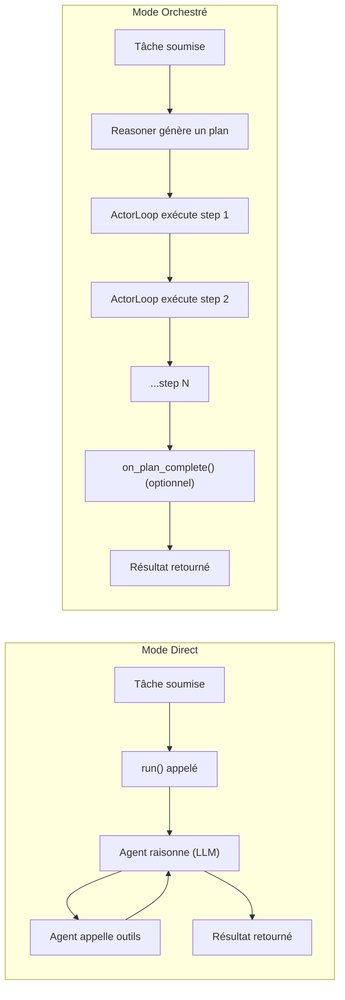

# Guide — Agents en Mode Orchestré

> *Comment écrire un agent Python qui délègue sa planification à ORIA : `execution_mode`, `system_prompt`, et le hook optionnel `on_plan_complete`.*

---

## Qu'est-ce que le Mode Orchestré ?

En Mode Direct (par défaut), c'est votre code Python dans `run()` qui décide quels outils appeler et dans quel ordre. En Mode Orchestré, c'est le runtime qui planifie et exécute — votre agent décrit **ce qu'il sait faire** (via `system_prompt`), et le runtime décide **comment** le faire.

**Les composants d'ORIA :**
- **ORIA** (Observer-Reasoner-Actor) : le moteur d'exécution du runtime. C'est lui qui supervise tous les agents, en mode direct comme orchestré.
- **Reasoner** : un appel LLM qui, à partir du `system_prompt` de l'agent et de la tâche soumise, génère un plan d'exécution JSON (quels outils appeler, dans quel ordre, avec quels paramètres).
- **ActorLoop** : la boucle d'exécution qui parcourt le plan step par step, appelle les outils, et gère les erreurs. Elle applique le `StepBudget` à chaque step.

---

## 1. Principe

En **Mode Orchestré**, l'agent n'implémente pas de boucle ReAct dans `run()`. ORIA prend en charge l'intégralité de l'exécution :

1. Le **Reasoner** génère un `ExecutionPlan` JSON à partir du `system_prompt` de l'agent et de l'input de la tâche
2. L'**ActorLoop** exécute les steps dans l'ordre topologique, appelle les outils directement
3. ORIA replanifie automatiquement si un step échoue (max 2 replans)
4. L'agent peut optionnellement post-traiter les résultats via `on_plan_complete()`

**Différence avec le Mode Direct :**

| | Mode Direct | Mode Orchestré |
|---|---|---|
| `run()` appelé par ORIA | Oui — boucle complète | Non — `run()` ignoré |
| Qui planifie | L'agent (boucle ReAct interne) | ORIA (LLM Reasoner) |
| Qui appelle les outils | L'agent via `ctx.tools` | ORIA via `ActorLoop` |
| Replanification | Manuelle dans `run()` | Automatique (max 2) |
| Persistance SQLite | Non | Oui (`~/.apollia/plans.db`) |

### Flux d'exécution comparé



---

## 2. Contrat minimal

Le **contrat AIP reste identique** : `manifest()` + `run()` async. `run()` n'est simplement pas appelé pendant l'exécution des steps.

```python
from apollia_aip import AgentManifest, AIPTask, AIPResult, RuntimeContext

class AnalyseContratAgent:

    def manifest(self):
        return AgentManifest(
            name="analyse-contrat",
            version="1.0.0",
            description="Analyse un contrat et extrait les clauses clés",
            execution_mode="orchestrated",       # Force le Mode Orchestré
            system_prompt=(
                "Tu es un expert juridique spécialisé dans l'analyse de contrats commerciaux. "
                "Décompose l'analyse en étapes séquentielles : lecture, extraction, synthèse. "
                "Utilise file_io pour lire les fichiers. Chaque step doit produire un résultat autonome."
            ),
            tools_required=["file_io"],
        )

    async def run(self, task: AIPTask, ctx: RuntimeContext) -> AIPResult:
        # En Mode Orchestré, run() n'est PAS appelé par ORIA pendant les steps.
        # Cette méthode est requise par le contrat AIP mais ne sera pas invoquée.
        # Laisser vide ou lever une exception pour signaler une invocation inattendue.
        raise NotImplementedError("Mode orchestré — run() non utilisé")
```

---

## 3. Champs `AgentManifest` spécifiques au Mode Orchestré

### `execution_mode`

```python
execution_mode="orchestrated"  # Force le Mode Orchestré
execution_mode="direct"        # Force le Mode Direct
execution_mode="auto"          # Heuristique ORIA (défaut)
```

Toute valeur inconnue est traitée comme `"auto"`.

### `system_prompt`

Prompt système injecté dans le Reasoner LLM pour guider la planification. Doit décrire :
- Le domaine métier de l'agent
- Le style de décomposition souhaité (séquentiel, parallèle, itératif)
- Les contraintes spécifiques (format de sortie, outils préférés)

```python
system_prompt=(
    "Tu es un assistant comptable pour PME françaises. "
    "Décompose les tâches en steps atomiques de 1-3 minutes chacun. "
    "Utilise python_executor pour les calculs et file_io pour la persistance. "
    "Chaque step doit avoir un output vérifiable et indépendant."
)
```

> `system_prompt` est **requis** si `execution_mode="orchestrated"`. ORIA émet un avertissement si absent.

---

## 4. Hook optionnel `on_plan_complete()`

Après l'exécution de tous les steps, ORIA détecte via duck typing (`hasattr`) si l'agent expose un hook `on_plan_complete`. Si oui, il l'appelle avec les outputs de tous les steps.

### Signature

```python
async def on_plan_complete(
    self,
    step_results: dict[str, str],  # { "s1": "output_step_1", "s2": "output_step_2", ... }
    ctx: RuntimeContext,
) -> str:
    """
    Post-traitement des résultats de tous les steps.
    Retourne la réponse finale (str) — devient l'output de la tâche.
    """
    ...
```

### Exemple — consolidation d'un rapport

```python
class AnalyseContratAgent:

    def manifest(self):
        return AgentManifest(
            name="analyse-contrat",
            execution_mode="orchestrated",
            system_prompt="Tu es un expert juridique...",
            tools_required=["file_io"],
        )

    async def run(self, task: AIPTask, ctx: RuntimeContext) -> AIPResult:
        raise NotImplementedError("Mode orchestré — run() non utilisé")

    async def on_plan_complete(
        self,
        step_results: dict[str, str],
        ctx: RuntimeContext,
    ) -> str:
        # Récupérer les outputs par step_id
        clauses = step_results.get("s2", "")
        synthese = step_results.get("s3", "")

        # Construire la réponse finale structurée
        rapport = f"## Analyse du contrat\n\n### Clauses identifiées\n{clauses}\n\n### Synthèse\n{synthese}"

        # Optionnel : persister en mémoire
        await ctx.memory.record(f"Analyse contrat : {len(step_results)} sections traitées")

        return rapport
```

### Si `on_plan_complete` est absent

ORIA concatène automatiquement les outputs de tous les steps dans l'ordre d'exécution :

```
output_s1\n\noutput_s2\n\noutput_s3
```

---

## 5. Visualisation temps réel avec `apollia-os run`

En Mode Orchestré, `apollia-os run` affiche le plan et la progression step par step :

```bash
$ apollia-os run analyse-contrat "Analyse le contrat Dupont SA"

  Plan généré (3 étapes) :
  ├── [s1] Lire le fichier contrat Dupont SA  → file_io
  ├── [s2] Extraire les clauses clés  → llm  (attend s1)
  └── [s3] Rédiger la synthèse exécutive  → llm  (attend s2)

  ● [1/3] Lire le fichier contrat Dupont SA...
  ✔ [1/3] (complété)  0.1s
  ● [2/3] Extraire les clauses clés...
  ✔ [2/3] (complété)  2.3s
  ● [3/3] Rédiger la synthèse exécutive...
  ✔ [3/3] (complété)  1.9s

  ✔ Tâche complétée en 4.4s
```

Si un step échoue et qu'une replanification est déclenchée :

```bash
  ✗ [2/3] Extraire les clauses clés  → Erreur : fichier encodage UTF-16
  ⟳ Replanification 1/2...

  Plan révisé (3 étapes) :
  ├── [s1] Lire le fichier contrat Dupont SA  → file_io       ✔
  ├── [s2b] Convertir l'encodage UTF-16  → python_executor
  └── [s3] Extraire les clauses et rédiger  → llm  (attend s2b)
```

**Inspecter le plan après exécution :**

```bash
$ apollia-os task inspect t-abc123
```

---

## 6. Contraintes et bonnes pratiques

### `system_prompt` efficace

- **Atomique** : chaque step doit produire un résultat indépendant et vérifiable
- **Borné** : indiquer une durée ou une taille maximale par step
- **Outil explicite** : préciser quel outil utiliser par type de tâche (`file_io` pour I/O, `python_executor` pour calcul)
- **Dépendances claires** : si l'ordre compte, le mentionner explicitement

```python
system_prompt=(
    "Décompose la tâche en 3-5 steps maximum. "
    "Chaque step est indépendant et produit un JSON ou une chaîne de texte. "
    "Pour lire/écrire des fichiers : utilise file_io. "
    "Pour les calculs : utilise python_executor. "
    "Pour la génération de texte : utilise llm (aucun tool_hint). "
    "Les steps peuvent avoir des dépendances via depends_on."
)
```

### StepBudget en Mode Orchestré

Le `StepBudget` s'applique par step, pas par tâche. Un agent orchestré avec 10 steps et un budget par défaut de 10 steps sera épuisé au premier step si chaque step consomme 10 tool_calls.

Adapter le budget dans le manifest :

```python
from apollia_aip import AgentManifest, StepBudgetConfig

AgentManifest(
    name="analyse-contrat",
    execution_mode="orchestrated",
    step_budget=StepBudgetConfig(
        max_steps=20,          # Plus de steps pour les tâches complexes
        max_tool_calls=40,
        wall_clock_timeout=600  # 10 minutes max
    ),
    # ...
)
```

### Replanification

La replanification est automatique pour les erreurs retryables (`ToolCallFailed`, `LlmCallFailed`). Les erreurs permanentes (`ToolNotFound`, `NoLlmBackend`) font échouer la tâche immédiatement.

Le `system_prompt` peut guider le comportement de replanification :

```python
system_prompt=(
    "Si un step échoue, propose une approche alternative. "
    "Par exemple, si file_io échoue sur un fichier, essaie python_executor pour le lire."
)
```

---

## 7. Exemple complet — Agent devis multi-étapes

```python
from apollia_aip import AgentManifest, AIPTask, AIPResult, RuntimeContext

class DevisGeneratorOrchestre:
    """Agent de génération de devis en Mode Orchestré."""

    def manifest(self):
        return AgentManifest(
            name="devis-generator-orchestre",
            version="1.0.0",
            description="Génère un devis structuré via planification ORIA",
            execution_mode="orchestrated",
            system_prompt=(
                "Tu es un assistant commercial pour PME. "
                "Pour générer un devis : "
                "1. Lire les infos client depuis clients/<nom>.json (file_io), "
                "2. Calculer les montants HT et TTC (python_executor), "
                "3. Générer le JSON du devis (llm), "
                "4. Sauvegarder dans devis/devis-<date>.json (file_io). "
                "Chaque step est indépendant. Utilise depends_on pour l'ordre."
            ),
            tools_required=["file_io", "python_executor"],
            memory_namespace="commercial",
        )

    async def run(self, task: AIPTask, ctx: RuntimeContext) -> AIPResult:
        raise NotImplementedError("Mode orchestré — run() non utilisé")

    async def on_plan_complete(
        self,
        step_results: dict[str, str],
        ctx: RuntimeContext,
    ) -> str:
        # Récupérer le chemin du devis généré par le dernier step
        devis_path = step_results.get("s4", "")
        montant = step_results.get("s2", "")

        # Mémoriser pour le suivi commercial
        await ctx.memory.record(f"Devis généré : {devis_path}, montant : {montant}")

        return f"Devis généré avec succès : {devis_path}\nMontant : {montant}"
```

---

## 8. Décisions architecturales associées

| Décision | Référence |
|---|---|
| Option B — ORIA exécute les outils directement | [ADR-022](./Decisions-Log#adr-022) |
| Deux modes Direct / Orchestré | [ADR-004](./Decisions-Log#adr-004) |
| Duck typing pour le contrat AIP | [ADR-003](./Decisions-Log#adr-003) |

---

*Lecture recommandée : [ORIA Engine](./Briques-ORIA-Engine) | [RuntimeContext Guide](./Agents-RuntimeContext-Guide)*
