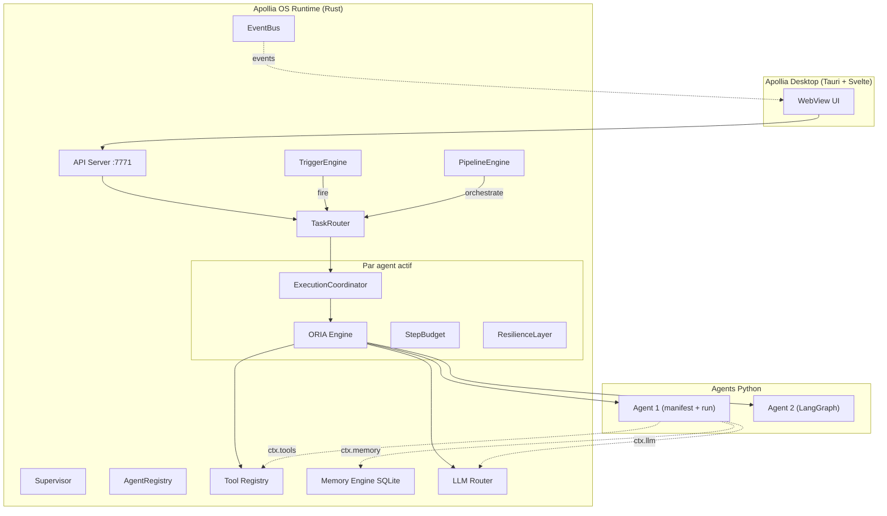

# Vue d'ensemble Technique & AIP

> *Stack, workspace Rust, interactions entre briques, et spécification complète de l'Agent Interface Protocol.*

**Prérequis de lecture :** cette page assume une familiarité avec Python async/await. Aucune connaissance de Rust n'est requise — les concepts Rust sont expliqués quand ils apparaissent. Si un terme n'est pas clair, consultez le [Glossaire](./glossary).

**Concepts clés :**
- **AIP** (Agent Interface Protocol) : le contrat minimal entre un agent Python et le runtime Rust. Deux fonctions suffisent : `manifest()` (qui je suis) et `run(task, ctx)` (que je fais).
- **ORIA** : le moteur d'exécution qui supervise les agents — Observer, Reasoner, Actor. Il applique les garde-fous (StepBudget) et peut planifier automatiquement en mode orchestré.
- **Acteur Tokio** : un composant autonome qui possède son état et communique par messages. C'est le pattern de concurrence utilisé par le runtime (inspiré d'[Alice Ryhl](https://ryhl.io/blog/actors-with-tokio/)).

### Diagramme simplifié



> **Note :** ce diagramme nécessite le preprocessor `mdbook-mermaid` pour un rendu graphique. Sans le plugin, il est lisible comme texte structuré.

---

## 1. Vue d'ensemble de l'architecture

### 1.1 Les briques fondamentales

```
┌─ APOLLIA DESKTOP (Tauri v2 + Svelte 5) ──────────────────────────┐
│  WebView · Commandes IPC · SSE Stores (agents/tasks/hitl)         │
│  init_embedded() → RuntimeHandle (ADR-027)                        │
└───────────────────────────┬───────────────────────────────────────┘
                            │ in-process
┌───────────────────────────▼───────────────────────────────────────┐
│                         APOLLIA OS RUNTIME                          │
│                                                                     │
│  ┌──────────────────────────────────────────────────────────────┐  │
│  │                       RUNTIME CORE                           │  │
│  │  Supervisor · AgentRegistry · TaskRouter · ChatMgr · API     │  │
│  └──────────────┬───────────────────────────────────────────────┘  │
│                 │                                                   │
│       ┌─────────▼─────────┐                                        │
│       │  ExecutionCoord.  │  (un par agent actif)                  │
│       └─────────┬─────────┘                                        │
│                 │                                                   │
│       ┌─────────▼─────────┐                                        │
│       │   ORIA ENGINE     │  Observer · Reasoner · Actor           │
│       │  (modes Direct    │  StepBudget · ResilienceLayer          │
│       │   / Orchestré)    │                                        │
│       └──┬──────────┬─────┘                                        │
│          │          │                                               │
│  ┌───────▼──┐  ┌────▼──────────┐                                   │
│  │  TOOL    │  │   MEMORY      │                                   │
│  │ REGISTRY │  │   ENGINE      │                                   │
│  │ + SANDBOX│  │  (SQLite)     │                                   │
│  └──────────┘  └───────────────┘                                   │
│                                                                     │
│  ┌──────────────────────────────────────────────────────────────┐  │
│  │                    TRIGGERS ENGINE                           │  │
│  │  CronTrigger · IntervalTrigger · FileWatchTrigger · Webhook  │  │
│  └──────────────────────────────────────────────────────────────┘  │
│                                                                     │
│  ┌──────────────────────────────────────────────────────────────┐  │
│  │                   CHAT SUBSYSTEM                 │  │
│  │  ChatSessionManager · BuiltInChatAgent · AgentChatExecutor   │  │
│  └──────────────────────────────────────────────────────────────┘  │
│                                                                     │
│  ┌──────────────────────────────────────────────────────────────┐  │
│  │                   STT ENGINE                    │  │
│  │  SttBackend · WhisperCpp · AudioCapture · SttRepository     │  │
│  └──────────────────────────────────────────────────────────────┘  │
│                                                                     │
│  ┌──────────────────────────────────────────────────────────────┐  │
│  │                      AIP BRIDGE (PyO3)                       │  │
│  │                  Rust ↔ Python async bridge                  │  │
│  └────────────────────────────┬─────────────────────────────────┘  │
└───────────────────────────────┼─────────────────────────────────────┘
                                │ AIP
                    ┌───────────▼───────────────┐
                    │      AGENT PYTHON         │
                    │  (LangGraph, CrewAI,       │
                    │   AutoGen, custom)         │
                    └───────────────────────────┘
```

### 1.2 Le workspace Rust

```
apollia-os/                          ← workspace Cargo
├── Cargo.toml                       ← workspace manifest
├── apollia.toml                     ← configuration par défaut
│
├── crates/
│   ├── apollia-core/                ← types partagés (AIPTask, AIPResult, Manifest...)
│   │   └── src/
│   │       ├── lib.rs
│   │       ├── manifest.rs          ← AgentManifest, AgentSkill
│   │       ├── task.rs              ← AIPTask, AIPInput, AIPPart
│   │       ├── result.rs            ← AIPResult, TaskStatus, AIPError
│   │       ├── process.rs           ← ProcessState (lifecycle ACP-aligned)
│   │       └── budget.rs            ← StepBudgetConfig
│   │
│   ├── apollia-desktop/             ← Application Desktop (Tauri v2 + Svelte 5)
│   │   ├── src/
│   │   │   ├── main.rs             ← entrée Tauri + init_embedded()
│   │   │   └── commands/           ← agents.rs, tasks.rs, hitl.rs
│   │   ├── ui/                     ← frontend Svelte (Vite)
│   │   └── tauri.conf.json
│   │
│   ├── apollia-runtime/             ← Runtime Core
│   │   └── src/
│   │       ├── lib.rs
│   │       ├── supervisor.rs        ← Supervisor + ChildSpec + RestartPolicy
│   │       ├── registry.rs          ← AgentRegistry acteur Tokio
│   │       ├── router.rs            ← TaskRouter acteur Tokio
│   │       ├── coordinator.rs       ← ExecutionCoordinator par agent
│   │       ├── api/                 ← APIServer axum (Unix socket + TCP)
│   │       │   ├── server.rs
│   │       │   ├── routes/
│   │       │   │   ├── routes_tasks.rs
│   │       │   │   ├── routes_agents.rs
│   │       │   │   ├── routes_triggers.rs
│   │       │   │   ├── routes_webhooks.rs
│   │       │   │   └── routes_dashboard.rs
│   │       │   └── sse.rs           ← Server-Sent Events streaming
│   │       └── eventbus.rs          ← EventBus broadcast Tokio
│   │
│   ├── apollia-triggers/            ← Triggers Engine
│   │   └── src/
│   │       ├── lib.rs
│   │       ├── types.rs             ← TriggerDefinition, OnBusyPolicy, InputTemplate
│   │       ├── engine.rs            ← TriggerEngine acteur Tokio + Handle
│   │       ├── persistence.rs       ← TriggerPersistence (SQLite)
│   │       ├── toml_config.rs       ← parse_triggers_from_toml_str()
│   │       └── sources/
│   │           ├── cron.rs          ← CronTrigger (crate cron 0.12)
│   │           ├── interval.rs      ← IntervalTrigger
│   │           ├── oneshot.rs       ← OneshotTrigger
│   │           └── file_watch.rs    ← FileWatchTrigger (notify v6)
│   │
│   ├── apollia-oria/                ← ORIA Engine
│   │   └── src/
│   │       ├── lib.rs
│   │       ├── observer.rs          ← Observer + ContextBundle
│   │       ├── reasoner.rs          ← Reasoner (LLM call + ExecutionPlan)
│   │       ├── actor.rs             ← ActorLoop + PlanStep execution
│   │       ├── budget.rs            ← StepBudget (runtime enforcement)
│   │       └── resilience.rs        ← ResilienceLayer + CircuitBreaker
│   │
│   ├── apollia-tools/               ← Tool Registry + outils natifs
│   │   └── src/
│   │       ├── lib.rs
│   │       ├── registry.rs          ← ToolRegistry + ToolDescriptor
│   │       ├── resolver.rs          ← ToolResolver (INITIALIZING validation)
│   │       ├── sandbox.rs           ← SandboxProfile + Linux namespaces
│   │       ├── audit.rs             ← AuditTrail SQLite
│   │       └── native/
│   │           ├── bash_executor.rs
│   │           ├── python_executor.rs
│   │           ├── file_io.rs
│   │           ├── http_client.rs
│   │           └── mcp_consumer.rs
│   │
│   ├── apollia-memory/              ← Memory Engine
│   │   └── src/
│   │       ├── lib.rs
│   │       ├── store.rs             ← MemoryStore (SQLite schema + migrations)
│   │       ├── interface.rs         ← MemoryInterface trait
│   │       ├── episodic.rs          ← EpisodicMemory backend
│   │       ├── semantic.rs          ← SemanticMemory backend
│   │       ├── procedural.rs        ← ProceduralMemory backend
│   │       ├── search.rs            ← FTS5 + vec0 hybride
│   │       └── manager.rs           ← MemoryManager (namespace isolation + TTL)
│   │
│   ├── apollia-aip/                 ← Bridge PyO3
│   │   └── src/
│   │       ├── lib.rs
│   │       ├── loader.rs            ← Chargement module Python + validation AIP
│   │       ├── bridge.rs            ← Appels async Rust → Python via pyo3-async-runtimes
│   │       ├── context.rs           ← RuntimeContext Python (ToolProxy + MemoryInterface)
│   │       └── wrapper.rs           ← AIPWrapper pour agents non-AIP natifs
│   │
│   └── apollia-cli/                 ← Binaire final
│       └── src/
│           ├── main.rs
│           ├── commands/
│           │   ├── start.rs
│           │   ├── stop.rs
│           │   ├── status.rs
│           │   ├── run.rs
│           │   ├── agent.rs
│           │   ├── task.rs
│           │   ├── tools.rs
│           │   ├── memory.rs
│           │   └── audit.rs
│           ├── commands/
│           │   ├── trigger.rs       ← `apollia-os trigger list|status|fire|...`
│           │   └── ...
│           └── output/              ← Formatters (table, json, quiet)
│
├── agents/                          ← Agents d'exemple et de test
│   ├── hello_agent.py
│   ├── devis_agent.py
│   └── qualification_agent.py
│
└── tests/
    └── integration/
        ├── test_hello_agent.rs
        ├── test_devis_workflow.rs
        ├── test_memory_persistence.rs
        ├── test_graceful_shutdown.rs
        ├── test_triggers.rs
        └── test_webhook.rs
```

### 1.3 Stack technique

| Composant | Technologie | Justification |
|---|---|---|
| Runtime | Rust + Tokio | Performances natives, sécurité mémoire, binaire unique |
| Agent bridge | PyO3 + pyo3-async-runtimes | Interopérabilité Python sans subprocess, async natif |
| Mémoire | SQLite + FTS5 + sqlite-vec (opt.) | Zéro dépendance externe, performant, souverain |
| API locale | axum (HTTP/REST) | Écosystème Tokio natif, simple, bien documenté |
| CLI | clap v4 (derive API) | Standard de facto pour les CLIs Rust |
| Sandbox | Linux namespaces (unshare) | Zéro dépendance Docker, fonctionne partout |
| Sérialisation | serde + serde_json | Standard Rust |
| Logging | tracing + tracing-subscriber | Async-aware, structured logging |
| Erreurs | thiserror | Ergonomie d'erreurs idiomatic Rust |

---

## 2. L'Agent Interface Protocol (AIP)

### 2.1 Philosophie

L'AIP est le **contrat minimal** entre un agent Python et le runtime Apollia OS. Il répond à une question fondamentale : que doit implémenter un agent pour être exécutable dans le runtime ?

La réponse est délibérément minimaliste : **deux méthodes**.

L'AIP est conçu sur 4 principes :

1. **Minimalisme contractuel** : Pas de classe de base obligatoire. Duck typing Python. Zero friction pour les agents existants.
2. **Alignement standards** : Lifecycle tâches aligné A2A, lifecycle processus aligné ACP, outils alignés MCP.
3. **Séparation des machines d'état** : `ProcessState` (processus agent) et `TaskState` (tâche en cours) sont deux machines d'état indépendantes.
4. **Fail fast au démarrage** : Toute erreur détectable à `INITIALIZING` est détectée à `INITIALIZING`.

### 2.2 Les 4 composants de l'AIP

#### Composant 1 : AgentManifest

La carte d'identité de l'agent. Déclarée en Python, source unique de vérité.

```python
from dataclasses import dataclass, field
from typing import Any

@dataclass
class AgentManifest:
    # Obligatoires
    name: str                        # "devis-generator"
    version: str                     # "1.0.0" (semver)
    description: str                 # "Génère des devis commerciaux"
    tools_required: list[str]        # ["file_io", "python_executor"]

    # Optionnels avec valeurs par défaut
    tools_optional: list[str] = field(default_factory=list)
    supports_streaming: bool = False
    supports_a2a: bool = False       # expose AgentCard A2A si True
    memory_namespace: str | None = None  # namespace isolation mémoire
    shared_memory_namespaces: list[str] = field(default_factory=list)

    # Limites (override des defaults runtime)
    max_concurrent_tasks: int = 1
    step_budget: StepBudgetConfig | None = None
    network_allowlist: list[str] | None = None  # None = pas de réseau

    # Métadonnées
    tags: list[str] = field(default_factory=list)
    skills: list[AgentSkill] = field(default_factory=list)
    metadata: dict[str, Any] = field(default_factory=dict)
```

Si `supports_a2a=True`, Apollia OS génère automatiquement une AgentCard A2A et l'expose à `/.well-known/agent.json`. L'agent n'écrit pas de code A2A.

#### Composant 2 : AgentLifecycle — ProcessState

La machine d'état du **processus** (alignée ACP) :

```
INITIALIZING ──► ACTIVE ──► DEGRADED ──► STOPPING ──► STOPPED
                   │                        ▲
                   └────────────────────────┘
                   (erreur non récupérable → STOPPING direct)
```

| État | Description |
|---|---|
| `INITIALIZING` | Résolution des outils, ouverture SQLite, validation manifest |
| `ACTIVE` | Prêt à recevoir des tâches |
| `DEGRADED` | Actif mais avec des `tools_optional` manquants |
| `STOPPING` | Drain des tâches en cours (timeout 30s) |
| `STOPPED` | Arrêt propre — plus aucune tâche acceptée |

Callbacks Python (optionnels, non obligatoires pour AIP-compliance) :

```python
class AIPAgent:  # Classe de base OPTIONNELLE — duck typing accepté
    def manifest(self) -> AgentManifest:
        raise NotImplementedError  # OBLIGATOIRE

    async def on_start(self, ctx: RuntimeContext) -> None:
        pass  # warm-up, chargement modèle, connexions

    async def on_stop(self) -> None:
        pass  # libération ressources

    async def run(self, task: AIPTask, ctx: RuntimeContext) -> AIPResult:
        raise NotImplementedError  # OBLIGATOIRE

    async def health_check(self) -> AgentHealth:
        return AgentHealth(status="healthy")
```

#### Composant 3 : TaskContract — TaskState

La machine d'état des **tâches** (alignée A2A TaskState) :

```
submitted ──► working ──► completed
                │
                ├──► input_required ──► working (reprise)
                ├──► failed
                └──► canceled
```

**AIPTask — ce que le runtime envoie à l'agent :**

```python
@dataclass
class AIPTask:
    task_id: str                     # UUID généré par le runtime
    context_id: str                  # groupe de tâches liées (session)
    input: AIPInput
    history: list[AIPMessage] = field(default_factory=list)
    created_at: datetime = field(default_factory=datetime.utcnow)
    timeout_seconds: int | None = None

@dataclass
class AIPInput:
    parts: list[AIPPart]             # TextPart | FilePart | DataPart

# Aligné A2A Part
@dataclass
class TextPart:
    text: str

@dataclass
class FilePart:
    name: str
    mime_type: str
    data: bytes | None = None
    uri: str | None = None

@dataclass
class DataPart:
    data: dict[str, Any]
```

**AIPResult — ce que l'agent retourne au runtime :**

```python
@dataclass
class AIPResult:
    task_id: str
    status: TaskStatus               # completed | failed | input_required | canceled
    output: list[AIPPart] = field(default_factory=list)
    error: AIPError | None = None
    input_request: InputRequest | None = None  # si input_required
    artifacts: list[AIPArtifact] = field(default_factory=list)
    metadata: ExecutionMetadata | None = None

    # Constructeurs de convenance
    @classmethod
    def completed(cls, text: str, task_id: str = "") -> "AIPResult": ...

    @classmethod
    def failed(cls, code: str, message: str, task_id: str = "") -> "AIPResult": ...
```

#### Composant 4 : RuntimeContext — services injectés

Le `RuntimeContext` est ce que l'agent reçoit comme second argument de `run()`. C'est son interface vers tous les services du runtime.

```python
@dataclass
class RuntimeContext:
    # Services disponibles
    tools: ToolProxy                 # ctx.tools.bash_executor.run("ls")
    memory: MemoryInterface | None   # None si pas de memory_namespace
    log: AgentLogger                 # logs structurés via runtime
    emit: ProgressEmitter            # streaming si supports_streaming=True
    step_budget: StepBudgetView      # lecture seule du budget restant

    # Métadonnées tâche
    task_id: str
    context_id: str
    agent_name: str
    runtime_version: str
```

### 2.3 L'agent minimal complet

```python
# mon_agent.py — agent AIP-compatible minimal
from apollia_os import AgentManifest, AIPTask, AIPResult, RuntimeContext

class MonAgent:
    def manifest(self) -> AgentManifest:
        return AgentManifest(
            name="mon-agent",
            version="1.0.0",
            description="Agent de démonstration",
            tools_required=["file_io"],
            memory_namespace="mon-agent-memory"
        )

    async def run(self, task: AIPTask, ctx: RuntimeContext) -> AIPResult:
        # Récupérer le texte de la tâche
        user_input = task.input.parts[0].text

        # Utiliser un outil
        files = await ctx.tools.file_io.list(".")

        # Stocker un épisode en mémoire
        await ctx.memory.record(
            f"Tâche reçue : {user_input}",
            importance=0.5,
            task_id=task.task_id
        )

        # Retourner un résultat
        return AIPResult.completed(
            f"Bonjour ! J'ai reçu : {user_input}. Fichiers : {files}"
        )

# Point d'entrée AIP
agent = MonAgent()
```

### 2.4 Décisions architecturales AIP

**Duck typing vs. classe de base :**
Les deux sont supportés. L'AIPAgent est une classe de base optionnelle. Un objet Python avec `manifest()` et `run()` async est AIP-compatible. Le runtime valide via `hasattr` + inspection des signatures.

**input_required (Human-in-the-Loop) :**
Supporté nativement. L'agent retourne `AIPResult(status=TaskStatus.INPUT_REQUIRED, input_request=...)`. Le runtime met la tâche en attente et notifie le caller. Reprise via `apollia-os task resume <task_id> --input "..."`.

**Wrapper pour agents non-AIP :**
```python
from apollia_os import AIPWrapper

# Wrapper un agent LangGraph existant
my_langgraph_agent = create_react_agent(...)
aip_agent = AIPWrapper(
    callable=my_langgraph_agent.ainvoke,
    manifest=AgentManifest(name="langraph-agent", ...)
)
```

---

## 3. Les deux machines d'état — distinction critique

Un point souvent source de confusion : Apollia OS maintient **deux machines d'état indépendantes**.

### ProcessState (lifecycle du processus agent)

Géré par le **Runtime Core** (AgentRegistry). Représente l'état du processus agent en tant que service opérationnel.

```
INITIALIZING → ACTIVE → DEGRADED → STOPPING → STOPPED
```

Déclenché par : `apollia-os agent start/stop`, paniques, restart policy.

### TaskState (lifecycle d'une tâche)

Géré par **ORIA Engine** + **TaskRouter**. Représente l'état d'une tâche spécifique.

```
submitted → working → completed/failed/input_required/canceled
```

Déclenché par : `apollia-os run`, appels API POST /tasks, completion de l'agent.

**Règle d'or :** Un agent peut être `ACTIVE` (ProcessState) avec 0 tâches, ou avec 1 tâche `working`. Il peut être `DEGRADED` (outils optionnels manquants) et quand même traiter des tâches `working`. Un agent `STOPPING` refuse de nouvelles tâches (`submitted` rejeté) mais laisse les tâches `working` se terminer.

---

*Prochaine lecture recommandée : [Protocoles & Standards](./Architecture-Protocoles-Standards)*
