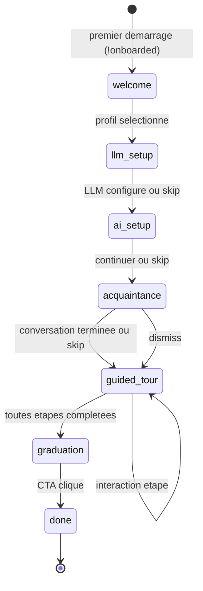

# Systeme d'Onboarding — Spec technique

> *Reference technique exhaustive du systeme d'onboarding multi-phases d'Apollia OS Desktop.*

---

## 1. Machine a etats — 7 phases



### Transitions valides

| Phase depuis | Phase vers | Condition |
|---|---|---|
| `welcome` | `llm_setup` | Profil selectionne (operator \| builder) |
| `llm_setup` | `ai_setup` | LLM configure OU skip |
| `ai_setup` | `acquaintance` | Continuer ou skip |
| `acquaintance` | `guided_tour` | Conversation completee OU skip/dismiss |
| `guided_tour` | `graduation` | `tour_step_index` >= `total_steps` |
| `graduation` | `done` | Bouton CTA clique |

Toute phase peut etre interrompue — l'etat est persiste et la barre de reprise s'affiche.

---

## 2. Commandes IPC Tauri

### Onboarding core (6 commandes)

| Commande | Parametres | Retour | Description |
|---|---|---|---|
| `get_onboarding_state` | — | `OnboardingState` | Etat complet depuis la DB |
| `advance_onboarding_phase` | `phase: String` | `OnboardingState` | Avance vers la phase cible |
| `get_onboarding_status` | — | `OnboardingStatus` | Topics couverts, statut completion |
| `dismiss_onboarding` | — | `` | Marque la conversation comme dismissee |
| `check_onboarded` | — | `bool` | `true` si `done` |
| `reset_onboarding` | — | `` | Reinitialise vers `welcome` |

### Tour guidé (4 commandes)

| Commande | Parametres | Retour | Description |
|---|---|---|---|
| `get_tour_steps` | `profile: String` | `Vec<TourStep>` | Etapes pour le profil donne |
| `set_tour_step` | `index: u32` | `` | Persiste la position courante |
| `complete_tour_action` | `step_key: String` | `TourActionResult` | Marque l'action de l'etape comme accomplie |
| `trigger_onboarding` | `topic: Option<String>, profile: Option<String>` | `TriggerResult` | Demarre une session de chat onboarding |

### Setup IA (5 commandes)

| Commande | Parametres | Retour | Description |
|---|---|---|---|
| `get_ai_setup_info` | — | `SystemInfo` | RAM, OS, arch, GPU |
| `scan_for_gguf_models` | — | `Vec<GgufModelInfo>` | Scan `~/.apollia/models/` + `~/Downloads/` |
| `scan_for_whisper_models` | — | `Vec<WhisperModelInfo>` | Scan modeles Whisper |
| `setup_local_llm` | `gguf_path: String` | `` | Configure le backend LLM local |
| `setup_whisper_model` | `model_path: String` | `` | Configure le modele STT |

### Companion (3 commandes)

| Commande | Parametres | Retour | Description |
|---|---|---|---|
| `set_companion_enabled` | `enabled: bool` | `` | Active/desactive le companion post-onboarding |
| `get_companion_state` | — | `CompanionState` | Etat du companion (enabled, session_id) |
| `start_tour_recording` / `stop_tour_recording` | — | `` | Push-to-talk STT pendant le tour |

### Voice (1 commande)

| Commande | Parametres | Retour | Description |
|---|---|---|---|
| `process_tour_voice_command` | `transcript: String` | `TourVoiceAction` | Clasifie la transcription en action tour |

---

## 3. Types TypeScript

```typescript
interface OnboardingState {
  phase: OnboardingPhase;
  profile: "operator" | "builder" | null;
  tour_step_index: number;
  companion_session_id: string | null;
  stats: OnboardingStats;
}

type OnboardingPhase =
  | "welcome"
  | "llm_setup"
  | "ai_setup"
  | "acquaintance"
  | "guided_tour"
  | "graduation"
  | "done";

interface TourStep {
  key: string;
  route: Route;
  spotlight_selector: string | null;
  companion_message_key: string;
  interaction_type: "navigate" | "click" | "observe";
  action_event: string | null;
}

type TourVoiceAction =
  | { action: "NextStep" }
  | { action: "PreviousStep" }
  | { action: "SkipTour" }
  | { action: "AskCompanion"; message: string }
  | { action: "Unrecognized" };

interface OnboardingStats {
  actions_completed: number;
  total_time_sec: number;
}
```

---

## 4. Cles UserMemory

L'onboarding ecrit dans le namespace `onboarding` de la UserMemory :

| Cle | Type | Description |
|---|---|---|
| `phase` | `String` | Phase courante |
| `profile` | `String` | Profil selectionne (`operator` \| `builder`) |
| `tour_step_index` | `u32` | Position dans le tour |
| `topics_covered` | `Vec<String>` | Topics abordes en conversation |
| `companion_session_id` | `Option<String>` | Session chat du companion |
| `stats.actions_completed` | `u32` | Compteur d'actions realisees |
| `stats.total_time_sec` | `u64` | Temps total d'onboarding |

---

## 5. RuntimeEvents emis

| Event | Payload | Moment |
|---|---|---|
| `onboarding-phase-changed` | `{ phase: String }` | Chaque transition de phase |
| `onboarding-tour-step` | `{ index: u32, total: u32 }` | Chaque avancement d'etape |
| `onboarding-completed` | `{ profile: String }` | Phase `done` atteinte |
| `stt-transcribed` | `String` | Transcription STT disponible |

---

## 6. Companion Apollia

Le Companion est un panneau flottant (draggable, resizable) qui fournit une aide contextuelle en utilisant une session de chat ordinaire.

### Etats

| Etat | Description |
|---|---|
| `hidden` | Masque completement |
| `minimized` | Bouton "Restaurer" visible en bas a droite |
| `visible` | Panneau complet affiche |

### Contexte par route

Le `CompanionContextProvider` ecoute le store de navigation et injecte un message contextuel selon la route active. Durant le tour guide, le message est override par `tourCompanionOverride` (store dedié).

### Post-onboarding

Apres la graduation, le companion reste disponible si `companion_enabled = true` (persiste via `set_companion_enabled`). La session est creee a la demande via `create_chat_session` avec `mode: "free"`.

---

## 7. Support Voice (STT)

Les commandes vocales sont disponibles pendant la phase `guided_tour` uniquement, si `stt_status.enabled && stt_status.model_loaded`.

### Flux

```
mousedown mic-btn → invoke("start_tour_recording")
mouseup mic-btn   → invoke("stop_tour_recording")
                  → event "stt-transcribed" recu
                  → invoke("process_tour_voice_command", transcript)
                  → TourVoiceAction dispatche
```

### Actions reconnues

| Utterance (FR/EN) | Action |
|---|---|
| suivant / next / continue | `NextStep` |
| precedent / back / previous | `PreviousStep` |
| passer / skip / quitter | `SkipTour` |
| tout autre texte | `AskCompanion` |
| transcription vide | `Unrecognized` |
